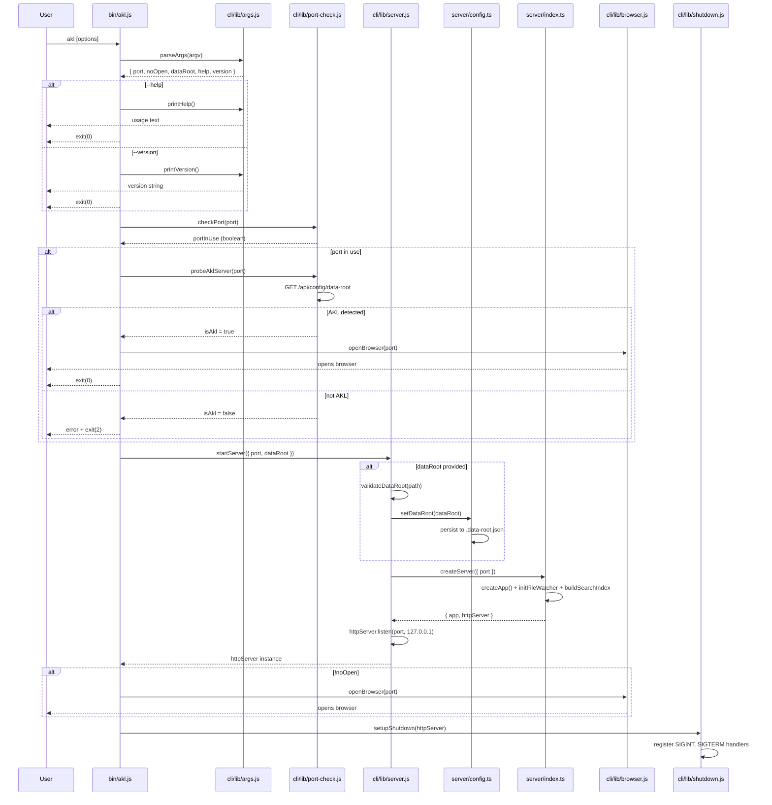

# CLI Entry Point — Startup Flow

## Overview

The `akl` CLI is the primary entry point for AKL's Knowledge. It orchestrates the complete startup lifecycle: argument parsing, port availability checking, server initialization, browser launching, and graceful shutdown. The CLI is designed to be resilient — it can detect if an AKL server is already running and will simply open a browser to it rather than failing with a port conflict.

**Entry point**: `bin/akl.js` (executable via `npm run akl`)
**Runtime**: Node.js with `tsx` for `.ts` → `.js` resolution
**Default port**: `3001`
**Bind address**: `127.0.0.1` only (local-first)

---

## Architecture



---

## Component Map

### `bin/akl.js` — Main Orchestrator

The top-level entry point that sequences all startup steps. It is an ES module with a shebang line (`#!/usr/bin/env node`) for direct execution.

**Responsibilities:**
- Parse CLI arguments
- Handle `--help` and `--version` (early exit)
- Check port availability
- Distinguish AKL server from other processes
- Start server or open browser to existing instance
- Register graceful shutdown handlers

**Key pattern:** The main flow is top-level `await` — no wrapper function, no promise chains. Each step is sequential and explicit.

---

### `cli/lib/args.js` — Argument Parsing

Manual argument parser (no external dependency like `commander` or `yargs`).

**Parsed options:**

| Flag | Type | Default | Description |
|------|------|---------|-------------|
| `--port <number>` | `number \| null` | `null` (→ 3001) | Server port |
| `--no-open` | `boolean` | `false` | Skip browser launch |
| `--data-root <path>` | `string \| null` | `null` | Override data directory |
| `--help` | `boolean` | `false` | Show usage |
| `--version` | `boolean` | `false` | Show version |

**Validation:**
- Port range: 1–65535 (exits with code 1 if invalid)
- `--help` takes precedence — parsed but all other flags are ignored when present

**Version:** Hardcoded as `0.1.0` (not read from `package.json`).

---

### `cli/lib/port-check.js` — Port Availability & AKL Probing

Two-step port detection that distinguishes between "AKL already running" and "something else is using the port."

**`checkPort(port)` — TCP bind test:**
1. Creates a `net.createServer()` and attempts to listen on `127.0.0.1:port`
2. If `error` event fires → port is in use → returns `true`
3. If `listening` event fires → port is free → closes server → returns `false`

**`probeAklServer(port)` — HTTP probe:**
1. Sends `GET http://127.0.0.1:{port}/api/config/data-root` with 2s timeout
2. Parses JSON response
3. Validates AKL signature: `json.success === true && json.data && typeof json.data.path !== 'undefined'`
4. Returns `true` only if all conditions met

**Why probe instead of just erroring?** This allows running `akl` multiple times — subsequent invocations simply open a browser to the existing server rather than failing.

---

### `cli/lib/server.js` — Server Startup

Imports the Express server factory from `server/index.js` and handles data root validation.

**`validateDataRoot(dataRoot)`:**
1. `fs.existsSync()` — directory must exist
2. `fs.accessSync(R_OK | W_OK)` — directory must be readable and writable
3. Returns `{ valid: boolean, error?: string }`

**`startServer({ port, dataRoot })`:**
1. If `dataRoot` provided → validate → call `setDataRoot()` (persists to `server/.data-root.json`)
2. Call `createServer({ port })` from `server/index.ts`
   - Creates Express app with all routes
   - Initializes file watcher with WebSocket
   - Builds initial search index (async, non-blocking)
3. Call `httpServer.listen(port, '127.0.0.1')` — wrapped in a Promise for await
4. Log startup message with rocket emoji
5. Return the HTTP server instance

---

### `cli/lib/browser.js` — Browser Opener

Opens the system default browser using platform-specific shell commands.

**Platform commands:**

| Platform | Command |
|----------|---------|
| macOS (`darwin`) | `open "{url}"` |
| Windows (`win32`) | `start "" "{url}"` |
| Linux (default) | `xdg-open "{url}"` |

**Error handling:** If the command fails, logs a warning with the URL for manual navigation — does not crash the server.

---

### `cli/lib/shutdown.js` — Graceful Shutdown

Registers signal handlers for clean server termination.

**Signals handled:**
- `SIGINT` — Ctrl+C in terminal
- `SIGTERM` — kill command, process manager signals

**Shutdown sequence:**
1. Log received signal
2. Call `httpServer.close()` — stops accepting new connections, waits for existing ones
3. On close callback → log → `process.exit(0)`
4. **Safety net:** 5-second timeout → force exit with code 1 if graceful shutdown hangs

**Note:** The shutdown handler calls `httpServer.close()` which triggers Express/Node cleanup. The file watcher (chokidar) and WebSocket server are attached to the same HTTP server instance, so they are cleaned up implicitly.

---

## Data Flow — Startup Sequence

```
1. User runs: akl --port 4000 --data-root ~/my-knowledge
2. parseArgs() → { port: 4000, noOpen: false, dataRoot: "~/my-knowledge", help: false, version: false }
3. checkPort(4000) → false (port is free)
4. startServer({ port: 4000, dataRoot: "~/my-knowledge" })
   a. validateDataRoot("~/my-knowledge") → { valid: true }
   b. setDataRoot("~/my-knowledge") → resolves path, persists to server/.data-root.json
   c. createServer() → creates Express app, routes, file watcher, search index
   d. httpServer.listen(4000, "127.0.0.1") → starts listening
5. openBrowser(4000) → opens http://127.0.0.1:4000
6. setupShutdown(httpServer) → registers SIGINT/SIGTERM handlers
```

---

## CLI Options Reference

```
akl [options]

Options:
  --port <number>      Port to run the server on (default: 3001)
  --no-open            Start server without opening the browser
  --data-root <path>   Path to the knowledge base data directory
  --help               Show this help message
  --version            Show the version number

Examples:
  akl                            Start on port 3001, open browser
  akl --port 4000                Start on port 4000
  akl --no-open                  Start without opening browser
  akl --data-root ~/my-data      Use custom data directory
```

**Exit codes:**

| Code | Meaning |
|------|---------|
| `0` | Success (server started, or browser opened to existing server) |
| `1` | Invalid arguments or data root validation failure |
| `2` | Port in use by non-AKL process |

---

## Key Decisions and Patterns

### Manual Argument Parsing

No external dependency (`commander`, `yargs`, `minimist`) — the argument parser is ~70 lines of vanilla JavaScript. This keeps the CLI lightweight and eliminates a dependency that would need maintenance.

### AKL Server Detection via API Probe

Rather than using a PID file or lock file, the CLI probes the `/api/config/data-root` endpoint. This is more reliable because:
- No stale PID files after crashes
- Works across process restarts
- The endpoint is always available on a running AKL server
- Response structure (`success: true`, `data.path`) is a unique AKL signature

### Data Root Persistence

When `--data-root` is passed, it is both applied to the in-memory config **and** persisted to `server/.data-root.json`. This means subsequent `akl` invocations (without `--data-root`) will use the last-set data root.

### Top-Level Await

The CLI uses top-level `await` rather than wrapping everything in an async IIFE. This requires Node.js 14.8+ (ESM) and keeps the code flat and readable.

### Server Factory Pattern

`server/index.ts` exports `createServer()` which returns `{ app, httpServer }` **without** calling `.listen()`. The CLI controls the listen lifecycle. This separation allows:
- CLI to validate data root before starting
- CLI to handle port conflicts before creating the server
- Server tests to create app instances without binding to ports

---

## Gotchas

### `.js` Import of `.ts` Server

`cli/lib/server.js` imports from `../../server/index.js` (note the `.js` extension), but the actual file is `server/index.ts`. This works because `tsx` (the runtime used by `bin/akl.js`) handles `.ts` → `.js` resolution automatically. **Do not rename the import to `.ts`** — it will break at runtime.

### Port Check Binds to `127.0.0.1` Only

`checkPort()` tests binding to `127.0.0.1`, not `0.0.0.0`. A process listening on `0.0.0.1:3001` would not be detected as a conflict. This is intentional — the server also binds to `127.0.0.1` only.

### Search Index Build is Non-Blocking

`searchIndex.build()` in `createServer()` is called without `await`. If the initial index build fails, it logs an error but does not prevent server startup. The index will be rebuilt on file changes via the watcher.

### Force Shutdown Timeout

The 5-second force-exit in `shutdown.js` uses `process.exit(1)` (error code), not `process.exit(0)`. This signals to process managers (systemd, pm2) that the shutdown was not clean.

### Browser Open Failures Are Silent

If `openBrowser()` fails (no default browser set, headless environment), it logs a warning but does not exit. The server continues running. This is important for server/CI deployments.

### Version Not Synced with `package.json`

The version in `args.js` (`0.1.0`) is hardcoded and not read from `package.json`. If the package version is updated, this must be updated manually.

---

## Related Documentation

- [Server Architecture](./server-architecture.md) — Express app, routes, middleware
- [CLI Packaging](./cli-packaging.md) — How the CLI is bundled and distributed
- [Data Root Configuration](../specs/data-root-spec.md) — Data root and vault management
- [AGENTS.md](../../AGENTS.md) — Project overview and developer commands
