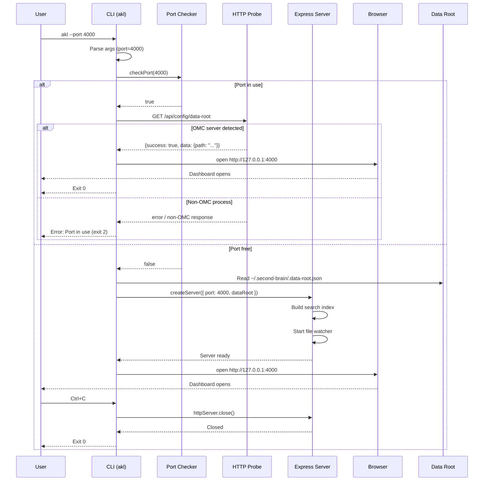
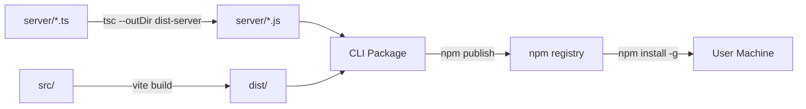

# Design: CLI Packaging (`akl` command)

**Date:** 2026-04-12
**Status:** Draft
**Author:** oracle
**Related Requirement:** `docs/ai/requirements/cli-packaging.md`

## Architecture Overview

The `akl` CLI is a thin wrapper around the existing Express server. It bundles the server code and React app (`dist/`) into a single npm package that can be installed globally. The CLI entry point handles argument parsing, port conflict detection, server startup, and browser opening.

```mermaid
graph TB
    User[User Terminal] -->|akl [flags]| CLI[CLI Entry Point<br/>bin/akl.js]
    CLI -->|parse args| Args[Argument Parser<br/>--port, --no-open,<br/>--data-root, --help, --version]
    CLI -->|check port| PortCheck[Port Probe<br/>net.createServer]
    PortCheck -->|port free| StartServer[Start Express Server<br/>createServer factory]
    PortCheck -->|port in use| HttpProbe[HTTP Probe<br/>GET /api/config/data-root]
    HttpProbe -->|OMC response| OpenBrowser[Open Browser Only<br/>open package]
    HttpProbe -->|non-OMC / error| PortError[Print Error + Exit 2]
    StartServer -->|ready| OpenBrowser
    OpenBrowser -->|http://127.0.0.1:PORT| Browser[User Browser]
    StartServer -->|SIGINT| GracefulShutdown[Graceful Shutdown<br/>close HTTP + WS + watcher]
    StartServer -->|serves| Dist[Static Assets<br/>dist/ embedded]
    StartServer -->|reads| DataRoot[Data Root<br/>~/.second-brain/.data-root.json]
    
    subgraph "CLI Package (npm)"
        CLI
        Args
        PortCheck
        HttpProbe
        StartServer
        GracefulShutdown
        Dist
    end
    
    subgraph "External"
        Browser
        DataRoot
    end
```

## Component Design

### 1. CLI Entry Point (`bin/akl.js`)

**Responsibility:** Parse arguments, orchestrate startup, handle signals.

```javascript
#!/usr/bin/env node
import { parseArgs } from './lib/args.js';
import { checkPort } from './lib/port-check.js';
import { probeOmcServer } from './lib/port-check.js';
import { startServer } from './lib/server.js';
import { openBrowser } from './lib/browser.js';
import { setupShutdown } from './lib/shutdown.js';

const args = parseArgs(process.argv.slice(2));

// --help takes precedence over all other flags
if (args.help) { printHelp(); process.exit(0); }
if (args.version) { printVersion(); process.exit(0); }

const port = args.port || 3001;
const portInUse = await checkPort(port);

if (portInUse) {
  // Distinguish OMC server from other processes
  const isOmc = await probeOmcServer(port);
  if (isOmc) {
    await openBrowser(port);
    process.exit(0);
  } else {
    console.error(`Port ${port} is already in use. Use --port to specify a different port.`);
    process.exit(2);
  }
}

const server = await startServer({ port, dataRoot: args.dataRoot });
if (!args.noOpen) await openBrowser(port);
setupShutdown(server);
```

### 2. Argument Parser (`lib/args.js`)

**Responsibility:** Parse CLI flags, validate inputs, return structured args.

```javascript
export function parseArgs(argv) {
  const args = { port: null, noOpen: false, dataRoot: null, help: false, version: false };
  for (let i = 0; i < argv.length; i++) {
    switch (argv[i]) {
      case '--port': args.port = parseInt(argv[++i], 10); break;
      case '--no-open': args.noOpen = true; break;
      case '--data-root': args.dataRoot = argv[++i]; break;
      case '--help': args.help = true; break;
      case '--version': args.version = true; break;
    }
  }
  // Validate port range
  if (args.port !== null && (args.port < 1 || args.port > 65535)) {
    console.error('Invalid port number. Must be between 1 and 65535.');
    process.exit(1);
  }
  return args;
}
```

### 3. Port Checker (`lib/port-check.js`)

**Responsibility:** Check if a port is already in use via TCP connection attempt, then probe for OMC server.

```javascript
import net from 'net';
import http from 'http';

export function checkPort(port) {
  return new Promise((resolve) => {
    const tester = net.createServer()
      .once('error', () => resolve(true)) // Port in use
      .once('listening', () => {
        tester.close();
        resolve(false); // Port free
      })
      .listen(port, '127.0.0.1');
  });
}

export async function probeOmcServer(port) {
  return new Promise((resolve) => {
    const req = http.get(`http://127.0.0.1:${port}/api/config/data-root`, { timeout: 2000 }, (res) => {
      let data = '';
      res.on('data', chunk => data += chunk);
      res.on('end', () => {
        try {
          const json = JSON.parse(data);
          resolve(json.success === true && json.data && typeof json.data.path === 'string');
        } catch {
          resolve(false);
        }
      });
    });
    req.on('error', () => resolve(false));
    req.on('timeout', () => { req.destroy(); resolve(false); });
  });
}
```

### 4. Server Starter (`lib/server.js`)

**Responsibility:** Import and start the existing Express server via factory function, apply CLI overrides.

```javascript
import { createServer } from '../server/index.js';
import { setDataRoot } from '../server/config.js';

export async function startServer({ port, dataRoot }) {
  if (dataRoot) setDataRoot(dataRoot);
  const { httpServer } = await createServer({ port });
  return httpServer;
}
```

### 5. Browser Opener (`lib/browser.js`)

**Responsibility:** Open system default browser to the server URL.

```javascript
import open from 'open';

export async function openBrowser(port) {
  try {
    await open(`http://127.0.0.1:${port}`);
  } catch {
    console.warn(`Could not open browser. Navigate to http://127.0.0.1:${port} manually.`);
  }
}
```

### 6. Graceful Shutdown (`lib/shutdown.js`)

**Responsibility:** Handle SIGINT/SIGTERM, close server cleanly.

```javascript
export function setupShutdown(httpServer) {
  const shutdown = (signal) => {
    console.log(`\nReceived ${signal}. Shutting down gracefully...`);
    httpServer.close(() => {
      console.log('Server closed.');
      process.exit(0);
    });
    setTimeout(() => process.exit(1), 5000); // Force exit after 5s
  };
  process.on('SIGINT', () => shutdown('SIGINT'));
  process.on('SIGTERM', () => shutdown('SIGTERM'));
}
```

## Data Flow



## API Contracts

The CLI does not expose new APIs — it starts the existing server. The server API remains unchanged:

| Endpoint | Method | Description |
|---|---|---|
| `/api/config/data-root` | GET/POST | Get/set data root |
| `/api/sessions` | GET | List sessions |
| `/api/agents` | GET | List agents |
| `/api/skills` | GET | List skills |
| `/api/topics` | GET | List topics |
| `/api/stats/*` | GET | Statistics |
| `/api/search` | POST | Search |
| `/ws/files` | WebSocket | File change notifications |

## Error Handling Strategy

| Scenario | Behavior | Exit Code |
|---|---|---|
| Port in use by non-OMC process | Print error, suggest `--port` flag | 2 |
| Port in use by OMC server | Open browser only, exit cleanly | 0 |
| `--data-root` path doesn't exist | Print error with path | 1 |
| `--data-root` path not writable | Print error with path | 1 |
| Server fails to start | Print error output from server | 1 |
| Browser fails to open | Print warning, continue running server | 0 (server continues) |
| `--help` combined with other flags | Print help, ignore other flags | 0 |
| Privileged port without permissions | Print error, suggest port >1024 | 2 |
| Ctrl/Cmd+C | Graceful shutdown (5s timeout) | 0 |

## Security Considerations

| Concern | Mitigation |
|---|---|
| Server binds to all interfaces | Explicitly bind to `127.0.0.1` only (C5) |
| CORS allows external origins | CORS restricted to `localhost` origins only |
| Data root path traversal | Server validates all file paths against data root |
| No authentication | Local-only access (127.0.0.1), no network exposure |

## Performance Considerations

| Metric | Target | How |
|---|---|---|
| Startup time | < 3 seconds | Lazy search index build, async file watcher init |
| Memory usage | < 150MB | Limit search index to 500 sessions, stream large files |
| API response time | < 200ms | In-memory search index (Fuse.js), cached file reads |

## Build Pipeline

The server is written in TypeScript and must be compiled to JavaScript before bundling into the CLI package.



**Build steps:**
1. `cd server && npx tsc` — Compile TypeScript to JavaScript (`dist-server/`)
2. `npm run build` — Build React app (`dist/`)
3. Copy `dist-server/` → `server/` in CLI package
4. Copy `dist/` → `dist/` in CLI package
5. `npm publish` — Publish to npm registry

## Package Structure

```
akl/
├── bin/
│   └── akl.js              # CLI entry point (#!/usr/bin/env node)
├── lib/
│   ├── args.js             # Argument parser
│   ├── port-check.js       # Port availability checker + HTTP probe
│   ├── server.js           # Server starter
│   ├── browser.js          # Browser opener
│   └── shutdown.js         # Graceful shutdown handler
├── server/                  # Compiled Express server (from TypeScript)
│   ├── index.js            # Exports createServer() factory
│   ├── config.js           # Data root persistence (~/.second-brain/.data-root.json)
│   ├── routes/
│   ├── services/
│   └── middleware/
├── dist/                    # Built React app (bundled)
│   ├── index.html
│   └── assets/
├── package.json             # npm package config with "bin" field
└── README.md
```

## Data Root Path Resolution

The `.data-root.json` file is stored at `~/.second-brain/.data-root.json` (cross-platform home directory). This path is resolved at runtime using `os.homedir()` and is independent of the CLI installation location.

**Fallback behavior:**
1. If `--data-root` flag is provided → use it
2. Else if `~/.second-brain/.data-root.json` exists → read path from file
3. Else → data root is `null` (server starts without data root, user must configure via UI)

## Dependencies

| Package | Purpose | Justification |
|---|---|---|
| `open` | Open system default browser | Cross-platform, well-maintained, 20KB |
| *(existing server deps)* | Express, chokidar, ws, fuse.js, js-yaml | Already in use |

No new heavy dependencies added. Total CLI overhead: ~25KB (`open` package).

## Native Dependency Handling

The server depends on `better-sqlite3`, a native addon. For cross-platform compatibility:

| Platform | Handling |
|---|---|
| macOS (arm64/x64) | Prebuilds included via `prebuild-install` |
| Linux (x64) | Prebuilds included via `prebuild-install` |
| Windows (x64) | Prebuilds included via `prebuild-install` |
| Other | Falls back to source compilation (requires build tools) |

The `package.json` includes `better-sqlite3` as a dependency with `prebuild-install` as a postinstall hook.

## YAGNI Check

| Component | Needed Now? | Decision |
|---|---|---|
| Argument parser | Yes | Minimal custom parser, no commander/yargs needed |
| Port checker | Yes | Simple net module, no external dependency |
| HTTP probe | Yes | Distinguishes OMC server from other processes (required for AC2, AC9) |
| Browser opener | Yes | `open` package is minimal and cross-platform |
| Graceful shutdown | Yes | Built-in process signals, no external dependency |
| Config file management | No | Out of scope — only `--data-root` and `--port` |
| Daemon mode | No | Out of scope — foreground only |
| Auto-update | No | Out of scope |
| Plugin system | No | Out of scope |

## Migration Path

1. **Current:** `cd server && npx tsx index.ts`
2. **After:** `akl` (globally installed)
3. **Transition:** Both methods work during transition; `akl` becomes the recommended approach
4. **Data root:** Existing `.data-root.json` is migrated to `~/.second-brain/.data-root.json` on first `akl` run

## Server Refactoring Required

The current `server/index.ts` auto-listens on import. It must be refactored to export a `createServer()` factory function:

```typescript
// server/index.ts (refactored)
import express from 'express';
import http from 'http';
// ... existing imports ...

export async function createServer(options: { port?: number } = {}) {
  const app = express();
  // ... existing middleware and routes ...
  
  const port = options.port || config.port;
  const httpServer = http.createServer(app);
  
  // Initialize file watcher and search index
  initFileWatcher(httpServer);
  searchIndex.build().catch(err => console.error('Failed to build search index:', err));
  
  // Do NOT call httpServer.listen() here — CLI controls lifecycle
  return { app, httpServer };
}

// Legacy entry point for `npx tsx index.ts`
if (process.argv[1]?.endsWith('index.ts')) {
  createServer().then(({ httpServer }) => {
    httpServer.listen(config.port, config.host, () => {
      console.log(`🚀 OMC Dashboard server running at http://${config.host}:${config.port}`);
    });
  });
}
```
