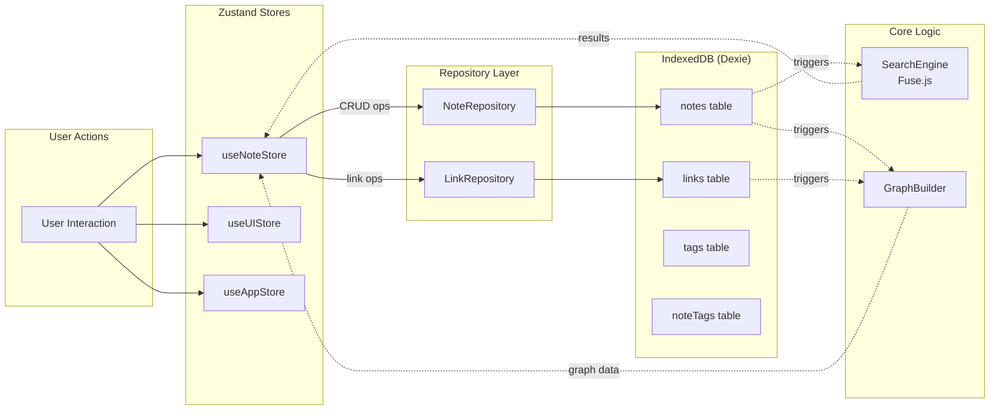

# Frontend Architecture

> **Last updated:** 2026-04-14
> **Scope:** `src/` directory — React SPA for AKL's Knowledge (Monolithic Lexicon)

## Overview

The frontend is a **React 19 SPA** built with Vite, serving as a read-only dashboard that visualizes opencode AI session data (agents, skills, configs, sessions, topics) from local markdown files. It also provides a **note-taking subsystem** with IndexedDB persistence, wikilink support, and a knowledge graph visualization.

The app communicates with a local Express API server (`http://127.0.0.1:3001`) and uses WebSocket for real-time file change notifications.

**Tech stack:** React 19, Vite, TypeScript, Tailwind CSS 4, Zustand, Dexie (IndexedDB), TipTap, React Router 7, Fuse.js

---

## Architecture Diagram

```mermaid
graph TB
    subgraph "Entry Point"
        main["main.tsx<br/>React Root + BrowserRouter"]
    end

    subgraph "App Shell (App.tsx)"
        TopBar["TopBar"]
        Sidebar["Sidebar"]
        Breadcrumbs["Breadcrumbs"]
        StatusBar["StatusBar"]
        Routes["React Router Routes"]
        GraphOverlay["Graph Overlay<br/>(full-screen)"]
    end

    subgraph "State Management"
        AppStore["useAppStore<br/>(dataRoot, config, loading)"]
        NoteStore["useNoteStore<br/>(notes CRUD, tags, PARA)"]
        UIStore["useUIStore<br/>(panels, overlays, focus mode)"]
    end

    subgraph "Storage Layer"
        Dexie["Dexie / IndexedDB<br/>SecondBrainDB"]
        NoteRepo["NoteRepository"]
        LinkRepo["LinkRepository"]
    end

    subgraph "API Layer"
        APIClient["api.ts<br/>fetch wrapper"]
        useApi["useApi hook<br/>loading/error/refetch"]
        FileWatcher["useFileWatcher<br/>WebSocket"]
    end

    subgraph "Core Logic"
        SearchEngine["SearchEngine<br/>(Fuse.js)"]
        GraphBuilder["GraphBuilder<br/>(notes → nodes/edges)"]
        BacklinkIndexer["BacklinkIndexer"]
        LinkResolver["LinkResolver"]
    end

    subgraph "Editor"
        TipTap["TipTap Editor<br/>useNoteEditor"]
        Wikilink["Wikilink Extension<br/>(ProseMirror plugin)"]
    end

    subgraph "Pages (15 routes)"
        SessionsPage
        SessionDetailPage
        AgentsPage
        AgentDetailPage
        SkillsPage
        SkillDetailPage
        TopicsPage
        TopicDetailPage
        ConfigsPage
        StatsPage
        MigrationPage
        SetupPage
        OpenCodePage
        NotFoundPage
    end

    subgraph "Component Libraries"
        Layout["layout/<br/>TopBar, Sidebar, StatusBar,<br/>Breadcrumbs, RightPanel,<br/>NoteInfoPanel, OutlinePanel,<br/>BacklinksPanel"]
        Sessions["sessions/<br/>SessionCard, SessionFilters"]
        Graph["graph/<br/>UnifiedGraph, GraphControls,<br/>GraphLegend"]
        Editor["editor/<br/>NoteEditor, WikilinkSuggestion"]
        Search["search/<br/>CommandPalette, SearchBar"]
        Shared["shared/<br/>MarkdownRenderer, EmptyState,<br/>LoadingSkeleton, StatusBadge,<br/>ShortcutHelp, Icon, AgentIcons"]
        Knowledge["knowledge/<br/>KnowledgeBadge, SnippetCard,<br/>SnippetsList"]
        Vaults["vaults/<br/>VaultManager, SyncPreviewModal"]
        OpenCode["opencode/<br/>HubSummaryCard, RecentActivityFeed"]
    end

    main --> App
    App --> TopBar
    App --> Sidebar
    App --> Breadcrumbs
    App --> Routes
    App --> StatusBar
    App --> GraphOverlay

    Routes --> SessionsPage
    Routes --> SessionDetailPage
    Routes --> AgentsPage
    Routes --> AgentDetailPage
    Routes --> SkillsPage
    Routes --> SkillDetailPage
    Routes --> TopicsPage
    Routes --> TopicDetailPage
    Routes --> ConfigsPage
    Routes --> StatsPage
    Routes --> MigrationPage
    Routes --> SetupPage
    Routes --> OpenCodePage
    Routes --> NotFoundPage

    App -. reads .-> AppStore
    App -. reads .-> UIStore
    Pages -. use .-> useApi
    Pages -. use .-> AppStore
    Pages -. use .-> UIStore
    Pages -. use .-> NoteStore

    useApi --> APIClient
    APIClient -. HTTP .-> Server["Express API<br/>127.0.0.1:3001"]
    FileWatcher -. WS .-> Server

    NoteStore --> NoteRepo
    NoteStore --> LinkRepo
    NoteRepo --> Dexie
    LinkRepo --> Dexie

    NoteStore -. uses .-> SearchEngine
    NoteStore -. uses .-> GraphBuilder
    GraphBuilder --> Dexie

    TipTap --> Wikilink
    NoteStore -. active note .-> TipTap
```



---

## Component Hierarchy and Dependency Map

### App Shell

```
<App> (App.tsx)
├── <TopBar>                          — Global header with search, nav, actions
├── <div flex-1>
│   ├── <Sidebar>                     — Collapsible navigation rail
│   └── <main>
│       ├── <Breadcrumbs>             — Route-based breadcrumb trail
│       └── <div overflow-y-auto>
│           └── <Routes>              — 15 route definitions (see Routing section)
├── <StatusBar>                       — Footer with watcher status, session count
└── <Graph Overlay> (conditional)     — Full-screen knowledge graph view
    ├── <GraphLegend>
    └── <UnifiedGraph>
```

### Component Groups

| Group | Directory | Components | Purpose |
|-------|-----------|------------|---------|
| **Layout** | `components/layout/` | `TopBar`, `Sidebar`, `StatusBar`, `Breadcrumbs`, `RightPanel`, `NoteInfoPanel`, `OutlinePanel`, `BacklinksPanel` | Shell chrome and session detail panels |
| **Sessions** | `components/sessions/` | `SessionCard`, `SessionFilters` | Session list rendering and filtering |
| **Graph** | `components/graph/` | `UnifiedGraph`, `GraphControls`, `GraphLegend` | Knowledge graph visualization |
| **Editor** | `components/editor/` | `NoteEditor`, `WikilinkSuggestion` | TipTap-based note editing |
| **Search** | `components/search/` | `CommandPalette`, `SearchBar` | Global search and command palette |
| **Knowledge** | `components/knowledge/` | `KnowledgeBadge`, `KnowledgeSnippetCard`, `KnowledgeSnippetsList` | Extracted knowledge display |
| **Vaults** | `components/vaults/` | `VaultManager`, `SyncPreviewModal` | Multi-vault management UI |
| **OpenCode** | `components/opencode/` | `HubSummaryCard`, `RecentActivityFeed` | OpenCode hub integration |
| **Shared** | `components/shared/` | `MarkdownRenderer`, `EmptyState`, `LoadingSkeleton`, `StatusBadge`, `ShortcutHelp`, `Icon`, `MaterialIcon`, `AgentIcons`, `ArticleOutline` | Reusable UI primitives |

### Page Component Pattern

Pages follow a consistent pattern:

```tsx
export default function SomePage() {
  // 1. Fetch data via useApi hook
  const { data, loading, error, refetch } = useApi(
    () => api.someEndpoint.list(params),
    [deps]
  );

  // 2. Handle loading/error states
  if (loading) return <LoadingSkeleton lines={10} />;
  if (error) return <EmptyState title="Error" description={error.message} />;

  // 3. Render content with optional right panel
  return (
    <div className="flex h-full">
      <section className="flex-1">...</section>
      <aside className="w-80">...</aside>  // optional
    </div>
  );
}
```

---

## State Management Flow (Zustand + IndexedDB)

### Three Zustand Stores

#### 1. `useAppStore` — Application Configuration

| Field | Type | Persistence | Purpose |
|-------|------|-------------|---------|
| `dataRoot` | `string \| null` | `localStorage` (`akl-data-root`) | Path to knowledge base directory |
| `isConfigured` | `boolean` | Derived from `dataRoot` | Guards main app vs setup page |
| `isLoading` | `boolean` | In-memory | Global loading indicator |
| `error` | `string \| null` | In-memory | Global error message |
| `sessionCount` | `number` | In-memory | Displayed in status bar |
| `watcherStatus` | `'watching' \| 'error' \| 'idle'` | In-memory | WebSocket connection status |

**Key decision:** `dataRoot` is persisted to `localStorage` so the app remembers the configured path across sessions. The `isConfigured` flag gates whether the user sees `SetupPage` or the main dashboard.

#### 2. `useNoteStore` — Note Management

| Field | Type | Purpose |
|-------|------|---------|
| `notes` | `NoteRecord[]` | All non-deleted notes (loaded from IndexedDB) |
| `activeNoteId` | `string \| null` | Currently selected note for editing |
| `isLoading` | `boolean` | Note loading state |
| `selectedParaCategory` | `ParaCategory \| 'all' \| null` | PARA filter for note list |
| `searchQuery` | `string` | Note search filter |
| `lastDeletedNote` | `NoteRecord \| null` | Supports undo-delete |

**Actions:** `loadNotes`, `selectNote`, `createNote`, `updateNote`, `deleteNote`, `undoDelete`, `addTag`, `removeTag`, `setParaCategory`, `setSearchQuery`

**Flow:** Store actions delegate to `NoteRepository` / `LinkRepository` which operate on Dexie/IndexedDB. The store then updates its in-memory array to keep the UI in sync.

#### 3. `useUIStore` — UI State

| Field | Type | Purpose |
|-------|------|---------|
| `sidebarOpen` | `boolean` | Sidebar visibility |
| `rightPanelOpen` | `boolean` | Right panel visibility |
| `rightPanelTab` | `'info' \| 'backlinks' \| 'graph' \| 'outline'` | Active right panel tab |
| `focusMode` | `boolean` | Distraction-free mode |
| `commandPaletteOpen` | `boolean` | Command palette visibility |
| `shortcutHelpOpen` | `boolean` | Keyboard shortcut help overlay |
| `graphOverlayOpen` | `boolean` | Full-screen graph overlay |

### IndexedDB Schema (Dexie)

```
SecondBrainDB (Dexie)
├── notes
│   ├── Primary key: id (string)
│   ├── Indexed: title, createdAt, updatedAt, paraCategory, isDeleted
│   └── Soft-delete via isDeleted flag
├── links
│   ├── Primary key: id (string)
│   ├── Indexed: fromNoteId, toNoteId, type
│   └── Types: 'wikilink' | 'backlink' | 'explicit'
├── tags
│   ├── Primary key: id (string)
│   └── Indexed: name
└── noteTags (composite)
    ├── Primary key: [noteId + tagId]
    └── Indexed: noteId, tagId
```

### State Flow Diagram



---

## Routing Structure

### Route Table

| Path | Component | Layout | Description |
|------|-----------|--------|-------------|
| `/` | `Navigate → /sessions` | — | Redirect to sessions |
| `/sessions` | `SessionsPage` | List + right panel | Paginated session list with filters |
| `/sessions/:id` | `SessionDetailPage` | Article + right rail | Session markdown content, metadata, knowledge |
| `/migration` | `MigrationPage` | Full width | SQLite → markdown migration wizard |
| `/agents` | `AgentsPage` | Left rail + grid | Agent registry with tier filtering |
| `/agents/:slug` | `AgentDetailPage` | Article + right rail | Agent details and usage |
| `/skills` | `SkillsPage` | Left rail + grid | Skill registry |
| `/skills/:slug` | `SkillDetailPage` | Article + right rail | Skill details and usage |
| `/topics` | `TopicsPage` | List | Topic listing |
| `/topics/:slug` | `TopicDetailPage` | Article + right rail | Topic details and related sessions |
| `/configs` | `ConfigsPage` | Full width | Configuration viewer |
| `/stats` | `StatsPage` | Dashboard | Analytics with time range selector |
| `/opencode` | `OpenCodePage` | Full width | OpenCode hub summary |
| `*` | `NotFoundPage` | Centered | 404 fallback |

### Setup Gate

The `App` component checks `isConfigured` from `useAppStore`. If `false`, it renders `<SetupPage />` directly (no shell chrome). Once a valid data root is configured, the full shell with sidebar, top bar, and routes becomes available.

### Keyboard Navigation

The app implements a **vim-style `g+key` navigation** pattern:

| Shortcut | Route |
|----------|-------|
| `g s` | `/sessions` |
| `g a` | `/agents` |
| `g k` | `/skills` |
| `g t` | `/topics` |
| `g c` | `/configs` |
| `g d` | `/stats` |
| `g m` | `/migration` |
| `g o` | `/opencode` |

Additional shortcuts (from `useKeyboardShortcuts`):

| Shortcut | Action |
|----------|--------|
| `Cmd/Ctrl + K` | Toggle command palette |
| `Cmd/Ctrl + N` | Create new note |
| `Cmd/Ctrl + \` | Toggle sidebar |
| `Cmd/Ctrl + /` | Toggle right panel |
| `Cmd/Ctrl + .` | Toggle focus mode |
| `Cmd/Ctrl + Shift + ?` | Toggle shortcut help |
| `g` (alone) | Toggle graph overlay |
| `Escape` | Close overlays |

---

## API Service (`api.ts`)

The API client is a **namespace-organized fetch wrapper** that communicates with the Express backend at `http://127.0.0.1:3001` (configurable via `VITE_API_BASE` env var).

### Architecture

```
api.ts
├── ApiError class          — Typed error with code, message, details
├── request<T>()            — Core fetch function with JSON parsing + error handling
├── buildQuery()            — Query string builder (filters undefined values)
└── api namespace
    ├── config              — dataRoot get/set/validate
    ├── sessions            — list, meta, get
    ├── agents              — list, get
    ├── skills              — list, get
    ├── topics              — list, categories, get
    ├── configs             — list, get
    ├── stats               — summary, timeline, byAgent, topTags
    ├── search              — query, indexStatus, rebuild
    ├── vaults              — list, add, remove, preview, sync
    ├── migration           — start, status, report
    ├── knowledge           — list, bySession, stats
    ├── graph               — get
    └── backlinks           — getSession, getTopic, getAgentUsedIn, getSkillUsedIn
```

### `useApi` Hook

A generic data-fetching hook that provides:

```typescript
interface UseApiResult<T> {
  data: T | null;
  loading: boolean;
  error: ApiError | null;
  refetch: () => Promise<void>;
}
```

Usage pattern: `const { data, loading, error, refetch } = useApi(() => api.sessions.list(), [deps])`

### WebSocket File Watcher

`useFileWatcher` connects to `ws://127.0.0.1:3001/ws/files` and provides:
- Connection status (`connected` | `disconnected` | `error`)
- Last file change event (`type`, `path`)
- `registerOnChange(callback)` for triggering data refreshes
- Auto-reconnect with 5-second delay on disconnect

---

## Core Logic Modules

### Note System (`src/core/note/`)

| Module | Purpose |
|--------|---------|
| `note.ts` | Type definitions: `NoteRecord`, `LinkRecord`, `TagRecord`, `NoteTagRecord`, `ParaCategory` |
| `graph-builder.ts` | Converts notes + links into `GraphData` (nodes, edges, adjacency map) |
| `link-resolver.ts` | Resolves wikilinks to note IDs |
| `backlink-indexer.ts` | Builds backlink relationships between notes |
| `force-simulation.ts` | Force-directed layout for graph visualization |

### Search Engine (`src/core/search/`)

| Module | Purpose |
|--------|---------|
| `search-engine.ts` | Fuse.js-based fuzzy search over notes (title: 0.6, content: 0.3, tags: 0.1) |

### PARA Categories

Notes are organized using the **PARA method**:
- **Projects** — Active, time-bound efforts
- **Areas** — Ongoing responsibilities
- **Resources** — Reference material
- **Archives** — Completed/inactive items

Each category has a distinct color for visual differentiation in the UI.

---

## Editor Configuration

### TipTap Setup (`src/editor/`)

```
editor-config.ts
├── useNoteEditor() hook
│   ├── StarterKit (headings H1-H3)
│   ├── Placeholder extension
│   └── Wikilink extension (custom)
└── extensions/
    └── wikilink.ts — Custom TipTap node
        ├── ProseMirror plugin for click handling
        ├── Decoration for resolved/unresolved styling
        ├── insertWikilink command
        └── Renders as [[displayText]] spans
```

The Wikilink extension is a **custom TipTap node** that:
- Renders `[[link]]` syntax as styled `<span>` elements
- Supports resolved/unresolved states (linked note exists or not)
- Handles click events to navigate to linked notes
- Integrates with `WikilinkSuggestion` component for autocomplete

---

## Key Decisions and Patterns

### 1. Read-Only App for Session Data, Write-Capable for Notes

Session/topic/agent/skill data is **read-only** — it comes from the Express API which parses markdown files. Notes are **user-writable** and stored in IndexedDB via Dexie. This separation keeps the opencode session data authoritative while allowing user annotations.

### 2. Zustand for State, Dexie for Persistence

Zustand stores hold in-memory state for reactivity. The note store delegates persistence to repository classes that operate on Dexie/IndexedDB. This creates a clean separation: stores handle UI state, repositories handle data persistence.

### 3. Soft Delete Pattern

Notes use an `isDeleted` flag rather than hard deletion. This enables undo functionality (`undoDelete` action) and prevents accidental data loss.

### 4. Composite Key for Note-Tag Junction

The `noteTags` table uses a Dexie compound index `[noteId+tagId]` for efficient many-to-many lookups, following relational database best practices.

### 5. Fuse.js for Client-Side Search

Search uses Fuse.js with weighted keys (title > content > tags) for fast, fuzzy client-side search without requiring server round-trips.

### 6. Graph Data Built from Notes + Links

The knowledge graph is constructed client-side from IndexedDB data (notes and wikilinks), separate from the server-side graph API that connects sessions/topics/agents/skills.

### 7. Keyboard-First Navigation

The app supports extensive keyboard shortcuts, including vim-style `g+key` navigation and standard `Cmd/Ctrl` shortcuts, enabling power-user workflows.

### 8. Setup Gate Pattern

The app checks configuration state before rendering the main shell. Unconfigured users see only the setup page, preventing broken UI states.

---

## Gotchas

1. **API base URL** is configured via `VITE_API_BASE` environment variable, defaulting to `http://127.0.0.1:3001`. The server must be running for the app to function.

2. **WebSocket URL** is hardcoded to `ws://127.0.0.1:3001/ws/files` in `useFileWatcher`. If the server runs on a different port, the watcher will fail silently (status becomes `error`).

3. **`dataRoot` persistence** uses `localStorage` key `akl-data-root`. Clearing browser storage will reset the configuration and show the setup page again.

4. **Note store loads all notes** into memory via `noteRepository.getAll()`. For large note collections, this could impact performance. The `getRecent(limit)` method exists but is not currently used by the store.

5. **Search engine is not automatically re-indexed** when notes change. The `SearchEngine` singleton must be manually re-indexed via `indexNotes(notes)`.

6. **Graph overlay uses `window.innerWidth/Height`** directly for dimensions, which won't update on resize. The graph is only rendered when the overlay opens.

7. **`useApi` hook has an eslint-disable** for `react-hooks/exhaustive-deps` because the `fetcher` function reference changes on every render. Callers should ensure `deps` accurately reflect when to refetch.

8. **Soft-deleted notes** are filtered at the repository level (`getAll`, `getRecent`, `getByParaCategory`, `searchByTitle`) but `getById` does not filter — it can return deleted notes.

9. **TipTap editor content** is stored as HTML strings in IndexedDB. The `useOutline` hook parses this HTML with `DOMParser` to extract headings — this is a client-side operation that runs on every active note change.

10. **Keyboard shortcuts** in `App.tsx` (`g+key` navigation) and `useKeyboardShortcuts.ts` (Cmd/Ctrl shortcuts) are implemented separately. The `g` key handler in `App.tsx` uses a two-key sequence pattern, while `useKeyboardShortcuts` handles modifier-based shortcuts.

---

## Related Documentation

- [Backend Architecture](./backend-architecture.md) — Express API server, file watcher, markdown parser
- [Server API Routes](./api-routes.md) — All `/api/` endpoints
- [Data Flow](./data-flow.md) — opencode CLI → markdown files → API → React dashboard
- [Type Definitions](./type-definitions.md) — TypeScript types for sessions, agents, skills, topics
