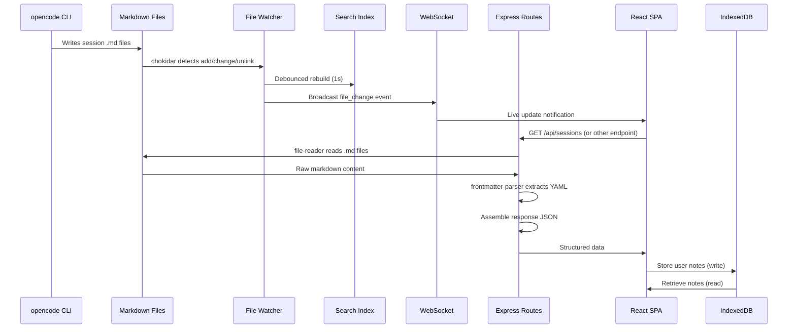

# Full System Architecture — AKL's Knowledge

## Overview and Purpose

**AKL's Knowledge** is a read-only React dashboard that visualizes opencode AI session data from local markdown files. The system acts as a discovery and visualization layer — it never creates or modifies session data. Content is produced by the opencode CLI, which writes markdown files to a configurable data root directory. This application reads those files, parses their frontmatter and body content, and exposes them through a REST API and WebSocket-powered React SPA.

**Version:** 0.1.0

---

## Architecture Diagram

```mermaid
graph TB
    subgraph "External"
        OC[opencode CLI]
        MD[(Markdown Files)]
    end

    subgraph "CLI Layer (bin/ + cli/lib/)"
        CLI[akl.js Entry]
        ARGS[args.js - Arg Parser]
        PORT[port-check.js - Port Checker]
        SRV[server.js - Server Starter]
        BROW[browser.js - Browser Opener]
        SHUT[shutdown.js - Graceful Shutdown]
    end

    subgraph "Server Layer (server/)"
        IDX[index.ts - createApp/createServer]
        CFG[config.ts - Data Root Config]
        
        subgraph "Middleware"
            VAL[validate-root.ts]
            ERR[error-handler.ts]
        end

        subgraph "Services"
            FW[file-watcher.ts - chokidar + WS]
            SI[search-index.ts - Fuse.js]
            FR[file-reader.ts - FS ops]
            FP[frontmatter-parser.ts - YAML]
            KE[knowledge-extractor.ts]
            GB[graph-builder.ts]
            BC[backlink-computer.ts]
            ME[migration-engine.ts]
            SE[sync-engine.ts]
            FH[file-hasher.ts]
        end

        subgraph "Routes /api/*"
            R_CFG[config]
            R_VLT[vaults]
            R_MIG[migrate]
            R_SES[sessions]
            R_AGT[agents]
            R_SKL[skills]
            R_CFGC[configs]
            R_STS[stats]
            R_TOP[topics]
            R_SRCH[search]
            R_KNOW[knowledge]
            R_GRAPH[graph]
            R_BL[backlinks]
        end
    end

    subgraph "Frontend (src/)"
        MAIN[main.tsx - React Entry]
        APP[App.tsx - Router + Layout]
        
        subgraph "State"
            ZS[app-store.ts - Zustand]
            ZU[ui-store.ts - Zustand]
        end

        subgraph "Storage"
            DEX[db.ts - Dexie IndexedDB]
        end

        subgraph "Services"
            API[api.ts - REST Client]
        end

        subgraph "Hooks"
            UAPI[useApi.ts]
        end

        subgraph "Routes/Pages"
            P_SETUP[SetupPage]
            P_SES[SessionsPage]
            P_SESD[SessionDetailPage]
            P_AGT[AgentsPage]
            P_AGTD[AgentDetailPage]
            P_SKL[SkillsPage]
            P_SKLD[SkillDetailPage]
            P_TOP[TopicsPage]
            P_TOPD[TopicDetailPage]
            P_CFG[ConfigsPage]
            P_STS[StatsPage]
            P_MIG[MigrationPage]
            P_OC[OpenCodePage]
        end

        subgraph "Components"
            C_TOP[TopBar]
            C_SID[Sidebar]
            C_STAT[StatusBar]
            C_BC[Breadcrumbs]
            C_GRAPH[UnifiedGraph - D3]
        end
    end

    OC -->|writes| MD
    MD -->|chokidar watches| FW
    FW -->|triggers rebuild| SI
    FW -->|broadcasts via WS| API

    CLI --> ARGS
    CLI --> PORT
    CLI --> SRV
    CLI --> BROW
    CLI --> SHUT
    SRV --> IDX

    IDX --> CFG
    IDX --> VAL
    IDX --> ERR
    IDX --> FW
    IDX --> SI
    IDX --> R_CFG
    IDX --> R_VLT
    IDX --> R_MIG
    IDX --> R_SES
    IDX --> R_AGT
    IDX --> R_SKL
    IDX --> R_CFGC
    IDX --> R_STS
    IDX --> R_TOP
    IDX --> R_SRCH
    IDX --> R_KNOW
    IDX --> R_GRAPH
    IDX --> R_BL

    R_SES --> FR
    R_SES --> FP
    R_AGT --> FR
    R_AGT --> FP
    R_SKL --> FR
    R_SKL --> FP
    R_TOP --> FR
    R_TOP --> FP
    R_CFGC --> FR
    R_CFGC --> FP
    R_SRCH --> SI
    R_KNOW --> KE
    R_GRAPH --> GB
    R_BL --> BC

    VAL --> CFG
    FR --> CFG

    API --> IDX
    API --> ZS
    UAPI --> API

    APP --> ZS
    APP --> ZU
    APP --> C_TOP
    APP --> C_SID
    APP --> C_STAT
    APP --> C_BC
    APP --> C_GRAPH
    APP --> P_SETUP
    APP --> P_SES
    APP --> P_SESD
    APP --> P_AGT
    APP --> P_AGTD
    APP --> P_SKL
    APP --> P_SKLD
    APP --> P_TOP
    APP --> P_TOPD
    APP --> P_CFG
    APP --> P_STS
    APP --> P_MIG
    APP --> P_OC

    MAIN --> APP
    MAIN --> ZS
    MAIN --> ZU
    MAIN --> DEX
```



---

## Component and Dependency Map

### 1. CLI Layer (`bin/` + `cli/lib/`)

| Module | Responsibility | Dependencies |
|--------|---------------|--------------|
| `bin/akl.js` | Main entry point; orchestrates startup flow | All `cli/lib/*` modules |
| `cli/lib/args.js` | Parses CLI flags (`--port`, `--no-open`, `--data-root`, `--help`, `--version`) | None (stdlib only) |
| `cli/lib/port-check.js` | Checks port availability via `net.createServer`; probes for existing AKL server via HTTP GET to `/api/config/data-root` | `net`, `http` |
| `cli/lib/server.js` | Validates data root, imports `createServer()` from `server/index.ts`, starts HTTP listener | `server/index.ts`, `server/config.ts` |
| `cli/lib/browser.js` | Opens system default browser (platform-specific: `open`/`start`/`xdg-open`) | `child_process`, `os` |
| `cli/lib/shutdown.js` | Graceful shutdown on SIGINT/SIGTERM with 5s force-exit timeout | None (stdlib only) |

### 2. Server Layer (`server/`)

#### Entry Point (`server/index.ts`)

Exports two factory functions:

- **`createApp()`** — Creates the Express application with middleware and routes. Does NOT start listening.
- **`createServer()`** — Creates app + HTTP server + initializes file watcher (WebSocket) + builds search index. Does NOT start listening.

Also includes a legacy direct-run entry point (when executed via `npx tsx index.ts`).

#### Configuration (`server/config.ts`)

- **In-memory config**: `port` (default 3001), `host` (`127.0.0.1`), `dataRoot` (nullable)
- **Persistence**: `server/.data-root.json` stores `dataRoot` path and `vaults` array
- **Functions**: `getDataRoot()`, `setDataRoot()`, `clearDataRoot()`, `getVaults()`, `addVault()`, `removeVault()`

#### Middleware

| Middleware | Purpose |
|-----------|---------|
| `validateRootMiddleware` | Guards routes that require a configured data root; returns 400 if not set or invalid |
| `errorHandler` | Global error handler; formats `FileError` instances with proper HTTP status codes; returns structured `ApiErrorResponse` |

#### Services

| Service | Purpose | Key Dependencies |
|---------|---------|-----------------|
| `file-watcher.ts` | chokidar watcher on data root; broadcasts file changes via WebSocket (`/ws/files`); debounced search index rebuild (1s) | chokidar, ws, search-index |
| `search-index.ts` | Fuse.js full-text search index; indexes sessions, agents, skills, topics, configs with weighted fields | fuse.js, file-reader, frontmatter-parser |
| `file-reader.ts` | Safe filesystem operations with path traversal protection; `readFile`, `listFiles`, `fileExists`, `validateDirectory` | fs/promises, path |
| `frontmatter-parser.ts` | Extracts YAML frontmatter from markdown; returns `{ frontmatter, body }` | js-yaml |
| `knowledge-extractor.ts` | Parses `## Key Findings`, `## Files Modified`, `## Next Steps` sections into structured snippets | None |
| `graph-builder.ts` | Builds unified graph (nodes + edges) from all entity types for D3 visualization | file-reader, frontmatter-parser |
| `backlink-computer.ts` | Computes backlinks between sessions, topics, agents, and skills | file-reader, frontmatter-parser |
| `migration-engine.ts` | Migrates SQLite database to markdown file format | better-sqlite3 |
| `sync-engine.ts` | Vault synchronization engine | file-reader, file-hasher |
| `file-hasher.ts` | File content hashing for change detection | crypto |

#### API Routes

All routes return a standardized response format:

```typescript
// Success
{ success: true, data: T, meta?: { timestamp, ... } }

// Error
{ success: false, error: { code: ErrorCode, message: string, details?: object } }
```

| Route Prefix | Middleware | Description |
|-------------|-----------|-------------|
| `/api/config` | None | Get/set/validate data root |
| `/api/vaults` | None | Vault CRUD and sync operations |
| `/api/migrate` | None | SQLite-to-markdown migration |
| `/api/sessions` | `validateRootMiddleware` | List (paginated, filtered), meta, get by ID |
| `/api/agents` | `validateRootMiddleware` | List and get by slug |
| `/api/skills` | `validateRootMiddleware` | List and get by slug |
| `/api/configs` | `validateRootMiddleware` | List and get by slug |
| `/api/stats` | `validateRootMiddleware` | Summary, timeline, by-agent, top-tags |
| `/api/topics` | `validateRootMiddleware` | List, categories, get by slug |
| `/api/search` | `validateRootMiddleware` | Full-text search, index status, rebuild |
| `/api/knowledge` | `validateRootMiddleware` | Knowledge snippets (findings, files, actions) |
| `/api/graph` | `validateRootMiddleware` | Unified graph nodes and edges |
| `/api/backlinks` | `validateRootMiddleware` | Backlinks for sessions, topics, agents, skills |

#### Static File Serving

- Express serves `dist/` (built SPA) via `express.static()`
- SPA fallback: `app.get('*', ...)` serves `dist/index.html` for all non-API routes
- CORS middleware allows requests from `localhost` and `127.0.0.1` origins

### 3. Frontend Layer (`src/`)

#### Entry Point (`src/main.tsx`)

Minimal bootstrap: React 19 + StrictMode + BrowserRouter → `<App />`.

#### App Shell (`src/routes/App.tsx`)

- **Layout**: TopBar → Sidebar + Main Content (with Breadcrumbs) → StatusBar
- **Routing**: React Router 7 with 14 routes (see Routes table below)
- **Configuration gate**: Shows `SetupPage` if `isConfigured` is false
- **Keyboard shortcuts**: `g+s`, `g+a`, `g+k`, `g+t`, `g+c`, `g+d`, `g+m`, `g+o` for navigation
- **Graph overlay**: Full-screen D3 graph with legend

#### State Management

| Store | Library | Purpose |
|-------|---------|---------|
| `app-store.ts` | Zustand | Data root path, configuration status, loading state, session count, watcher status. Persists `dataRoot` to `localStorage`. |
| `ui-store.ts` | Zustand | Sidebar state, right panel (info/backlinks/graph/outline), focus mode, command palette, shortcut help, graph overlay |

#### Storage

| Module | Library | Purpose |
|--------|---------|---------|
| `db.ts` | Dexie (IndexedDB) | **Notes only** — stores user-created notes, links, tags, and note-tag associations. NOT used for session/topic/agent data. |

Schema:
```
notes: id, title, createdAt, updatedAt, paraCategory, isDeleted
links: id, fromNoteId, toNoteId, type
tags: id, name
noteTags: [noteId+tagId], noteId, tagId
```

#### API Client (`src/services/api.ts`)

Typed REST client with:
- `ApiError` class with error codes
- Configurable `API_BASE` (default: `http://127.0.0.1:3001`, overridable via `VITE_API_BASE` env var)
- Query string builder for filter parameters
- Namespaced API methods: `config`, `sessions`, `agents`, `skills`, `topics`, `configs`, `stats`, `search`, `vaults`, `migration`, `knowledge`, `graph`, `backlinks`

#### Hook (`src/hooks/useApi.ts`)

Generic data-fetching hook returning `{ data, loading, error, refetch }`.

#### Pages/Routes

| Route | Component | Description |
|-------|-----------|-------------|
| `/` | → `/sessions` | Redirect |
| `/sessions` | SessionsPage | Paginated, filterable session list |
| `/sessions/:id` | SessionDetailPage | Full session content with markdown rendering |
| `/agents` | AgentsPage | Agent list |
| `/agents/:slug` | AgentDetailPage | Agent detail with backlinks |
| `/skills` | SkillsPage | Skill list |
| `/skills/:slug` | SkillDetailPage | Skill detail with backlinks |
| `/topics` | TopicsPage | Topic list with categories |
| `/topics/:slug` | TopicDetailPage | Topic detail with backlinks |
| `/configs` | ConfigsPage | opencode config file viewer |
| `/stats` | StatsPage | Usage statistics and charts |
| `/migration` | MigrationPage | SQLite migration wizard |
| `/opencode` | OpenCodePage | opencode session viewer |
| `*` | NotFoundPage | 404 page |

#### Key Components

| Component | Purpose |
|-----------|---------|
| `TopBar` | Application header with search, navigation, graph toggle |
| `Sidebar` | Collapsible navigation panel |
| `StatusBar` | Bottom status bar showing watcher status, session count |
| `Breadcrumbs` | Current page breadcrumb navigation |
| `UnifiedGraph` | D3-based force-directed graph visualization |
| `GraphLegend` | Graph node type color legend |

---

## Data Flow

### Complete End-to-End Flow



### File System Structure (Data Root)

```
<data-root>/
├── sessions/
│   ├── 2024-01-15-abc123.md
│   └── ...
├── agents/
│   ├── orchestrator.md
│   └── ...
├── skills/
│   ├── flutter.md
│   └── ...
├── topics/
│   ├── state-management.md
│   └── ...
└── configs/
    ├── .opencode.json
    └── ...
```

Each markdown file contains YAML frontmatter with metadata and a markdown body with content.

### Session Markdown Format

```yaml
---
id: "abc123"
slug: "2024-01-15-abc123"
title: "Implement user authentication"
agent: "fixer"
model: "gpt-4"
createdAt: "2024-01-15T10:30:00Z"
status: "completed"
tags: ["auth", "backend"]
tokens:
  input: 1500
  output: 800
  reasoning: 200
  total: 2500
cost: 0.05
duration: 120
relatedSessions: ["def456"]
---

## Key Findings
- Finding 1
- Finding 2

## Files Modified
- src/auth.ts
- src/middleware.ts

## Next Steps
- Add rate limiting
- Write integration tests

[Full session content...]
```

---

## Key Decisions and Patterns

### 1. Read-Only Architecture
The application never writes session, topic, agent, or skill data. It only reads from markdown files. The only write operations are:
- User notes in IndexedDB (frontend)
- Data root configuration in `server/.data-root.json`
- Migration output (when explicitly triggered by user)

### 2. Local-First, No External Network Calls
- API binds to `127.0.0.1` only
- No external API calls from the server
- All data sourced from local filesystem

### 3. Dual TypeScript Configuration
- **Root `tsconfig.json`**: `moduleResolution: "bundler"` (frontend/Vite)
- **`server/tsconfig.json`**: `moduleResolution: "NodeNext"` (backend/Express)
- These are intentionally separate and must not be merged

### 4. Factory Pattern for Server
- `createApp()` and `createServer()` are exported factories
- The caller controls the HTTP server lifecycle
- Enables testing without starting a real server
- CLI imports from `server/index.js` (`.ts` resolved by `tsx` at runtime)

### 5. Path Traversal Protection
- `file-reader.ts` validates all file paths stay within the configured data root
- Uses `path.resolve()` + prefix matching with separator check
- Throws `FileError('PATH_TRAVERSAL')` for escape attempts

### 6. Debounced Index Rebuild
- File watcher uses a 1-second debounce for search index rebuilds
- Prevents excessive rebuilds during bulk file operations
- WebSocket broadcasts are immediate (no debounce)

### 7. Fuse.js Weighted Search
- Title: 0.5 weight
- Content: 0.3 weight
- Tags: 0.1 weight
- Agent: 0.05 weight
- Category: 0.05 weight
- Threshold: 0.4, includes score and matches

### 8. Standardized API Response Format
All responses follow a consistent envelope:
```typescript
{ success: boolean, data?: T, error?: { code, message, details }, meta?: object }
```

### 9. SPA Fallback Pattern
- Express serves static files from `dist/`
- All non-API routes fall back to `dist/index.html`
- Enables client-side routing with React Router

### 10. Port Collision Detection
- CLI probes port before starting
- HTTP probe to `/api/config/data-root` distinguishes AKL server from other processes
- If AKL is already running, just opens browser instead of failing

---

## Entry Points and Public APIs

### CLI Entry

```bash
akl                    # Start on port 3001, open browser
akl --port 4000        # Custom port
akl --no-open          # No browser
akl --data-root /path  # Custom data directory
akl --help             # Show help
akl --version          # Show version (0.1.0)
```

### npm Scripts

| Command | Description |
|---------|-------------|
| `npm run dev` | Start Vite dev server (frontend only) |
| `npm run build` | Typecheck + build SPA to `dist/` |
| `npm run preview` | Serve built SPA locally |
| `npm run akl` | Start full app via CLI (`tsx bin/akl.js`) |
| `npm test` | Run Vitest (watch mode) |
| `npm run test:coverage` | Run with v8 coverage |
| `cd server && npm run dev` | Start backend with `tsx watch` |
| `cd server && npm run typecheck` | Typecheck backend |

### Server Exports (`server/index.ts`)

```typescript
export function createApp(): express.Application
export async function createServer(options?: { port?: number }): Promise<{ app: express.Application; httpServer: http.Server }>
export default createApp
```

### Server Exports (`server/config.ts`)

```typescript
export function getConfig(): ServerConfig
export function getDataRoot(): string | null
export function setDataRoot(rootPath: string): void
export function clearDataRoot(): void
export function getVaults(): Vault[]
export function addVault(vault: Vault): void
export function removeVault(vaultId: string): boolean
export const config: ServerConfig
```

### Frontend Exports

```typescript
// src/services/api.ts
export const api: { config, sessions, agents, skills, topics, configs, stats, search, vaults, migration, knowledge, graph, backlinks }
export class ApiError

// src/state/app-store.ts
export const useAppStore: Zustand store

// src/state/ui-store.ts
export const useUIStore: Zustand store

// src/storage/db.ts
export const db: Dexie database instance

// src/hooks/useApi.ts
export function useApi<T>(fetcher, deps): { data, loading, error, refetch }
```

### WebSocket Endpoint

```
ws://127.0.0.1:3001/ws/files
```

Message format:
```json
{
  "type": "file_change",
  "event": "add" | "change" | "unlink",
  "path": "relative/path/from/data-root",
  "contentType": "sessions" | "agents" | "skills" | "topics" | "configs",
  "timestamp": "ISO-8601"
}
```

---

## Gotchas

1. **CLI imports `.js` from `.ts`**: `bin/akl.js` imports from `server/index.js` — this works because `tsx` handles `.ts` → `.js` resolution at runtime. Do not change these imports to `.ts`.

2. **`server/.data-root.json` vs data root directory**: The `.data-root.json` file in the `server/` directory is the **persistence file** for configuration. It is NOT the data root directory itself. The data root is a separate directory (default: `~/akl-knowledge`) that contains the markdown files.

3. **Dexie is for notes only**: The frontend uses Dexie (IndexedDB) exclusively for user-created notes, links, and tags. Sessions, topics, agents, and skills come from the REST API — they are NOT stored in IndexedDB.

4. **Tailwind CSS v4**: Uses `@tailwindcss/vite` plugin, not PostCSS. Configuration is different from Tailwind v3.

5. **Two TypeScript configs**: Root `tsconfig.json` (bundler resolution) and `server/tsconfig.json` (NodeNext resolution) are separate. Do not merge them.

6. **Search index limit**: Session indexing is capped at 500 files for performance (`search-index.ts` line 36).

7. **Port 3001 collision**: If port 3001 is in use, the CLI makes an HTTP probe to determine if it's an existing AKL server. If so, it opens the browser and exits. If not, it exits with error code 2.

8. **Read-only guarantee**: The application is designed to be read-only for session data. Never add write operations for sessions, topics, agents, or skills.

9. **SPA fallback order**: The error handler middleware must be registered BEFORE the static file serving and SPA fallback routes in `server/index.ts`.

10. **JSON body limit**: Set to 10mb to support migration file uploads. This is specified in the SRS.

---

## Related Documentation

| Document | Location |
|----------|----------|
| Project overview & conventions | `AGENTS.md` |
| Design specifications (graveyard) | `docs/specs/` |
| Server types | `server/types/` |
| Frontend types | `src/types/` |
| Test suite | `test/` |
| Server tests | `test/server/` |
| Seed script | `scripts/seed-notes.ts` |

---

## Technology Stack Summary

### Frontend (React SPA)

| Technology | Version | Purpose |
|-----------|---------|---------|
| React | 19 | UI framework |
| React Router | 7 | Client-side routing |
| Vite | 8 | Build tool + dev server |
| TypeScript | 6 | Type safety |
| Tailwind CSS | 4 | Styling |
| Zustand | 5 | State management |
| Dexie | 4 | IndexedDB wrapper (notes) |
| TipTap | 3 | Rich text editor (notes) |
| D3 | 7 | Graph visualization |
| Fuse.js | 7 | Client-side search (if needed) |
| marked | 18 | Markdown rendering |
| DOMPurify | 3 | HTML sanitization |
| date-fns | 4 | Date formatting |
| lucide-react | 1 | Icon library |
| @tanstack/react-virtual | 3 | Virtual scrolling |
| Vitest | 4 | Testing framework |

### Backend (Express API)

| Technology | Version | Purpose |
|-----------|---------|---------|
| Express | 4 | HTTP server |
| chokidar | 3 | File system watcher |
| ws | 8 | WebSocket server |
| better-sqlite3 | 11 | SQLite driver (migration) |
| Fuse.js | 7 | Full-text search index |
| js-yaml | 4 | YAML frontmatter parsing |
| tsx | 4 | TypeScript runtime |
