# Design: New Design System — Emoji to SVG Icon Migration

**Date:** 2026-04-12
**Status:** Draft
**Author:** Oracle
**Related Requirement:** `docs/ai/requirements/new-design-system.md`

---

## 1. Architecture Diagram

```mermaid
graph TB
    subgraph "Dependency"
        LUCIDE[(lucide-react<br/>npm package)]
    end

    subgraph "Icon Layer"
        MAP[Emoji-to-Icon<br/>Mapping Config]
        ICON[Icon Component<br/>src/components/shared/Icon.tsx]
    end

    subgraph "CSS Token Boundary (Preserved)"
        TOKENS[src/index.css<br/>sb-* tokens]
    end

    subgraph "Layout Components"
        SIDEBAR[Sidebar.tsx]
        TOPBAR[TopBar.tsx]
        RIGHTPANEL[RightPanel.tsx]
        NOTEINFO[NoteInfoPanel.tsx]
        BACKLINKS[BacklinksPanel.tsx]
        STATUSBAR[StatusBar.tsx]
    end

    subgraph "Search Components"
        SEARCHBAR[SearchBar.tsx]
        CMDPALETTE[CommandPalette.tsx]
    end

    subgraph "Shared Components"
        SHORTCUT[ShortcutHelp.tsx]
    end

    subgraph "Route Components"
        AGENTS[AgentsPage.tsx]
        AGENTDET[AgentDetailPage.tsx]
        SKILLS[SkillsPage.tsx]
    end

    LUCIDE -->|ESM imports| ICON
    MAP -->|lookup| ICON
    ICON -->|renders SVG<br/>currentColor| SIDEBAR
    ICON -->|renders SVG<br/>currentColor| TOPBAR
    ICON -->|renders SVG<br/>currentColor| RIGHTPANEL
    ICON -->|renders SVG<br/>currentColor| NOTEINFO
    ICON -->|renders SVG<br/>currentColor| BACKLINKS
    ICON -->|renders SVG<br/>currentColor| SEARCHBAR
    ICON -->|renders SVG<br/>currentColor| CMDPALETTE
    ICON -->|renders SVG<br/>currentColor| SHORTCUT
    ICON -->|renders SVG<br/>currentColor| AGENTS
    ICON -->|renders SVG<br/>currentColor| AGENTDET
    ICON -->|renders SVG<br/>currentColor| SKILLS

    TOKENS -.->|color via CSS<br/>no changes| SIDEBAR
    TOKENS -.->|color via CSS<br/>no changes| TOPBAR
    TOKENS -.->|color via CSS<br/>no changes| RIGHTPANEL
    TOKENS -.->|color via CSS<br/>no changes| NOTEINFO
    TOKENS -.->|color via CSS<br/>no changes| BACKLINKS
    TOKENS -.->|color via CSS<br/>no changes| SEARCHBAR
    TOKENS -.->|color via CSS<br/>no changes| CMDPALETTE
    TOKENS -.->|color via CSS<br/>no changes| SHORTCUT
    TOKENS -.->|color via CSS<br/>no changes| AGENTS
    TOKENS -.->|color via CSS<br/>no changes| AGENTDET
    TOKENS -.->|color via CSS<br/>no changes| SKILLS

    STATUSBAR -.->|colored div<br/>no icon| TOKENS

    style LUCIDE fill:#1a1a2e,color:#e6edf3
    style ICON fill:#16213e,color:#e6edf3
    style MAP fill:#16213e,color:#e6edf3
    style TOKENS fill:#0f3460,color:#e6edf3
```



**Key architectural decisions:**
- **Single Icon component** (`src/components/shared/Icon.tsx`) wraps all lucide-react imports, providing a consistent API with `name`, `size`, `color`, `ariaLabel`, and `ariaHidden` props.
- **CSS token boundary** (dashed lines) is preserved — `sb-*` tokens are untouched. Icons inherit color via `currentColor`, which flows from parent elements already using `sb-text`, `sb-text-secondary`, etc.
- **Tree-shaking** is achieved by importing individual icons by name, not the entire library.

---

## 2. Component Impact Analysis

### 2.1 Sidebar.tsx

| Location | Current Emoji | Semantic Meaning | Planned Lucide Icon |
|----------|--------------|-----------------|---------------------|
| Line 10 | `📋` | Sessions | `ClipboardList` |
| Line 11 | `👥` | Agents | `Users` |
| Line 12 | `🛠` | Skills | `Wrench` |
| Line 13 | `📚` | Topics | `BookOpen` |
| Line 14 | `⚙️` | Configs | `Settings` |
| Line 15 | `📊` | Stats | `BarChart3` |
| Line 16 | `🔄` | Migration | `ArrowLeftRight` |
| Line 39 | `☰` / `◀` | Collapse toggle | `PanelLeftClose` / `PanelLeftOpen` |
| Line 71 | `📁` | Data root folder | `FolderOpen` |
| Line 81-84 | `🟢`/`🔴`/`⚪` | Status indicators | Colored `div` with `border-radius: 50%` (NOT an icon — see Status Indicator Strategy below) |

**Import changes:** Replace `navItems` array's `icon: string` with `icon: React.ComponentType`. Add individual lucide imports.
**Structural changes:** The `<span className="text-base shrink-0">{item.icon}</span>` becomes `<Icon name={item.icon} size={16} />` or direct component render.

### 2.2 TopBar.tsx

| Location | Current Emoji | Semantic Meaning | Planned Lucide Icon |
|----------|--------------|-----------------|---------------------|
| Line 18 | `☰` | Hamburger menu | `PanelLeft` |
| Line 21 | `🧠` | Brain logo | `Brain` |
| Line 37 | `↻` | Refresh | `RefreshCw` |
| Line 43 | `⚙` | Settings | `Settings` |

**Import changes:** Add 4 individual lucide imports.
**Structural changes:** Replace inline emoji characters with `<Icon>` components. The brain logo in the `<h1>` should keep `aria-hidden="true"` since "AKL's Knowledge" text provides the label.

### 2.3 RightPanel.tsx

| Location | Current Emoji | Semantic Meaning | Planned Lucide Icon |
|----------|--------------|-----------------|---------------------|
| Line 10 | `ℹ️` | Info tab | `Info` |
| Line 11 | `🔗` | Links tab | `Link` |
| Line 12 | `⬡` | Graph tab | `Hexagon` |
| Line 13 | `📑` | Outline tab | `List` |

**Import changes:** Add 4 individual lucide imports.
**Structural changes:** The `TABS` array's `icon: string` becomes `icon: React.ComponentType`. Tab button renders `<Icon name={tab.icon} size={12} />` inline with label text.

### 2.4 SearchBar.tsx

| Location | Current Emoji | Semantic Meaning | Planned Lucide Icon |
|----------|--------------|-----------------|---------------------|
| Line 8 | `💬` | Session type | `MessageSquare` |
| Line 9 | `🤖` | Agent type | `Bot` |
| Line 10 | `🛠️` | Skill type | `Wrench` |
| Line 11 | `📚` | Topic type | `BookOpen` |
| Line 12 | `⚙️` | Config type | `Settings` |
| Line 105 | `🔍` | Search magnifier | `Search` |
| Line 154 | `📄` | Note fallback | `FileText` |

**Import changes:** Add 7 individual lucide imports. The `typeIcons` Record becomes `Record<string, React.ComponentType>`.
**Structural changes:** Search input's magnifier icon at line 105 becomes an absolutely positioned `<Icon name="Search" size={16} ariaHidden />`. Result items render type icons via `<Icon>`.

### 2.5 CommandPalette.tsx

| Location | Current Emoji | Semantic Meaning | Planned Lucide Icon |
|----------|--------------|-----------------|---------------------|
| Line 126 | `📄` | Note item | `FileText` |
| Line 126 | `⚡` | Command item | `Zap` |

**Import changes:** Add 2 individual lucide imports.
**Structural changes:** The inline `'📄' : '⚡'` ternary becomes a conditional `<Icon>` render.

### 2.6 ShortcutHelp.tsx

| Location | Current Emoji | Semantic Meaning | Planned Lucide Icon |
|----------|--------------|-----------------|---------------------|
| Line 29 | `⌨️` | Keyboard shortcuts header | `Keyboard` |
| Line 31 | `✕` | Close button | `X` |

**Import changes:** Add 2 individual lucide imports.
**Structural changes:** Header icon gets `aria-hidden="true"` (text "Keyboard Shortcuts" provides label). Close button icon also `aria-hidden` (button has no visible text, so add `aria-label="Close"` to button).

### 2.7 NoteInfoPanel.tsx

| Location | Current Emoji | Semantic Meaning | Planned Lucide Icon |
|----------|--------------|-----------------|---------------------|
| Line 128 | `🗑️` | Delete action | `Trash2` |

**Import changes:** Add 1 lucide import.
**Structural changes:** Replace `🗑️ Delete Note` with `<Icon name="Trash2" size={14} /> Delete Note`. Icon is decorative since "Delete Note" text provides the label.

### 2.8 BacklinksPanel.tsx

| Location | Current Emoji | Semantic Meaning | Planned Lucide Icon |
|----------|--------------|-----------------|---------------------|
| Line 41 | `🔗` | Backlinks header | `Link` |

**Import changes:** Add 1 lucide import.
**Structural changes:** Replace inline emoji with `<Icon name="Link" size={14} ariaHidden />`.

### 2.9 AgentsPage.tsx

| Location | Current Emoji | Semantic Meaning | Planned Lucide Icon |
|----------|--------------|-----------------|---------------------|
| Line 63 | `🤖` | Agent fallback | `Bot` |

**Import changes:** Add 1 lucide import.
**Structural changes:** The `agent.emoji || '🤖'` becomes a conditional: if `agent.emoji` exists, render as text (data-driven emoji from frontmatter); otherwise render `<Icon name="Bot" size={32} />`. **Note:** The `agent.emoji` field is data from frontmatter — this is NOT replaced, only the fallback.

### 2.10 AgentDetailPage.tsx

| Location | Current Emoji | Semantic Meaning | Planned Lucide Icon |
|----------|--------------|-----------------|---------------------|
| Line 43 | `🤖` | Agent fallback | `Bot` |

**Import changes:** Add 1 lucide import.
**Structural changes:** Same pattern as AgentsPage — `frontmatter.emoji || '🤖'` keeps data-driven emoji, fallback becomes `<Icon name="Bot" size={40} />`.

### 2.11 SkillsPage.tsx

| Location | Current Emoji | Semantic Meaning | Planned Lucide Icon |
|----------|--------------|-----------------|---------------------|
| Line 72 | `🛠️` | Skill fallback | `Wrench` |

**Import changes:** Add 1 lucide import.
**Structural changes:** Same pattern — `skill.emoji || '🛠️'` keeps data-driven emoji, fallback becomes `<Icon name="Wrench" size={32} />`.

### 2.12 StatusBar.tsx

| Location | Current Emoji | Semantic Meaning | Replacement Strategy |
|----------|--------------|-----------------|---------------------|
| Line 12-15 | `🟢 Watching` / `🔴 Error` / `⚪ Idle` | File watcher status | Colored `div` with `border-radius: 50%` + text label (NOT an icon) |

**Import changes:** None — no icon imports needed.
**Structural changes:** Replace the emoji character in the status text with a colored `div` element. The text label ("Watching", "Error", "Idle") remains as-is.

---

## 2.13 Status Indicator Strategy

Status indicators (🟢🔴⚪) are replaced with colored `div` elements, NOT SVG icons. This is simpler, requires no icon library imports, and avoids the issue of Lucide's `Circle` being outline-only.

**Implementation pattern:**
```tsx
// Before
<span>{status === 'watching' ? '🟢' : status === 'error' ? '🔴' : '⚪'}</span>

// After
<span
  className="w-2 h-2 rounded-full"
  style={{
    backgroundColor:
      status === 'watching' ? 'var(--color-sb-success)' :
      status === 'error' ? 'var(--color-sb-error)' :
      'var(--color-sb-text-muted)',
  }}
/>
```

**Components affected:**
- `src/components/layout/Sidebar.tsx` (lines 81-84) — status dots next to nav items
- `src/components/layout/StatusBar.tsx` (lines 12-15) — file watcher status indicator

---

## 3. Emoji-to-Icon Mapping Table

| Emoji | Semantic Meaning | Lucide Icon | Size | Notes |
|-------|-----------------|-------------|------|-------|
| 📋 | Sessions | `ClipboardList` | 16px | Sidebar nav item |
| 👥 | Agents (nav) | `Users` | 16px | Sidebar nav item |
| 🛠 | Skills (nav) | `Wrench` | 16px | Sidebar nav item |
| 📚 | Topics | `BookOpen` | 16px | Used in Sidebar + SearchBar |
| ⚙️ | Configs / Settings | `Settings` | 16px | Used in Sidebar + TopBar + SearchBar |
| 📊 | Stats | `BarChart3` | 16px | Sidebar nav item |
| 🔄 | Migration | `ArrowLeftRight` | 16px | Sidebar nav item |
| ☰ | Hamburger / expand | `PanelLeft` | 16px | TopBar toggle |
| ◀ | Collapse indicator | `PanelLeftClose` | 16px | Sidebar toggle (collapsed state) |
| — | Expand indicator | `PanelLeftOpen` | 16px | Sidebar toggle (expanded state) |
| 🧠 | Brand / logo | `Brain` | 20px | TopBar brand — decorative, text provides label |
| ↻ | Refresh | `RefreshCw` | 16px | TopBar refresh button |
| 📁 | Data root folder | `FolderOpen` | 12px | Sidebar footer |
| 🟢 | Status: watching | — | 8px | **NOT an icon** — use `<div>` with `w-2 h-2 rounded-full bg-[var(--color-sb-success)]` |
| 🔴 | Status: error | — | 8px | **NOT an icon** — use `<div>` with `w-2 h-2 rounded-full bg-[var(--color-sb-error)]` |
| ⚪ | Status: idle | — | 8px | **NOT an icon** — use `<div>` with `w-2 h-2 rounded-full bg-[var(--color-sb-text-muted)]` |
| ℹ️ | Info panel | `Info` | 12px | RightPanel tab |
| 🔗 | Backlinks / Links | `Link` | 12px | RightPanel tab + BacklinksPanel header |
| ⬡ | Graph view | `Hexagon` | 12px | RightPanel tab |
| 📑 | Outline | `List` | 12px | RightPanel tab |
| 💬 | Session type | `MessageSquare` | 14px | SearchBar result type |
| 🤖 | Agent type / fallback | `Bot` | 14px | SearchBar + AgentsPage/Detail fallback |
| 🛠️ | Skill type / fallback | `Wrench` | 14px | SearchBar + SkillsPage fallback |
| 🔍 | Search magnifier | `Search` | 16px | SearchBar input prefix |
| 📄 | Note document | `FileText` | 14px | SearchBar fallback + CommandPalette |
| ⌨️ | Keyboard shortcuts | `Keyboard` | 18px | ShortcutHelp header — decorative |
| ✕ | Close button | `X` | 16px | ShortcutHelp close |
| 🗑️ | Delete action | `Trash2` | 14px | NoteInfoPanel delete button |
| ⚡ | Quick action / command | `Zap` | 14px | CommandPalette command items |

**Total unique Lucide icons: 21** (status indicators use colored `div` elements, not icons)

---

## 4. Implementation Strategy

### Phase 1: Foundation (Day 1)

**Goal:** Install dependency, create shared Icon component, verify tree-shaking.

| Step | File | Action |
|------|------|--------|
| 1 | `package.json` | `npm install lucide-react` |
| 2 | `src/components/shared/Icon.tsx` | Create shared Icon wrapper component |
| 3 | `src/components/shared/Icon.test.tsx` | Create unit tests for Icon component |
| 4 | `npm run build` | Verify build succeeds, run bundle analysis |

**Icon Component API:**
```tsx
interface IconProps {
  name: string;           // Lucide icon name (e.g., "Search")
  size?: number;          // Default: 24
  color?: string;         // Default: "currentColor"
  strokeWidth?: number;   // Default: 2
  ariaLabel?: string;     // For meaningful icons
  ariaHidden?: boolean;   // For decorative icons
  className?: string;     // Additional CSS classes
}
```

**Testing strategy:**
- Unit test: Icon renders SVG with correct viewBox (24x24)
- Unit test: Icon applies `aria-label` when provided
- Unit test: Icon applies `aria-hidden="true"` when `ariaHidden` is true
- Unit test: Icon renders nothing (null) for unknown icon name
- Build test: Bundle analysis confirms only imported icons are present

### Phase 2: Layout Components (Day 2)

**Order:** TopBar → Sidebar → RightPanel → NoteInfoPanel → BacklinksPanel

| Step | File | Icons Migrated | Verification |
|------|------|---------------|--------------|
| 1 | `TopBar.tsx` | PanelLeft, Brain, RefreshCw, Settings | Visual check, no emoji in DOM |
| 2 | `Sidebar.tsx` | ClipboardList, Users, Wrench, BookOpen, Settings, BarChart3, ArrowLeftRight, PanelLeftClose, PanelLeftOpen, FolderOpen, Circle | Visual check, nav items render correctly |
| 3 | `RightPanel.tsx` | Info, Link, Hexagon, List | Tab buttons render with icons |
| 4 | `NoteInfoPanel.tsx` | Trash2 | Delete button renders correctly |
| 5 | `BacklinksPanel.tsx` | Link | Header renders correctly |

**Testing strategy per file:**
- Render test: Component renders without errors
- Visual test: Icons appear at correct size and color
- Accessibility test: Meaningful icons have aria-labels, decorative icons have aria-hidden

### Phase 3: Search Components (Day 3)

**Order:** SearchBar → CommandPalette

| Step | File | Icons Migrated | Verification |
|------|------|---------------|--------------|
| 1 | `SearchBar.tsx` | MessageSquare, Bot, Wrench, BookOpen, Settings, Search, FileText | Search results show type icons |
| 2 | `CommandPalette.tsx` | FileText, Zap | Commands and notes show correct icons |

**Testing strategy:**
- Integration test: Search results render with correct type icons
- Integration test: Command palette shows correct icons for commands vs notes
- Keyboard test: Navigation still works (no regression)

### Phase 4: Shared + Route Components (Day 4)

**Order:** ShortcutHelp → AgentsPage → AgentDetailPage → SkillsPage

| Step | File | Icons Migrated | Verification |
|------|------|---------------|--------------|
| 1 | `ShortcutHelp.tsx` | Keyboard, X | Modal renders with icon header |
| 2 | `AgentsPage.tsx` | Bot (fallback only) | Agent cards show Bot icon when no emoji |
| 3 | `AgentDetailPage.tsx` | Bot (fallback only) | Detail header shows Bot icon when no emoji |
| 4 | `SkillsPage.tsx` | Wrench (fallback only) | Skill cards show Wrench icon when no emoji |

**Testing strategy:**
- Data-driven emoji test: When `agent.emoji` is set, it still renders as text
- Fallback test: When `agent.emoji` is null/undefined, Bot icon renders
- Modal test: ShortcutHelp opens/closes correctly with new icons

### Phase 5: Verification (Day 5)

| Check | Method | Pass Criteria |
|-------|--------|---------------|
| Bundle size | `npm run build` + bundle visualizer | lucide-react adds ≤ 15KB gzipped |
| No emoji in UI | Grep for emoji in rendered output | Zero emoji characters in DOM |
| Tree-shaking | Bundle analysis | Only 24 imported icons present |
| CSS tokens unchanged | Diff `src/index.css` | All `sb-*` tokens preserved |
| Accessibility | Manual keyboard nav + screen reader | All icons properly labeled or hidden |
| CLS | Lighthouse | CLS = 0 from icons |
| TTI | Lighthouse | TTI increase ≤ 100ms |

---

## 5. Error Handling Strategy

### 5.1 Build-Time: Icon Library Import Failure

**Scenario:** `lucide-react` fails to install or import.

**Strategy:** The build will fail naturally because TypeScript cannot resolve the module. No additional handling needed — this satisfies the acceptance criterion "build fails with a clear error message (no silent fallback to emoji)."

**TypeScript safety:**
- The `Icon` component uses a typed map of icon names to components
- Unknown icon names are caught at the component level (returns `null`)
- TypeScript's `Record<string, React.ComponentType>` provides compile-time safety for the icon registry

### 5.2 Runtime: Invalid Icon Name

**Scenario:** An icon name passed to `<Icon>` doesn't exist in the registry.

**Strategy:**
```tsx
const ICON_MAP: Record<string, React.ComponentType<any>> = {
  ClipboardList, Users, Wrench, /* ... all 24 icons */
};

function Icon({ name, ...props }: IconProps) {
  const Component = ICON_MAP[name];
  if (!Component) {
    // In development, warn once
    if (import.meta.env.DEV) {
      console.warn(`[Icon] Unknown icon: "${name}"`);
    }
    return null; // Renders nothing, no crash
  }
  return <Component {...props} />;
}
```

**Behavior:**
- **Development:** `console.warn` with the unknown icon name for debugging
- **Production:** Returns `null` — renders nothing, no JavaScript error
- **No silent emoji fallback:** The acceptance criterion explicitly forbids falling back to emoji

### 5.3 TypeScript Safety Measures

1. **Typed icon name union:** Create a `type IconName = keyof typeof ICON_MAP` for compile-time validation of icon names.
2. **No stringly-typed icon names in production code:** Components should use the `IconName` type, not arbitrary strings.
3. **Icon registry is the single source of truth:** All icon names must be registered in `ICON_MAP`. Adding a new icon requires adding it to the map first.

---

## 6. Performance Considerations

### 6.1 Tree-Shaking Verification

**Approach:**
1. After implementation, run `npm run build`
2. Run `npx vite-bundle-visualizer` to generate bundle analysis
3. Verify that only the 24 imported icons appear in the bundle
4. Confirm total lucide-react contribution ≤ 15KB gzipped

**Why this works:** lucide-react exports each icon as a separate ES module. Vite's Rollup-based bundler tree-shakes unused exports automatically. By importing individual icons (not `import * as icons from 'lucide-react'`), only used icons are included.

### 6.2 Bundle Size Monitoring

| Metric | Target | Measurement |
|--------|--------|-------------|
| lucide-react gzipped | ≤ 15KB | `vite-bundle-visualizer` |
| Total bundle increase | ≤ 20KB gzipped | Pre/post build comparison |
| Individual icon size | ~1-2KB each (uncompressed) | Bundle analysis |

**Expected:** 24 icons × ~1KB each = ~24KB uncompressed → ~8-10KB gzipped. Well within the 15KB limit.

### 6.3 CLS Prevention Strategy

**Problem:** SVG icons have intrinsic dimensions but can cause layout shift if width/height aren't set before render.

**Solution:**
- All `<Icon>` components receive explicit `size` prop (maps to both `width` and `height` on the SVG)
- Lucide icons render with explicit `width` and `height` attributes on the `<svg>` element
- This reserves space in the layout before the SVG paints, preventing CLS

**Verification:** Run Lighthouse before and after — CLS contribution from icons should be 0.

### 6.4 TTI Impact

**Expected impact:** Minimal. SVG icons are:
- Synchronous renders (no async loading)
- Small DOM nodes
- No network requests (bundled, not CDN)

**Risk:** Negligible. The 24 icons add ~10KB gzipped to the bundle, which at typical broadband speeds adds < 50ms to download time.

---

## 7. Accessibility Implementation

### 7.1 aria-label for Semantic Icons

Icons that convey meaning without accompanying text receive `aria-label`:

| Component | Icon | aria-label | Rationale |
|-----------|------|------------|-----------|
| SearchBar | Search (magnifier) | None needed | Paired with visible input placeholder "Search..." |
| TopBar | PanelLeft (hamburger) | None needed | Button has `title` attribute |
| TopBar | RefreshCw | None needed | Button has `title="Refresh"` |
| TopBar | Settings | None needed | Button has `title="Settings"` |
| ShortcutHelp | X (close) | None needed | Button gets `aria-label="Close"` |
| RightPanel tabs | Info, Link, Hexagon, List | None needed | Tab label text provides meaning |
| Sidebar nav items | All | None needed | Label text provides meaning |

**Rule:** If an icon is paired with visible text that describes its meaning, the icon gets `aria-hidden="true"`. If an icon stands alone without text, it gets `aria-label`.

### 7.2 aria-hidden for Decorative Icons

All icons that are paired with descriptive text receive `aria-hidden="true"`:

```tsx
// Example: Sidebar nav item
<a href={item.path}>
  <Icon name={item.icon} size={16} ariaHidden />
  {!collapsed && <span>{item.label}</span>}
</a>

// Example: CommandPalette note item
<span>
  <Icon name="FileText" size={14} ariaHidden /> {item.label}
</span>
```

### 7.3 Focus Indicator Approach

**Current state:** The `sb-btn` class and Tailwind utility classes already provide focus styles via browser defaults.

**Enhancement for WCAG 2.2 compliance (criterion 2.4.13):**
- Interactive elements containing icons already have focus indicators from existing CSS
- The `sb-btn` class provides `outline` on focus via browser default
- For icon-only buttons (e.g., close button in ShortcutHelp), ensure `aria-label` is set on the button element
- No additional CSS changes needed — existing focus styles encompass both icon and text within the same interactive element

**Verification:** Tab through all interactive elements — focus ring should encompass the entire button/link, not just the text portion.

---

## 8. Design Against Requirements Checklist

### Icon Library Integration

| # | Acceptance Criterion | Design Decision | Status |
|---|---------------------|-----------------|--------|
| 1 | Icon library adds ≤ 15KB gzipped | lucide-react with tree-shaking; 24 icons × ~1KB = ~10KB gzipped | ✅ Addressed |
| 2 | SVG replaces emoji with same semantic meaning | Emoji-to-icon mapping table (Section 3) ensures 1:1 semantic correspondence | ✅ Addressed |
| 3 | Build succeeds, unused icons tree-shaken | Individual named imports; verified via bundle analysis in Phase 5 | ✅ Addressed |
| 4 | Icons are inline `<svg>` elements | lucide-react renders inline SVGs by default | ✅ Addressed |
| 5 | No direct equivalent → documented alternative | All 15 emojis have direct lucide equivalents; mapping table documents each | ✅ Addressed |

### Emoji Replacement Coverage

| # | Acceptance Criterion | Design Decision | Status |
|---|---------------------|-----------------|--------|
| 6 | Sidebar: 📁📚⚙️📊 replaced | Section 2.1: ClipboardList, Users, Wrench, BookOpen, Settings, BarChart3 | ✅ Addressed |
| 7 | TopBar: ⚙️ replaced | Section 2.2: Settings icon | ✅ Addressed |
| 8 | SearchBar: 🤖🛠️📚⚙️📄 replaced | Section 2.4: Bot, Wrench, BookOpen, Settings, FileText | ✅ Addressed |
| 9 | CommandPalette: 📄⚡ replaced | Section 2.5: FileText, Zap | ✅ Addressed |
| 10 | RightPanel: ℹ️🔗⬡📑 replaced | Section 2.3: Info, Link, Hexagon, List | ✅ Addressed |
| 11 | BacklinksPanel: 🔗 replaced | Section 2.8: Link | ✅ Addressed |
| 12 | NoteInfoPanel: 🗑️ replaced | Section 2.7: Trash2 | ✅ Addressed |
| 13 | ShortcutHelp: ⌨️ replaced | Section 2.6: Keyboard | ✅ Addressed |
| 14 | AgentsPage: 🤖 replaced | Section 2.9: Bot (fallback only) | ✅ Addressed |
| 15 | AgentDetailPage: 🤖 replaced | Section 2.10: Bot (fallback only) | ✅ Addressed |
| 16 | SkillsPage: 🛠️ replaced | Section 2.11: Wrench (fallback only) | ✅ Addressed |

### Visual Consistency

| # | Acceptance Criterion | Design Decision | Status |
|---|---------------------|-----------------|--------|
| 17 | All icons use 24x24 viewBox | Lucide default viewBox is 24x24; `size` prop scales proportionally | ✅ Addressed |
| 18 | Icons inherit color via `currentColor` | Lucide icons use `currentColor` by default | ✅ Addressed |
| 19 | Consistent stroke width (2px), outline style | Lucide default strokeWidth is 2; all icons are outline style | ✅ Addressed |
| 20 | Minimum 4.5:1 contrast ratio | Icons use `sb-text` (#e6edf3 on #0d1117 = 13.5:1) and `sb-text-secondary` (#8b949e on #0d1117 = 5.7:1) | ✅ Addressed |
| 21 | Icon colors use `sb-*` tokens | Icons inherit from parent elements using existing tokens; no hardcoded colors | ✅ Addressed |
| 22 | All `sb-*` tokens exist in `src/index.css` | Verified: all referenced tokens (sb-text, sb-text-secondary, sb-accent, sb-success, sb-warning, sb-error) exist | ✅ Addressed |

### Design Token Preservation

| # | Acceptance Criterion | Design Decision | Status |
|---|---------------------|-----------------|--------|
| 23 | All `sb-*` CSS custom properties preserved | No modifications to `src/index.css` token definitions | ✅ Addressed |
| 24 | Utility classes match pre-update values | No changes to `.sb-btn`, `.sb-card`, `.sb-input`, `.sb-tag`, `.sb-border`, `.sb-shadow-*` | ✅ Addressed |
| 25 | TipTap editor styles unchanged | No modifications to `.ProseMirror` or descendants | ✅ Addressed |

### Error Handling

| # | Acceptance Criterion | Design Decision | Status |
|---|---------------------|-----------------|--------|
| 26 | Build fails on import error | TypeScript module resolution failure = build error; no silent fallback | ✅ Addressed |
| 27 | Invalid icon name → renders nothing, no error | Icon component returns `null` for unknown names; dev warning only | ✅ Addressed |

### Performance

| # | Acceptance Criterion | Design Decision | Status |
|---|---------------------|-----------------|--------|
| 28 | TTI increase ≤ 100ms | ~10KB gzipped addition; synchronous render; negligible impact | ✅ Addressed |
| 29 | CLS = 0 from icons | Explicit `size` prop sets width/height on SVG; space reserved before paint | ✅ Addressed |

### Accessibility

| # | Acceptance Criterion | Design Decision | Status |
|---|---------------------|-----------------|--------|
| 30 | Semantic icons have aria-label or paired text | Section 7.1: All semantic icons paired with text; standalone icons get aria-label | ✅ Addressed |
| 31 | Decorative icons have aria-hidden="true" | Section 7.2: All decorative icons get `aria-hidden="true"` | ✅ Addressed |
| 32 | Focus indicators meet WCAG 2.4.13 | Existing focus styles encompass icon+text; no additional CSS needed | ✅ Addressed |

---

## 9. New File: Icon Component Specification

### `src/components/shared/Icon.tsx`

```tsx
import { createElement, type ComponentType } from 'react';
import {
  // Layout
  PanelLeft, PanelLeftClose, PanelLeftOpen,
  // Navigation
  ClipboardList, Users, Wrench, BookOpen, Settings, BarChart3, ArrowLeftRight,
  // Brand
  Brain,
  // Actions
  RefreshCw, Trash2, Search, X,
  // Status
  Circle,
  // Content
  FolderOpen, Info, Link, Hexagon, List,
  // Types
  MessageSquare, Bot, FileText,
  // Commands
  Zap,
  // Shortcuts
  Keyboard,
} from 'lucide-react';

const ICON_MAP: Record<string, ComponentType<any>> = {
  PanelLeft, PanelLeftClose, PanelLeftOpen,
  ClipboardList, Users, Wrench, BookOpen, Settings, BarChart3, ArrowLeftRight,
  Brain,
  RefreshCw, Trash2, Search, X,
  Circle,
  FolderOpen, Info, Link, Hexagon, List,
  MessageSquare, Bot, FileText,
  Zap,
  Keyboard,
};

export type IconName = keyof typeof ICON_MAP;

interface IconProps {
  name: IconName;
  size?: number;
  color?: string;
  strokeWidth?: number;
  ariaLabel?: string;
  ariaHidden?: boolean;
  className?: string;
}

export function Icon({
  name,
  size = 24,
  color = 'currentColor',
  strokeWidth = 2,
  ariaLabel,
  ariaHidden = false,
  className,
}: IconProps) {
  const Component = ICON_MAP[name];

  if (!Component) {
    if (import.meta.env.DEV) {
      console.warn(`[Icon] Unknown icon: "${name}"`);
    }
    return null;
  }

  return createElement(Component, {
    size,
    color,
    strokeWidth,
    className,
    'aria-label': ariaLabel,
    'aria-hidden': ariaHidden || !ariaLabel ? 'true' : undefined,
  });
}
```

**Design rationale:**
- Uses `createElement` instead of JSX to avoid needing to know the component type at compile time
- `IconName` type provides compile-time safety — passing an unregistered icon name is a TypeScript error
- Default `size=24` matches the 24x24 viewBox requirement
- Default `strokeWidth=2` matches the visual consistency requirement
- `ariaHidden` defaults to `true` when no `ariaLabel` is provided (decorative by default)

---

## 10. Risks and Mitigations

| Risk | Likelihood | Impact | Mitigation |
|------|-----------|--------|------------|
| lucide-react bundle exceeds 15KB | Low | High | Pre-check: install and measure before implementation |
| Icon name typo causes silent null | Medium | Low | TypeScript `IconName` type catches at compile time; dev warning at runtime |
| Data-driven emoji (agent.skill.emoji) conflicts with icon system | Low | Medium | Design explicitly preserves data-driven emoji as text; only fallbacks use icons |
| CSS token changes break existing styles | Low | High | Phase 5 verification includes CSS diff; no token modifications planned |
| Accessibility regression | Medium | High | Manual keyboard navigation test in Phase 5; aria attributes verified per component |

---

## 11. Out of Scope Confirmation

The following are explicitly **out of scope** per the requirements and this design:

- ❌ Light theme support (dark theme only)
- ❌ Custom icon design (only lucide-react icons)
- ❌ Icon animations (static only)
- ❌ TipTap editor changes
- ❌ Knowledge graph visualization changes
- ❌ Data layer / storage / API changes
- ❌ Routing / navigation logic changes
- ❌ Internationalization
- ❌ User-customizable icons
- ❌ Scrollbar / selection / typography changes
- ❌ Responsive / mobile adaptations
- ❌ Color palette refinements
- ❌ Replacing data-driven emoji from frontmatter (agent.emoji, skill.emoji)

---

## 12. Dependency Justification

**lucide-react** is the chosen icon library because:

| Criterion | lucide-react | Alternatives Considered |
|-----------|-------------|----------------------|
| SVG-based | ✅ Inline SVGs | Heroicons (also SVG) |
| ES Module tree-shaking | ✅ Named exports | React Icons (also supports) |
| React 19 compatible | ✅ No peer dep conflicts | Heroicons (also compatible) |
| Vite 8 compatible | ✅ Standard ESM | Both compatible |
| 24x24 viewBox | ✅ Default | Heroicons: 24x24 default |
| 2px stroke width | ✅ Default | Heroicons: outline variant |
| currentColor support | ✅ Default | Both support |
| All 24 needed icons available | ✅ Verified | Heroicons: missing some (e.g., Hexagon) |
| Bundle size | ~10KB gzipped for 24 icons | Similar |
| License | MIT | MIT (both) |
| Maintenance | Active, weekly releases | Active |

**Decision:** lucide-react selected because it has all 24 required icons with exact semantic matches, while Heroicons lacks `Hexagon` and some other icons needed for this migration.

---

*End of Design Document*
