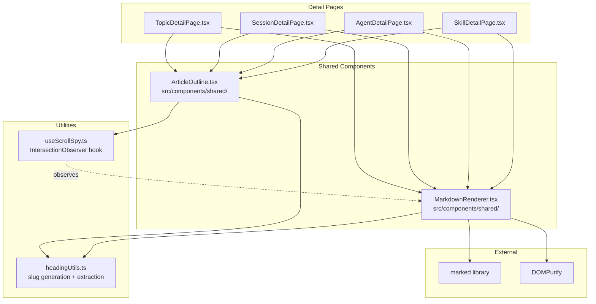
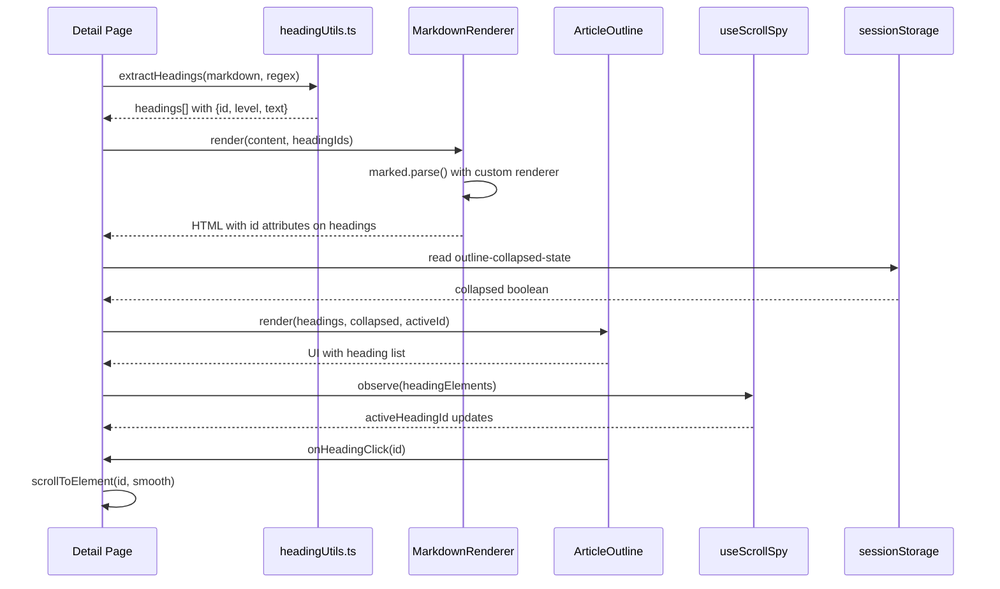

# Design: Interactive Outline Upgrade for Detail Screens

**Date:** 2026-04-14
**Status:** Reviewed
**Author:** Oracle
**Related Requirement:** `docs/ai/requirements/outline-detail-screen-upgrade.md`

---

## 1. Architecture Overview

### 1.1 Component Diagram



### 1.2 Data Flow



---

## 2. Component Design

### 2.1 `ArticleOutline` Component

**Location:** `src/components/shared/ArticleOutline.tsx`

**Props Interface:**
```typescript
interface ArticleOutlineProps {
  headings: HeadingItem[];
  activeHeadingId: string | null;
  onHeadingClick: (id: string) => void;
}

interface HeadingItem {
  id: string;
  level: number;  // 1-6
  text: string;
}
```

**Internal State:**
```typescript
const [isCollapsed, setIsCollapsed] = useState(() => {
  const stored = sessionStorage.getItem('outline-collapsed-state');
  return stored === 'true';
});
```

**Structure:**
```
<section>
  <h3 className="font-mono text-[10px] text-outline-variant uppercase tracking-[0.2em] mb-4 flex items-center justify-between">
    <span>Outline</span>
    <button
      onClick={toggle}
      className="cursor-pointer hover:text-primary transition-colors duration-150"
      aria-label={isCollapsed ? 'Expand outline' : 'Collapse outline'}
    >
      <MaterialIcon name={isCollapsed ? 'expand_more' : 'segment'} size={14} />
    </button>
  </h3>
  <div className={cn(
    'overflow-hidden transition-[max-height] duration-200 ease-in-out',
    isCollapsed ? 'max-h-0' : 'max-h-[500px]'
  )}>
    <ul role="list" className="flex flex-col gap-3">
      {headings.map((heading, index) => (
        <li
          key={heading.id}
          role="listitem"
          tabIndex={0}
          onClick={() => onHeadingClick(heading.id)}
          onKeyDown={(e) => handleKeyDown(e, index)}
          className={cn(
            'font-headline text-sm text-on-surface-variant hover:text-primary cursor-pointer transition-colors duration-150 truncate',
            'focus-visible:outline-2 focus-visible:outline-primary',
            activeHeadingId === heading.id && 'text-primary border-l-2 border-primary-container',
            paddingClasses[heading.level]
          )}
          title={heading.text}
        >
          {heading.level === 1 && <span className="w-1 h-1 bg-primary-container rounded-full mr-2" />}
          {heading.text}
        </li>
      ))}
    </ul>
  </div>
</section>
```

**Key Design Decisions:**
- Collapse animation uses CSS `max-height` transition (200ms ease-in-out) — no external animation library needed
- Active heading uses `text-primary` color + `primary-container` left border indicator
- Heading items use `truncate` for overflow handling with native `title` attribute for hover tooltip
- Toggle button uses existing `segment` / `expand_more` MaterialIcon swap pattern
- Toggle button is a native `<button>` element — Enter/Space keyboard activation is handled by the browser automatically

**Visual Design Token Mapping (AC G1-G3, H2):**

| Element | Tailwind Classes | Purpose |
|---------|-----------------|---------|
| Section header | `font-mono text-[10px] text-outline-variant uppercase tracking-[0.2em]` | Monolithic Lexicon header style |
| Header toggle button | `cursor-pointer hover:text-primary transition-colors duration-150` | Interactive toggle |
| Heading list container | `flex flex-col gap-3` | Vertical spacing between items |
| Heading item (all levels) | `font-headline text-sm text-on-surface-variant hover:text-primary cursor-pointer transition-colors duration-150 truncate` | Base item styling |
| Heading item (active) | `text-primary` + `border-l-2 border-primary-container` | Active heading highlight |
| Heading item (focus) | `focus-visible:outline-2 focus-visible:outline-primary` | Keyboard focus ring |
| H1 indicator dot | `w-1 h-1 bg-primary-container rounded-full` | Level 1 visual marker |
| H2 padding | `pl-4` | 16px indent (level 2) |
| H3 padding | `pl-8` | 32px indent (level 3) |
| H4 padding | `pl-12` | 48px indent (level 4) |
| H5 padding | `pl-16` | 64px indent (level 5) |
| H6 padding | `pl-20` | 80px indent (level 6) |

**Padding Class Mapping:**
```typescript
const paddingClasses: Record<number, string> = {
  1: '',
  2: 'pl-4',
  3: 'pl-8',
  4: 'pl-12',
  5: 'pl-16',
  6: 'pl-20',
};
```

### 2.2 `headingUtils.ts` Utility

**Location:** `src/utils/headingUtils.ts`

**Functions:**

```typescript
// Extract headings from raw markdown with ID generation
function extractHeadings(markdown: string): HeadingItem[] {
  const regex = /^(#{1,6})\s+(.+)$/gm;
  const slugCounts: Record<string, number> = {};
  const headings: HeadingItem[] = [];
  let match;
  let index = 0;

  while ((match = regex.exec(markdown)) !== null) {
    const level = match[1].length;
    const text = match[2].trim();
    const id = generateSlug(text, level, index, slugCounts);
    headings.push({ id, level, text });
    index++;
  }

  return headings;
}

// Generate URL-safe slug with duplicate handling
function generateSlug(text: string, level: number, index: number, counts: Record<string, number>): string {
  const base = text
    .toLowerCase()
    .replace(/\s+/g, '-')
    .replace(/[^a-z0-9-]/g, '');

  if (!base) {
    // Fallback for text with only special characters (e.g., "## !!!")
    // Uses level and index to produce deterministic IDs like heading-h1-0, heading-h3-2
    return `heading-h${level}-${index}`;
  }

  const count = counts[base] || 0;
  counts[base] = count + 1;
  return count > 0 ? `${base}-${count}` : base;
}
```

### 2.3 `useScrollSpy` Hook

**Location:** `src/hooks/useScrollSpy.ts`

**Interface:**
```typescript
function useScrollSpy(
  containerRef: React.RefObject<HTMLElement>,
  headingIds: string[]
): string | null;
```

**Implementation Strategy:**
- Uses `IntersectionObserver` with a root margin targeting the top 10% of the scroll container
- Each heading element gets observed with `threshold: [0, 0.25, 0.5, 0.75, 1]`
- The observer callback tracks which heading has the highest intersection ratio near the top
- Falls back to the heading whose top edge has the smallest non-negative offset from container top
- Returns `null` when no heading is above the viewport midpoint
- **Throttling**: The observer callback updates state at most once per 100ms (10 updates/sec) using a custom `useRef`-based throttle to avoid React re-render storms from rapid IntersectionObserver firings

**Throttle Implementation:**
```typescript
const lastUpdateRef = useRef(0);

const observerCallback = useCallback((entries: IntersectionObserverEntry[]) => {
  const now = performance.now();
  if (now - lastUpdateRef.current < 100) return;  // Throttle to 100ms
  lastUpdateRef.current = now;

  // ... compute active heading and setState
}, []);
```

**Performance:**
- Single `IntersectionObserver` instance observes all heading elements
- No scroll event listeners needed
- Throttle ensures max 10 state updates/sec regardless of observer fire frequency
- Cleanup on unmount disconnects all observers

### 2.4 `MarkdownRenderer` Enhancement

**Location:** `src/components/shared/MarkdownRenderer.tsx`

**Changes:**
- Accept optional `headingIds` prop: `Map<string, string>` mapping heading text to ID
- Configure `marked` with custom renderer that adds `id` attributes to heading elements
- The custom renderer intercepts heading tokens and injects the pre-computed ID

```typescript
interface MarkdownRendererProps {
  content: string;
  className?: string;
  headingIds?: Map<string, string>;  // NEW: text -> id mapping
}

// Custom renderer for marked
const renderer = new marked.Renderer();
renderer.heading = (text, level, raw) => {
  const id = headingIds?.get(raw) || generateSlug(raw, {});
  return `<h${level} id="${id}">${text}</h${level}>`;
};
```

**Alternative Approach (if marked renderer is complex):**
Post-render DOM injection via `useEffect` — query all headings in the rendered output and assign IDs based on the `headingIds` map. This is simpler and avoids marked customization complexity.

**Decision:** Use **post-render DOM injection** for simplicity and to avoid modifying the marked configuration. The `useEffect` runs after `innerHTML` is set and assigns IDs to all heading elements.

---

## 3. Scroll-to-Heading Implementation

**Location:** Detail page components

**Strategy:**
```typescript
const handleHeadingClick = (id: string) => {
  const container = contentContainerRef.current;
  const target = container?.querySelector(`[id="${id}"]`);
  if (target && container) {
    const top = target.offsetTop - container.offsetTop;
    container.scrollTo({
      top,
      behavior: 'smooth',
    });
  }
};
```

**Key Points:**
- Scroll target is the center panel container (`flex-1 overflow-y-auto`), not the window
- Uses `offsetTop` relative to the scroll container for accurate positioning — this achieves equivalent behavior to `scrollIntoView({ block: 'start' })` (AC B1)
- `scroll-padding-top` CSS property on the container accounts for any fixed header offset
- Tolerance of ±4px is acceptable for scroll completion verification (AC B2)
- URL-safe slug IDs ensure scroll targeting works for headings with special characters (AC B3)

---

## 4. Keyboard Navigation Implementation

**Location:** `ArticleOutline` component

**Strategy:**
- Use `tabIndex={0}` on each heading item for focusability
- Use `role="list"` on `<ul>` and `role="listitem"` on `<li>` for accessibility
- Arrow key navigation managed via `onKeyDown` handler on the container
- Focus ring via Tailwind `focus-visible:outline-2 focus-visible:outline-primary`
- Escape key collapses outline and returns focus to toggle button
- Initial focus on expand: `useEffect` sets focus to first heading item after collapse animation completes
- **Toggle button keyboard**: The toggle `<button>` element natively handles Enter/Space activation via HTML button semantics — no additional keyboard handler needed. When focused, pressing Enter or Space triggers the `onClick` handler automatically (AC I5, I6).

```typescript
const handleKeyDown = (e: React.KeyboardEvent, index: number) => {
  switch (e.key) {
    case 'ArrowDown':
      e.preventDefault();
      focusItem((index + 1) % headings.length);
      break;
    case 'ArrowUp':
      e.preventDefault();
      focusItem((index - 1 + headings.length) % headings.length);
      break;
    case 'Enter':
    case ' ':
      e.preventDefault();
      onHeadingClick(headings[index].id);
      break;
    case 'Escape':
      e.preventDefault();
      setIsCollapsed(true);
      toggleButtonRef.current?.focus();
      break;
  }
};
```

---

## 5. State Persistence Implementation

**Location:** `ArticleOutline` component

**Strategy:**
- Read from `sessionStorage` on mount with lazy initializer
- Write to `sessionStorage` on every collapse/expand toggle
- Key: `outline-collapsed-state` (shared across all detail pages in same tab)
- Value: `"true"` or `"false"` string
- Defaults to `false` (expanded) if no stored value exists

```typescript
const [isCollapsed, setIsCollapsed] = useState(() => {
  try {
    return sessionStorage.getItem('outline-collapsed-state') === 'true';
  } catch {
    return false;
  }
});

const toggleCollapse = () => {
  setIsCollapsed(prev => {
    const next = !prev;
    try {
      sessionStorage.setItem('outline-collapsed-state', String(next));
    } catch {
      // sessionStorage may be unavailable in some contexts
    }
    return next;
  });
};
```

---

## 6. Error Handling Strategy

| Scenario | Handling |
|----------|----------|
| No headings in markdown | Outline section not rendered (existing behavior) |
| Heading ID not found in DOM | Scroll silently fails (no error thrown) |
| sessionStorage unavailable | Defaults to expanded state, no persistence |
| IntersectionObserver not supported | Falls back to no active tracking (graceful degradation) |
| MarkdownRenderer fails to render | Outline still shows extracted headings (regex-based, independent of render) |

---

## 7. Security Considerations

- **DOMPurify** already sanitizes markdown HTML output — no XSS risk from user content
- Heading IDs are generated from heading text via slugification — no injection risk
- `sessionStorage` stores only boolean state — no sensitive data
- `querySelector` with ID selector uses escaped IDs — safe from selector injection

---

## 8. Performance Considerations

| Concern | Mitigation |
|---------|-----------|
| Heading extraction on large documents | Regex is O(n) over markdown string — negligible for typical content |
| IntersectionObserver overhead | Single observer instance, 5 thresholds per heading — minimal |
| Re-renders on scroll | IntersectionObserver fires on visibility changes, not scroll events |
| Collapse animation | CSS `max-height` transition — GPU-accelerated, no JS animation loop |
| DOM query on heading click | Single `querySelector` by ID — O(1) lookup |

---

## 9. Acceptance Criteria Traceability

| AC Section | Design Coverage |
|------------|----------------|
| A. Shared Outline Component | Section 2.1 — `ArticleOutline` component with props interface |
| B. Click-to-Scroll Navigation | Section 3 — scroll-to-heading implementation |
| C. Heading ID Generation | Section 2.2 — `headingUtils.ts` with slug generation |
| D. Active Heading Tracking | Section 2.3 — `useScrollSpy` hook with IntersectionObserver |
| E. Collapse/Expand Toggle | Section 2.1 — internal state + CSS animation |
| F. Cross-Page Consistency | Section 1.1 — all 4 detail pages use shared component |
| G. Visual Design Compliance | Section 2.1 — Monolithic Lexicon tokens applied |
| H. H4-H6 Heading Support | Section 2.2 — regex `/^(#{1,6})\s+(.+)$/gm`, 16px per level indent |
| I. Keyboard Navigation | Section 4 — Arrow keys, Enter/Space, Escape, focus management |
| J. State Persistence | Section 5 — sessionStorage with `outline-collapsed-state` key |

---

## 10. File Change Summary

| File | Action | Description |
|------|--------|-------------|
| `src/components/shared/ArticleOutline.tsx` | **NEW** | Shared outline component with collapse, keyboard nav, persistence |
| `src/utils/headingUtils.ts` | **NEW** | Heading extraction and slug generation utilities |
| `src/hooks/useScrollSpy.ts` | **NEW** | IntersectionObserver-based active heading tracking hook |
| `src/components/shared/MarkdownRenderer.tsx` | **MODIFY** | Add post-render heading ID injection via useEffect |
| `src/routes/TopicDetailPage.tsx` | **MODIFY** | Replace inline outline with `ArticleOutline`, add scroll container ref |
| `src/routes/SessionDetailPage.tsx` | **MODIFY** | Replace inline outline with `ArticleOutline`, add scroll container ref |
| `src/routes/AgentDetailPage.tsx` | **MODIFY** | Add outline section with `ArticleOutline` |
| `src/routes/SkillDetailPage.tsx` | **MODIFY** | Add outline section with `ArticleOutline` |

---

## 11. Out of Scope (Confirmed)

- Persisting state across browser tab close/reopen (localStorage)
- Drag-to-reorder or editable outline items
- Outline search/filter within the heading list
- Changes to `MarkdownRenderer` core markdown parsing logic
- Changes to editor-focused `OutlinePanel.tsx` in `src/components/layout/`
- Mobile-responsive adaptations
- Exporting or sharing the outline

---

## 12. YAGNI Check

| Potential Over-Engineering | Decision |
|---------------------------|----------|
| Separate `useOutlineState` hook | **Skipped** — state logic lives in `ArticleOutline` component |
| Animation library for collapse | **Skipped** — CSS `max-height` transition is sufficient |
| Generic scroll-spy library | **Skipped** — custom `useScrollSpy` hook is ~40 lines |
| Heading ID persistence in URL | **Skipped** — not required by requirements |
| Virtual scrolling for long outlines | **Skipped** — typical documents have <50 headings |
| `Map<string, string>` for headingIds prop | **Skipped** — post-render DOM injection is simpler |

---

## 13. Migration Strategy

### Phase 1: Foundation
1. Create `headingUtils.ts` with extraction and slug generation
2. Create `useScrollSpy.ts` hook
3. Enhance `MarkdownRenderer.tsx` with heading ID injection

### Phase 2: Component
4. Create `ArticleOutline.tsx` with collapse, keyboard nav, persistence
5. Test component in isolation

### Phase 3: Integration
6. Update `TopicDetailPage.tsx` — replace inline outline
7. Update `SessionDetailPage.tsx` — replace inline outline
8. Add outline to `AgentDetailPage.tsx`
9. Add outline to `SkillDetailPage.tsx`

### Phase 4: Verification
10. Test all acceptance criteria across all 4 pages
11. Verify no regression in existing functionality

---

## 14. Risks & Mitigations

| Risk | Likelihood | Impact | Mitigation |
|------|-----------|--------|-----------|
| `marked` renderer changes break existing output | Low | High | Use post-render DOM injection instead of modifying marked config |
| IntersectionObserver not supported in older browsers | Low | Medium | Graceful degradation — active tracking simply doesn't work |
| Regex extraction misses ATX-style headings with trailing `#` | Medium | Low | Update regex to `/^(#{1,6})\s+(.+?)(?:\s+#+)?$/gm` if needed |
| Scroll container ref not available on mount | Low | Medium | Use `useLayoutEffect` or null-check before scroll |
| sessionStorage quota exceeded | Very Low | Low | Try/catch around storage operations, default to expanded |
