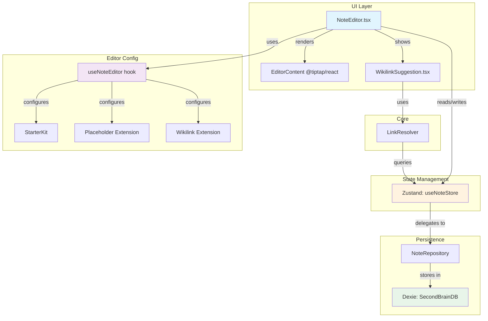
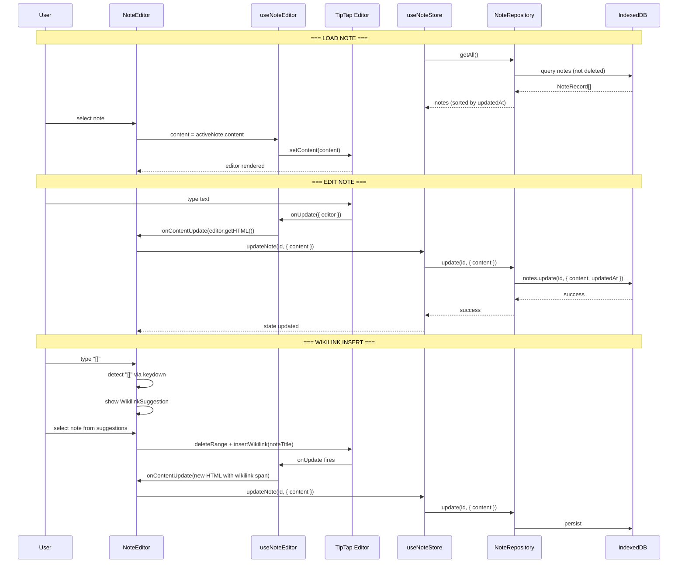

# Rich Text Editor — TipTap Integration

## Overview

The Second Brain app uses **TipTap** (a headless rich text editor built on ProseMirror) as its note editing engine. The editor supports markdown-style formatting, wikilinks (`[[note title]]`) for cross-note linking, and persists content as HTML in IndexedDB via Dexie.

**Purpose**: Provide a distraction-free writing experience with bidirectional linking between notes, similar to Obsidian/Roam Research.

---

## Architecture Diagram



---

## Component Map

### 1. Editor Configuration (`src/editor/editor-config.ts`)

**`useNoteEditor` hook** — factory that creates a TipTap editor instance.

| Parameter | Type | Purpose |
|-----------|------|---------|
| `content` | `string` | Initial HTML content |
| `onUpdate` | `(content: string) => void` | Callback fired on every edit (receives HTML) |
| `onWikilinkClick` | `(linkText: string) => void` | Callback when a wikilink is clicked |
| `placeholder` | `string` | Placeholder text (default: "Start writing... Use [[ to link notes") |

**Editor props**:
- CSS class: `prose max-w-none focus:outline-none`
- Content synced via `editor.commands.setContent()` when `activeNoteId` changes

### 2. Wikilink Extension (`src/editor/extensions/wikilink.ts`)

Custom TipTap **Node** extension that renders `[[link]]` syntax as clickable spans.

**Attributes**:
| Attribute | Type | Default | Purpose |
|-----------|------|---------|---------|
| `linkText` | `string \| null` | `null` | The target note title (stored in `data-link-text`) |
| `displayText` | `string \| null` | `null` | Optional alias shown to user (stored in `data-display-text`) |
| `resolved` | `boolean` | `true` | Whether the linked note exists (affects CSS class) |

**Commands**:
- `insertWikilink(linkText, displayText?)` — inserts a wikilink node at cursor

**ProseMirror Plugin**:
- **Decorations**: Applies `.wikilink` or `.wikilink unresolved` CSS classes based on `resolved` attribute
- **Click handler**: Intercepts clicks on wikilink nodes and calls `onClick(linkText)`

**Render output**:
```html
<span data-type="wikilink" class="wikilink" contenteditable="false" data-link-text="My Note">[[My Note]]</span>
```

**Text representation** (for copy/paste):
- With alias: `[[linkText|displayText]]`
- Without alias: `[[linkText]]`

### 3. NoteEditor Component (`src/components/editor/NoteEditor.tsx`)

Main editor UI component that orchestrates the editing experience.

**Props**:
| Prop | Type | Purpose |
|------|------|---------|
| `onContentUpdate` | `(content: string) => void` | Fires on every editor change |
| `onTitleUpdate` | `(title: string) => void` | Fires when title input changes |
| `onWikilinkClick` | `(linkText: string) => void` | Fires when a wikilink is clicked |

**Features**:
- **Title input**: Editable text field at top of editor
- **PARA category badge**: Displays note's PARA classification
- **Tag management**: Display existing tags with remove buttons; add new tags via `+ tag` input (Enter to submit)
- **Wikilink detection**: Listens for `[[` keystroke to show suggestion popup
- **Empty state**: Shows "No note selected" message when `activeNote` is null

**Wikilink suggestion flow**:
1. User types `[[` → `keydown` listener detects double bracket
2. `showWikilinkSuggestion` set to `true`
3. `WikilinkSuggestion` component renders with note suggestions
4. User navigates with arrow keys, selects with Enter
5. `handleWikilinkSelect` removes `[[` + query text, inserts wikilink node via `insertWikilink` command

### 4. WikilinkSuggestion Component (`src/components/editor/WikilinkSuggestion.tsx`)

Autocomplete popup for wikilink creation.

**Props**:
| Prop | Type | Purpose |
|------|------|---------|
| `query` | `string` | Current search text |
| `onSelect` | `(noteTitle: string) => void` | Called when user selects a suggestion |
| `onClose` | `() => void` | Called when user dismisses popup |

**Behavior**:
- Uses `linkResolver.suggest(query, notes, 5)` to get up to 5 matching notes
- Keyboard navigation: ArrowUp/ArrowDown to navigate, Enter to select, Escape to close
- Resets `activeIndex` to 0 when query changes
- Shows "No matching notes found" when suggestions are empty

---

## Data Flow



---

## TipTap Extensions and Configuration

### StarterKit

Base markdown extensions with heading levels 1-3 only:

```ts
StarterKit.configure({
  heading: {
    levels: [1, 2, 3],
  },
})
```

This provides: bold, italic, strike, code, heading, blockquote, bullet/ordered lists, code blocks, horizontal rule, hard break.

### Placeholder

Shows placeholder text when editor is empty:

```ts
Placeholder.configure({
  placeholder: 'Start writing... Use [[ to link notes',
})
```

### Wikilink (Custom)

Custom node extension (see section 2 above) that:
- Parses `<span data-type="wikilink">` elements from HTML
- Renders as `[[displayText]]` in the editor
- Stores `linkText`, `displayText`, and `resolved` as data attributes
- Provides `insertWikilink` command
- Handles click events to navigate to linked notes

---

## State Management

### NoteStore (Zustand)

**State shape**:
```ts
interface NoteState {
  notes: NoteRecord[];           // All non-deleted notes
  activeNoteId: string | null;   // Currently selected note
  isLoading: boolean;            // Loading indicator
  selectedParaCategory: ParaCategory | 'all' | null;
  searchQuery: string;
  lastDeletedNote: NoteRecord | null;  // For undo
}
```

**Key actions for editor**:
| Action | Signature | Effect |
|--------|-----------|--------|
| `loadNotes` | `() => Promise<void>` | Fetches all notes from IndexedDB |
| `selectNote` | `(id: string \| null) => void` | Sets active note (triggers editor content sync) |
| `updateNote` | `(id, updates) => Promise<void>` | Updates note in DB + state, sets `updatedAt` |
| `createNote` | `(title, paraCategory) => Promise<NoteRecord>` | Creates new note, sets as active |
| `addTag` | `(id, tag) => Promise<void>` | Adds tag to note |
| `removeTag` | `(id, tag) => Promise<void>` | Removes tag from note |

### NoteRecord (Dexie Schema)

```ts
interface NoteRecord {
  id: string;              // UUID
  title: string;
  content: string;         // HTML from TipTap
  paraCategory: ParaCategory;  // projects | areas | resources | archives
  tags: string[];
  createdAt: number;       // timestamp
  updatedAt: number;       // timestamp
  isDeleted: boolean;      // soft delete flag
}
```

### IndexedDB Tables (Dexie)

| Table | Primary Key | Indexed Fields |
|-------|-------------|----------------|
| `notes` | `id` | `title`, `createdAt`, `updatedAt`, `paraCategory`, `isDeleted` |
| `links` | `id` | `fromNoteId`, `toNoteId`, `type` |
| `tags` | `id` | `name` |
| `noteTags` | `[noteId+tagId]` | `noteId`, `tagId` |

---

## Key Decisions and Patterns

### 1. HTML Storage (Not Markdown)
Content is stored as **HTML** (via `editor.getHTML()`), not markdown. TipTap's StarterKit produces HTML output that is persisted directly. This simplifies rendering but means content is tied to TipTap's HTML structure.

### 2. Soft Delete
Notes are never permanently deleted by default. The `delete` operation sets `isDeleted: true`. The `getAll()` query filters out deleted notes. A `lastDeletedNote` field enables undo functionality.

### 3. Editor Content Sync
When `activeNoteId` changes, the editor syncs content via `editor.commands.setContent()`. A guard prevents unnecessary syncs: `if (currentContent !== activeNote.content)`.

### 4. Wikilink as Atom Node
The wikilink extension uses `atom: true` and `contenteditable: "false"`, making wikilinks indivisible units that cannot be partially edited. This prevents corruption of the link syntax.

### 5. Debounced Persistence
Every keystroke triggers `onUpdate` → `updateNote` → IndexedDB write. There is **no debounce** at the store level — each edit writes immediately. This is acceptable for local-first IndexedDB but could be optimized for large notes.

### 6. Wikilink Detection via Keydown Listener
The `[[` detection uses a raw `keydown` event listener on `editor.view.dom`, not a TipTap input rule. This is a simpler approach but may have edge cases (e.g., pasting `[[`).

### 7. LinkResolver for Suggestions
The `LinkResolver` class maintains a `Map<string, string>` index of note titles (lowercase + slugified) to IDs. The `suggest()` method does a simple `includes()` filter — no fuzzy matching.

---

## Gotchas

### 1. No Debounce on Saves
Every editor change triggers an immediate IndexedDB write. For fast typists, this means many database operations per second. Consider adding debounce if performance becomes an issue.

### 2. Wikilink Detection is Fragile
The `[[` detection relies on checking if `parent.textContent.endsWith('[[')` in a keydown handler. This can miss cases where `[[` is pasted or inserted programmatically.

### 3. Content Sync Race Condition
The `useEffect` that syncs editor content on `activeNoteId` change compares `editor.getHTML()` with `activeNote.content`. If the user is still typing when the note switches, unsaved changes may be lost.

### 4. Wikilink Resolution Not Automatic
The `resolved` attribute defaults to `true` on insertion. There is no automatic re-resolution when notes are renamed or deleted. The `unresolved` CSS class exists but the resolution logic is not wired up in the current codebase.

### 5. No Rich Text Toolbar
The editor has no formatting toolbar. Users must know keyboard shortcuts (Cmd+B, Cmd+I, etc.) or use markdown-style typing. This is intentional for a distraction-free experience but may not be obvious to users.

### 6. HTML Class Names Use Custom Theme Tokens
Editor content uses `prose` (Tailwind Typography) and custom theme classes like `bg-sb-surface`, `text-sb-text`. These require the Tailwind theme to be properly configured.

### 7. Dexie Schema Version is Fixed
The database is at version 1 with no migration path. Any schema changes will require a version bump and migration logic.

---

## Related Documentation

- [Note Core Types](../../src/core/note/note.ts) — `NoteRecord`, `LinkRecord`, `ParaCategory` definitions
- [Link Resolver](../../src/core/note/link-resolver.ts) — Wikilink suggestion and resolution logic
- [Note Repository](../../src/storage/note-repository.ts) — IndexedDB CRUD operations
- [Database Schema](../../src/storage/db.ts) — Dexie table definitions
- [Note Store](../../src/state/note-store.ts) — Zustand state management
- [AGENTS.md](../../AGENTS.md) — Project architecture overview (mentions Dexie for notes only)
