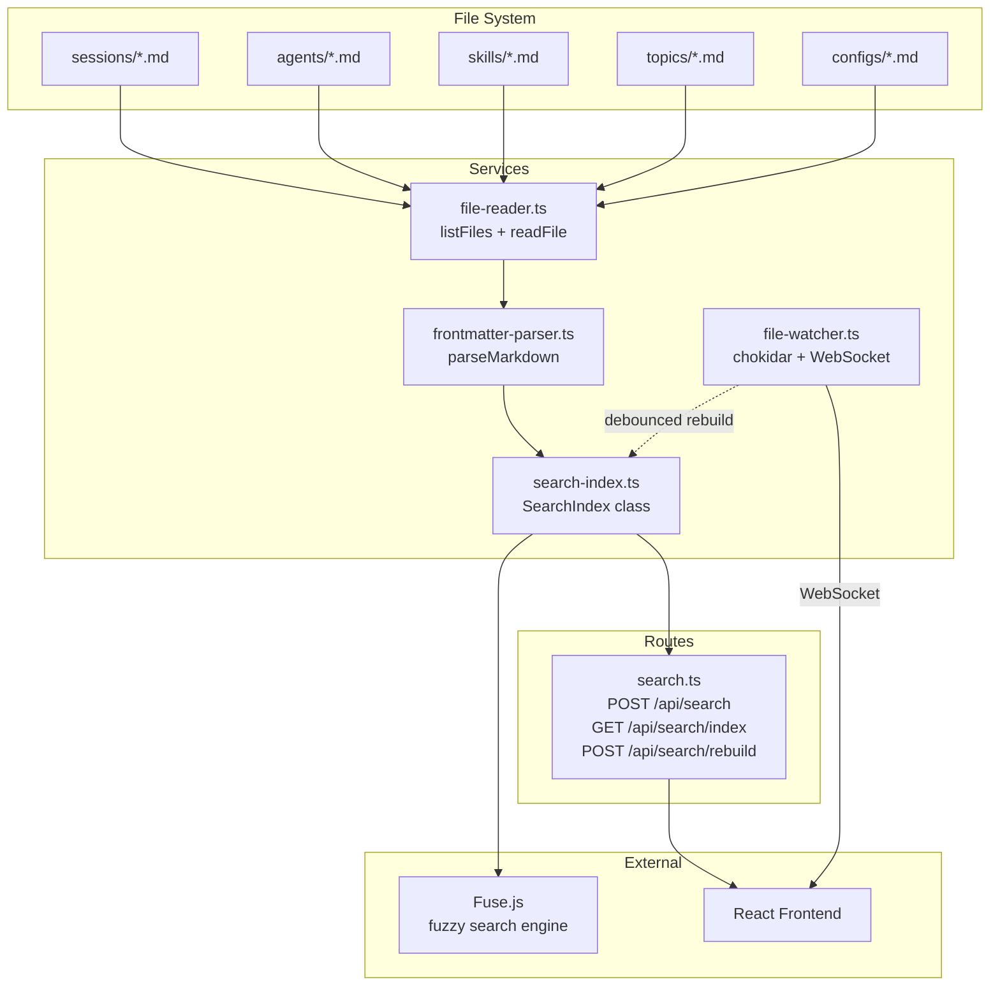
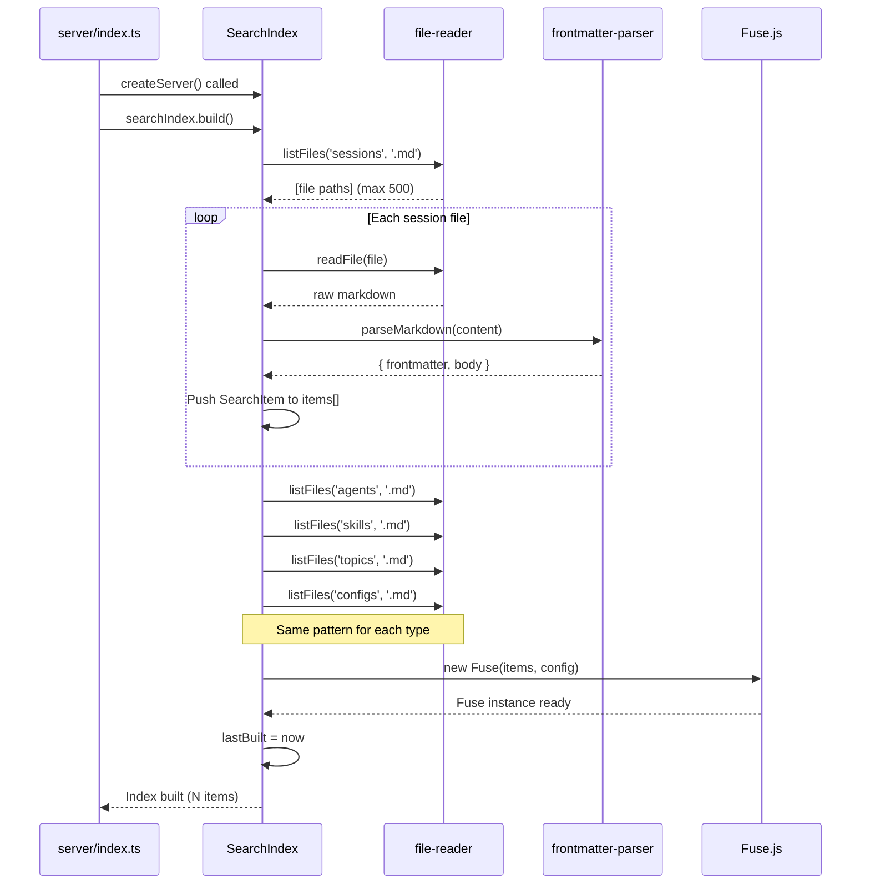
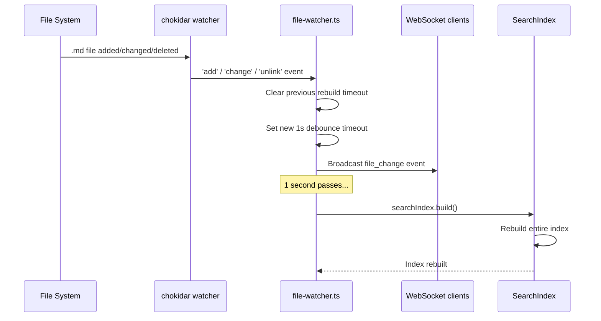
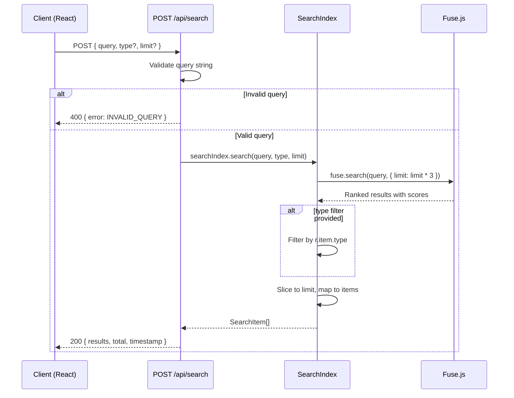

# Design: Search System

**Date:** 2026-04-14
**Status:** Implemented
**Author:** chronicler

## Overview

The search system provides full-text search across all content types (sessions, agents, skills, topics, configs) using Fuse.js — a lightweight fuzzy-search library. The search index is built in-memory at server startup and automatically refreshed when files change via chokidar file watcher.

## Architecture



## Component Map

### 1. SearchIndex Class (`server/services/search-index.ts`)

**Responsibility:** Build, maintain, and query the in-memory search index.

| Property | Type | Purpose |
|---|---|---|
| `fuse` | `Fuse<SearchItem> \| null` | Fuse.js instance (null until built) |
| `items` | `SearchItem[]` | All indexed items |
| `lastBuilt` | `string \| null` | ISO timestamp of last successful build |
| `building` | `boolean` | Reentrancy guard — prevents concurrent builds |

| Method | Signature | Description |
|---|---|---|
| `build()` | `async () => Promise<void>` | Reads all markdown files, parses them, constructs Fuse index |
| `search()` | `(query, typeFilter?, limit?) => SearchItem[]` | Fuzzy search with optional type filter and result limit |
| `getStatus()` | `() => { indexed, lastBuilt }` | Returns index metadata for health checks |

**Singleton:** Exported as `searchIndex` — single instance shared across the server.

### 2. SearchItem Interface

```typescript
export interface SearchItem {
  type: 'session' | 'agent' | 'skill' | 'topic' | 'config';
  id: string;
  slug: string;
  title: string;
  content: string;       // Combined searchable text
  tags?: string[];
  agent?: string;
  category?: string;
  createdAt?: string;
}
```

Each content type maps to a `SearchItem` with type-specific field assignments:

| Type | `title` source | `content` composition | Extra fields |
|---|---|---|---|
| `session` | `frontmatter.title` | `body + tags + agent` | `tags`, `agent`, `createdAt` |
| `agent` | `frontmatter.name` | `body + whenToUse` | `category` (tier) |
| `skill` | `frontmatter.name` | `body + whenToUse` | `category` |
| `topic` | `frontmatter.title` | `body + tags + summary` | `tags`, `category`, `createdAt` |
| `config` | `frontmatter.name` | `body` only | `category` (type) |

### 3. Search API Routes (`server/routes/search.ts`)

| Endpoint | Method | Auth | Description |
|---|---|---|---|
| `/api/search` | POST | validateRootMiddleware | Execute search query |
| `/api/search/index` | GET | validateRootMiddleware | Get index status (item count, last built) |
| `/api/search/rebuild` | POST | validateRootMiddleware | Manually trigger full index rebuild |

## Data Flow

### Initial Build (Server Startup)



### File Change → Index Refresh



### Search Query



## API Reference

### POST `/api/search`

Execute a full-text search query.

**Request body:**

| Field | Type | Required | Default | Description |
|---|---|---|---|---|
| `query` | `string` | Yes | — | Search text (fuzzy matching) |
| `type` | `string` | No | — | Filter by content type: `session`, `agent`, `skill`, `topic`, `config` |
| `limit` | `number` | No | `20` | Maximum results to return |

**Response (200):**

```json
{
  "success": true,
  "data": {
    "results": [
      {
        "type": "session",
        "id": "session-2026-04-14-001",
        "slug": "search-system-design",
        "title": "Search System Design",
        "content": "...",
        "tags": ["search", "fuse.js"],
        "agent": "chronicler",
        "createdAt": "2026-04-14T10:00:00.000Z"
      }
    ],
    "total": 1
  },
  "meta": {
    "timestamp": "2026-04-14T10:05:00.000Z"
  }
}
```

**Response (400):**

```json
{
  "success": false,
  "error": {
    "code": "INVALID_QUERY",
    "message": "Query string is required"
  }
}
```

### GET `/api/search/index`

Get search index health status.

**Response (200):**

```json
{
  "success": true,
  "data": {
    "indexed": 342,
    "lastBuilt": "2026-04-14T10:00:00.000Z"
  },
  "meta": {
    "timestamp": "2026-04-14T10:05:00.000Z"
  }
}
```

### POST `/api/search/rebuild`

Manually trigger a full index rebuild. Useful after bulk file operations or migration.

**Response (200):** Same shape as `/api/search/index` with updated status.

**Response (500):**

```json
{
  "success": false,
  "error": {
    "code": "INTERNAL_ERROR",
    "message": "..."
  }
}
```

## Search Configuration

### Fuse.js Options

```typescript
{
  keys: [
    { name: 'title',    weight: 0.5   },   // Highest priority — title matches rank best
    { name: 'content',  weight: 0.3   },   // Body text — substantial but secondary
    { name: 'tags',     weight: 0.1   },   // Tag matches — useful for categorization
    { name: 'agent',    weight: 0.05  },   // Agent name — low priority
    { name: 'category', weight: 0.05  },   // Category/tier — low priority
  ],
  threshold: 0.4,        // Fuzzy match tolerance (0 = exact, 1 = match anything)
  includeScore: true,    // Return match score for ranking
  includeMatches: true,  // Return matched indices for highlighting
}
```

### Weighting Rationale

| Field | Weight | Rationale |
|---|---|---|
| `title` | 0.5 (50%) | User intent usually targets specific items by name |
| `content` | 0.3 (30%) | Body text provides context but is noisy |
| `tags` | 0.1 (10%) | Structured metadata — precise but sparse |
| `agent` | 0.05 (5%) | Attribution field — rarely the search target |
| `category` | 0.05 (5%) | Classification field — rarely the search target |

### Threshold Behavior

- **0.4 threshold** allows moderate fuzzy matching — typos and partial matches are accepted
- Lower values (e.g., 0.2) would require closer matches but miss legitimate results
- Higher values (e.g., 0.6) would return too many irrelevant results

## Key Decisions

### D1: Full Rebuild on Every Change

**Decision:** The entire search index is rebuilt from scratch on any file change, rather than incrementally updating.

**Rationale:**
- Simpler implementation — no delta tracking or item-level CRUD
- Index build is fast enough for typical data sizes (< 500 sessions)
- Avoids stale state bugs from missed update events
- Debounce (1s) prevents thrashing during bulk operations

**Trade-off:** Rebuild cost scales with total file count. If the data root grows to thousands of files, incremental updates will be needed.

### D2: Session Limit of 500

**Decision:** Only the first 500 session files are indexed (`sessionFiles.slice(0, 500)`).

**Rationale:**
- Fuse.js performance degrades with large datasets
- Most users have fewer than 500 sessions
- Prevents memory bloat on long-running servers

**Trade-off:** Older sessions beyond the 500-file limit are not searchable. The limit is hardcoded — not configurable.

### D3: POST for Search (Not GET)

**Decision:** Search uses `POST /api/search` with a JSON body rather than `GET /api/search?q=...`.

**Rationale:**
- Consistent with the existing API design pattern (all mutations use POST)
- Allows structured request body with optional fields
- No URL length limitations for long queries

**Trade-off:** Cannot bookmark search results or share search URLs directly.

### D4: Reentrancy Guard

**Decision:** The `building` flag prevents concurrent `build()` calls.

**Rationale:**
- File watcher events can fire rapidly (e.g., git checkout, bulk copy)
- Prevents race conditions in the Fuse.js instance
- Silent skip (no error) — the next change will trigger another build

## Gotchas

### G1: Silent Error Swallowing

Each file read/parse is wrapped in `try/catch { /* skip */ }`. Corrupted or malformed markdown files are silently excluded from the index with no logging. This makes it difficult to diagnose why a file is not appearing in search results.

### G2: No Incremental Updates

Every file change triggers a full rebuild of the entire index. For large data roots, this causes a brief period where the old index is still active while the new one builds. There is no "indexing..." status exposed to the client during rebuild.

### G3: `limit * 3` Oversampling

The search method requests `limit * 3` results from Fuse.js before applying the type filter, then slices down to `limit`. This compensates for type filtering reducing the result count, but the `3x` multiplier is arbitrary and not tuned.

### G4: No Score or Match Data in Response

Fuse.js is configured with `includeScore: true` and `includeMatches: true`, but the `search()` method maps results to `r.item` only — discarding the score and match data. The frontend cannot display relevance scores or highlight matched text.

### G5: Build Race on Startup

`searchIndex.build()` is called asynchronously in `createServer()` without `await`. If a search query arrives before the initial build completes, the index is empty and returns no results. There is no "index not ready" response.

### G6: Hardcoded Content Types

The `SearchItem.type` union is hardcoded to five types. Adding a new content type requires modifying the `build()` method, the `SearchItem` interface, and any frontend type filters.

## Related Documentation

- [CLI Packaging Design](./cli-packaging.md) — Server startup flow that triggers initial index build
- [File Watcher Service](../../server/services/file-watcher.ts) — Debounced rebuild trigger
- [Frontmatter Parser](../../server/services/frontmatter-parser.ts) — Markdown parsing for index items
- [File Reader Service](../../server/services/file-reader.ts) — File listing and reading for index build
