# Server API Layer

## Overview

The Express API server (`server/`) is the backend for **AKL's Knowledge** — a read-only React dashboard that visualizes opencode AI session data from local markdown files. The server provides a REST API for querying sessions, agents, skills, topics, configs, and derived data (search, knowledge, graph, backlinks). It also handles data root configuration, vault management, and SQLite migration.

**Key characteristics:**
- **Local-first**: Binds to `127.0.0.1` only, no external network calls
- **Read-only for content**: Never writes session/topic/agent data — only reads from markdown files
- **File-watcher driven**: Uses `chokidar` to watch the data root and push live updates via WebSocket
- **In-memory caching**: Search index and knowledge cache are rebuilt on file changes
- **SPA fallback**: Serves the built React app for all non-API routes

---

## Architecture

```mermaid
flowchart TB
    subgraph Client["React SPA (dist/)"]
        UI[Dashboard UI]
    end

    subgraph Express["Express App (server/index.ts)"]
        CORS[CORS Middleware]
        JSON[JSON Parser 10mb]
        ERR[Error Handler]
        STATIC[Static File Server]
        SPA[SPA Fallback]
    end

    subgraph Middleware["Middleware"]
        VRM[validateRootMiddleware]
    end

    subgraph Routes["API Routes (13 modules)"]
        R_CONFIG[config]
        R_VAULTS[vaults]
        R_SESSIONS[sessions]
        R_MIGRATE[migrate]
        R_AGENTS[agents]
        R_SKILLS[skills]
        R_CONFIGS[configs]
        R_STATS[stats]
        R_TOPICS[topics]
        R_SEARCH[search]
        R_KNOWLEDGE[knowledge]
        R_GRAPH[graph]
        R_BACKLINKS[backlinks]
    end

    subgraph Services["Services (10 modules)"]
        S_FR[frontmatter-parser]
        S_FRD[file-reader]
        S_FW[file-watcher]
        S_SI[search-index]
        S_KE[knowledge-extractor]
        S_GB[graph-builder]
        S_BC[backlink-computer]
        S_SE[sync-engine]
        S_ME[migration-engine]
        S_FH[file-hasher]
    end

    subgraph Config["Configuration"]
        CFG[config.ts]
        TYPES[types/index.ts]
    end

    subgraph Data["Data Root (markdown files)"]
        MD[(sessions/*.md)]
        MD2[(agents/*.md)]
        MD3[(skills/*.md)]
        MD4[(topics/*.md)]
        MD5[(configs/*.md)]
    end

    subgraph External["External"]
        WS[WebSocket /ws/files]
        DB[(SQLite opencode.db)]
    end

    UI -->|HTTP /api/*| CORS
    CORS --> JSON
    JSON --> R_CONFIG
    JSON --> R_VAULTS
    JSON --> R_SESSIONS
    JSON --> R_MIGRATE
    JSON --> R_AGENTS
    JSON --> R_SKILLS
    JSON --> R_CONFIGS
    JSON --> R_STATS
    JSON --> R_TOPICS
    JSON --> R_SEARCH
    JSON --> R_KNOWLEDGE
    JSON --> R_GRAPH
    JSON --> R_BACKLINKS

    R_SESSIONS -.requires.-> VRM
    R_AGENTS -.requires.-> VRM
    R_SKILLS -.requires.-> VRM
    R_CONFIGS -.requires.-> VRM
    R_STATS -.requires.-> VRM
    R_TOPICS -.requires.-> VRM
    R_SEARCH -.requires.-> VRM
    R_KNOWLEDGE -.requires.-> VRM
    R_GRAPH -.requires.-> VRM
    R_BACKLINKS -.requires.-> VRM

    R_CONFIG --> CFG
    R_VAULTS --> CFG
    R_SESSIONS --> S_FRD
    R_SESSIONS --> S_FR
    R_AGENTS --> S_FRD
    R_AGENTS --> S_FR
    R_SKILLS --> S_FRD
    R_SKILLS --> S_FR
    R_CONFIGS --> S_FRD
    R_CONFIGS --> S_FR
    R_STATS --> S_FRD
    R_STATS --> S_FR
    R_TOPICS --> S_FRD
    R_TOPICS --> S_FR
    R_SEARCH --> S_SI
    R_KNOWLEDGE --> S_KE
    R_KNOWLEDGE --> S_FRD
    R_KNOWLEDGE --> S_FR
    R_GRAPH --> S_GB
    R_GRAPH --> S_FRD
    R_GRAPH --> S_FR
    R_BACKLINKS --> S_BC
    R_BACKLINKS --> S_FRD
    R_BACKLINKS --> S_FR
    R_VAULTS --> S_SE
    R_MIGRATE --> S_ME

    S_SE --> S_FH
    S_SI --> S_FRD
    S_SI --> S_FR
    S_GB --> S_FRD
    S_GB --> S_FR
    S_BC --> S_FRD
    S_BC --> S_FR
    S_KE --> S_FRD
    S_KE --> S_FR

    S_FW -->|WebSocket| WS
    S_FW --> S_SI
    S_ME -->|reads| DB
    S_FRD -->|reads| MD
    S_FRD -->|reads| MD2
    S_FRD -->|reads| MD3
    S_FRD -->|reads| MD4
    S_FRD -->|reads| MD5

    ERR --> STATIC
    STATIC --> SPA
```



---

## Component Map

### Entry Points

| Export | Purpose |
|--------|---------|
| `createApp()` | Creates the Express app with middleware, routes, error handler, and SPA fallback. Does **not** start listening. |
| `createServer()` | Calls `createApp()`, wraps in `http.Server`, initializes file watcher + WebSocket, builds initial search index. Does **not** start listening. |
| Direct run (`npx tsx index.ts`) | Auto-starts server on configured port/host. |

### Middleware

| Module | Function | Purpose |
|--------|----------|---------|
| `middleware/validate-root.ts` | `validateRootMiddleware` | Guards routes that require a configured, accessible data root. Returns `400 DATA_ROOT_NOT_SET` or `400 DATA_ROOT_INVALID`. |
| `middleware/error-handler.ts` | `errorHandler` | Global error handler. Maps `FileError` instances to HTTP status codes via `ERROR_CODE_HTTP_STATUS`. Generic errors return `500 INTERNAL_ERROR`. |

### Routes (13 modules)

Routes are divided into two categories based on data root requirements:

**No data root required** (setup/configuration routes):
- `/api/config` — data root configuration and validation
- `/api/vaults` — vault management and sync
- `/api/migrate` — SQLite migration

**Data root required** (content routes, guarded by `validateRootMiddleware`):
- `/api/sessions` — session listing, filtering, detail
- `/api/agents` — agent listing and detail
- `/api/skills` — skill listing and detail
- `/api/configs` — config listing and detail
- `/api/stats` — aggregate statistics
- `/api/topics` — topic listing, categories, detail
- `/api/search` — full-text search
- `/api/knowledge` — extracted knowledge snippets
- `/api/graph` — unified entity graph
- `/api/backlinks` — cross-entity backlinks

### Services (10 modules)

| Service | Purpose | Key Functions |
|---------|---------|---------------|
| `file-reader.ts` | Safe file I/O with path traversal protection | `readFile()`, `listFiles()`, `fileExists()`, `validateDirectory()`, `FileError` |
| `frontmatter-parser.ts` | YAML frontmatter extraction from markdown | `parseMarkdown()`, `parseFrontmatter()` |
| `file-watcher.ts` | chokidar watcher + WebSocket broadcaster | `initFileWatcher()`, `getWatcherStatus()` |
| `search-index.ts` | Fuse.js full-text search index | `SearchIndex.build()`, `.search()`, `.getStatus()` |
| `knowledge-extractor.ts` | Extracts findings/files/actions from session bodies | `extractKnowledgeFromBody()`, `rebuildKnowledgeCache()`, `getKnowledgeSnippets()` |
| `graph-builder.ts` | Builds unified node/edge graph for visualization | `buildGraph()` |
| `backlink-computer.ts` | Computes cross-entity references | `computeSessionBacklinks()`, `computeTopicBacklinks()`, `computeAgentUsedIn()`, `computeSkillUsedIn()` |
| `sync-engine.ts` | Vault sync preview and execution | `generateSyncPreview()`, `executeSync()` |
| `migration-engine.ts` | SQLite → markdown migration | `MigrationEngine.run()`, `.getProgress()` |
| `file-hasher.ts` | SHA-256 hashing for sync dedup | `hashContent()`, `hashFile()`, `getFileSize()` |

### Configuration

| Module | Purpose |
|--------|---------|
| `config.ts` | In-memory server config + persistent vault config (`server/.data-root.json`) |
| `types/index.ts` | All TypeScript interfaces for API requests/responses, domain entities, error codes |

---

## Data Flow

### 1. Server Startup

```
createServer()
  → createApp()
    → CORS middleware
    → JSON parser (10mb limit)
    → Register all 13 route modules
    → Register errorHandler middleware
    → Register static file server (dist/)
    → Register SPA fallback
  → http.createServer(app)
  → initFileWatcher(httpServer)
    → WebSocketServer at /ws/files
    → chokidar.watch(dataRoot)
    → On file change: broadcast via WS + debounce rebuild search index
  → searchIndex.build() (initial index)
  → Caller calls httpServer.listen()
```

### 2. Content Request (e.g., GET /api/sessions)

```
Client → GET /api/sessions
  → validateRootMiddleware
    → getDataRoot() → null? → 400 DATA_ROOT_NOT_SET
    → validateDirectory(dataRoot) → false? → 400 DATA_ROOT_INVALID
    → next()
  → sessionRoutes handler
    → listFiles('sessions', '.md')
      → validatePathWithinRoot('sessions') → path traversal check
      → fs.readdir recursive walk
    → For each file:
      → readFile(file)
      → parseMarkdown(content) → { frontmatter, body }
      → toSessionSummary(frontmatter) → filter/sort/paginate
  → Return ApiSuccessResponse<SessionsListResponse>
```

### 3. Live File Update

```
File change in data root
  → chokidar detects add/change/unlink
  → broadcast(event, filePath)
    → Compute relative path and content type
    → Send JSON via WebSocket to all connected clients
    → Debounce (1s) → searchIndex.build()
  → Client receives WS message → triggers data refetch
```

### 4. Migration Flow

```
POST /api/migrate/start { sqlitePath?, dryRun? }
  → Check no migration in progress (409 if running)
  → Validate data root configured
  → migrationEngine.setOutputRoot(dataRoot)
  → migrationEngine.run(dryRun) [async, non-blocking]
    → Open SQLite (readonly)
    → Query sessions, messages, parts
    → For each session:
      → Generate markdown with frontmatter + conversation
      → Write to {dataRoot}/sessions/YYYY-MM/YYYY-MM-DD-slug.md
    → Update progress state
  → Return { migrationId, status: 'running' }

GET /api/migrate/status → current progress
GET /api/migrate/report → last completed migration summary
```

---

## Public API Reference

### Response Format

All responses follow a consistent envelope:

**Success:**
```json
{
  "success": true,
  "data": { ... },
  "meta": {
    "timestamp": "2026-04-14T00:00:00.000Z"
  }
}
```

**Error:**
```json
{
  "success": false,
  "error": {
    "code": "ERROR_CODE",
    "message": "Human-readable message",
    "details": { ... }
  }
}
```

### Error Codes

| Code | HTTP Status | Meaning |
|------|-------------|---------|
| `DATA_ROOT_NOT_SET` | 400 | No data root configured |
| `DATA_ROOT_INVALID` | 400 | Data root path is not a valid directory |
| `FILE_NOT_FOUND` | 404 | Requested file/entity not found |
| `INVALID_FRONTMATTER` | 422 | Frontmatter parsing failed |
| `PATH_TRAVERSAL` | 403 | Path escapes data root |
| `MIGRATION_IN_PROGRESS` | 409 | Concurrent migration attempt |
| `SQLITE_NOT_FOUND` | 404 | SQLite database not found |
| `INTERNAL_ERROR` | 500 | Unexpected server error |
| `VAULT_PATH_INVALID` | 400 | Vault path is invalid |
| `VAULT_NOT_WRITABLE` | 403 | Vault path is not writable |
| `VAULT_NOT_FOUND` | 404 | Vault ID not found |
| `SYNC_FAILED` | 500 | Vault sync operation failed |

---

### `/api/config` — Data Root Configuration

No data root validation required.

#### `GET /api/config/data-root`

Returns the currently configured data root path.

**Response:**
```json
{
  "success": true,
  "data": { "path": "/Users/khoi/akl-knowledge" },
  "meta": { "timestamp": "..." }
}
```

#### `POST /api/config/data-root`

Sets the data root path. Validates that the path exists and is a directory.

**Body:** `{ "path": "/absolute/path/to/data" }`

**Response (200):** `{ "success": true, "data": { "path": "/absolute/path/to/data" }, ... }`

**Response (400):** `{ "success": false, "error": { "code": "DATA_ROOT_INVALID", ... } }`

#### `POST /api/config/validate-root`

Validates a path without setting it. Returns which content types are present.

**Body:** `{ "path": "/absolute/path" }`

**Response:**
```json
{
  "success": true,
  "data": {
    "valid": true,
    "contentTypes": ["sessions", "agents", "skills", "topics", "configs"]
  },
  "meta": { "timestamp": "..." }
}
```

---

### `/api/vaults` — Vault Management

No data root validation required (except for preview/sync endpoints).

#### `GET /api/vaults`

List all registered vaults.

**Response:** `{ "success": true, "data": { "vaults": [{ "id", "path", "name", "addedAt" }] }, ... }`

#### `POST /api/vaults`

Add a new vault. Validates path exists (or parent exists) and is writable.

**Body:** `{ "path": "/absolute/path/to/vault" }`

**Response (200):** `{ "success": true, "data": { "vault": { "id": "vault-...", "path", "name", "addedAt" } }, ... }`

**Response (400):** `VAULT_PATH_INVALID` — path invalid or parent missing

**Response (403):** `VAULT_NOT_WRITABLE` — path not writable

#### `DELETE /api/vaults/:id`

Remove a vault by ID.

**Response (200):** `{ "success": true, "data": { "success": true }, ... }`

**Response (404):** `VAULT_NOT_FOUND`

#### `POST /api/vaults/preview`

Compute sync diff preview without writing. Requires data root.

**Response:** `{ "success": true, "data": { "preview": { "sourceRoot", "vaults": [{ "vaultId", "vaultName", "vaultPath", "files": [{ "sourcePath", "targetPath", "status", "sourceHash", "targetHash", "sourceSize", "targetSize" }], "summary": { "new", "modified", "unchanged", "deleted", "totalChanges" } }], "totalFiles", "totalChanges" } }, ... }`

#### `POST /api/vaults/sync`

Execute sync to all vaults. Requires data root.

**Response:** `{ "success": true, "data": { "result": { "success": number, "failed": number, "errors": [{ "vaultId", "vaultName", "error" }] } }, ... }`

---

### `/api/sessions` — Session Data

Requires valid data root.

#### `GET /api/sessions/meta`

Returns filter options for the session list.

**Response:**
```json
{
  "success": true,
  "data": {
    "agents": ["orchestrator", "explorer", ...],
    "statuses": ["completed", "failed", ...],
    "tags": ["flutter", "api", ...],
    "dateRange": { "min": "2025-01-01", "max": "2026-04-14" }
  },
  "meta": { "timestamp": "..." }
}
```

#### `GET /api/sessions`

Paginated, filtered, sorted session list.

**Query parameters:**

| Param | Type | Default | Description |
|-------|------|---------|-------------|
| `page` | number | 1 | Page number |
| `limit` | number | 50 | Items per page (1–100) |
| `agent` | string | — | Filter by agent name |
| `status` | string | — | Filter by status |
| `tags` | string | — | Comma-separated tags (ALL must match) |
| `dateFrom` | string | — | Filter sessions from this date (ISO) |
| `dateTo` | string | — | Filter sessions to this date (ISO) |
| `sort` | string | `date` | Sort field: `date`, `title`, `agent`, `tokens`, `cost`, `duration` |
| `order` | string | `desc` | Sort order: `asc` or `desc` |

**Response:**
```json
{
  "success": true,
  "data": {
    "sessions": [{ "id", "slug", "title", "agent", "model", "createdAt", "tokens": { "input", "output", "reasoning", "total" }, "cost", "status", "tags?", "duration?" }],
    "total": 150,
    "page": 1,
    "limit": 50
  },
  "meta": { "timestamp": "...", "totalPages": 3 }
}
```

#### `GET /api/sessions/:id`

Get a single session's full content.

**Response:**
```json
{
  "success": true,
  "data": {
    "frontmatter": { "id", "slug", "title", "agent", "model", "createdAt", "updatedAt", "tokens", "cost", "status", "tags", "duration", "version", "relatedSessions?", "parentSession?" },
    "body": "...markdown body...",
    "raw": "...full file content..."
  },
  "meta": { "timestamp": "..." }
}
```

**Response (404):** `FILE_NOT_FOUND`

---

### `/api/agents` — Agent Data

Requires valid data root.

#### `GET /api/agents`

List all agents, optionally filtered.

**Query parameters:**

| Param | Type | Description |
|-------|------|-------------|
| `tier` | string | Filter by tier: `core`, `specialist`, `utility` |
| `status` | string | Filter by status: `active`, `deprecated`, `experimental` |

**Response:** `{ "success": true, "data": { "agents": [{ "id", "name", "slug", "emoji?", "number?", "tier", "status", "model?", "shortDescription?", "sessionsCount?" }] }, ... }`

#### `GET /api/agents/:slug`

Get a single agent's full content.

**Response:** `{ "success": true, "data": { "frontmatter": { ...AgentFrontmatter }, "body": "..." }, ... }`

**Response (404):** `FILE_NOT_FOUND`

---

### `/api/skills` — Skill Data

Requires valid data root.

#### `GET /api/skills`

List all skills, optionally filtered.

**Query parameters:**

| Param | Type | Description |
|-------|------|-------------|
| `category` | string | Filter by category |
| `status` | string | Filter by status: `active`, `deprecated`, `experimental` |

**Response:** `{ "success": true, "data": { "skills": [{ "id", "name", "slug", "emoji?", "category", "status", "shortDescription?", "compatibleAgents?" }] }, ... }`

#### `GET /api/skills/:slug`

Get a single skill's full content.

**Response:** `{ "success": true, "data": { "frontmatter": { ...SkillFrontmatter }, "body": "..." }, ... }`

**Response (404):** `FILE_NOT_FOUND`

---

### `/api/configs` — Config Data

Requires valid data root.

#### `GET /api/configs`

List all configs, optionally filtered.

**Query parameters:**

| Param | Type | Description |
|-------|------|-------------|
| `type` | string | Filter by type: `opencode`, `skill`, `agent`, `theme`, `environment` |
| `scope` | string | Filter by scope: `global`, `project`, `user` |

**Response:** `{ "success": true, "data": { "configs": [{ "id", "name", "slug", "type", "scope", "lastSynced" }] }, ... }`

#### `GET /api/configs/:slug`

Get a single config's full content.

**Response:** `{ "success": true, "data": { "frontmatter": { ...ConfigFrontmatter }, "body": "..." }, ... }`

**Response (404):** `FILE_NOT_FOUND`

---

### `/api/stats` — Statistics

Requires valid data root.

#### `GET /api/stats/summary`

Aggregate statistics across all content.

**Response:**
```json
{
  "success": true,
  "data": {
    "totalSessions": 150,
    "totalTokens": { "input": 500000, "output": 300000, "reasoning": 100000, "total": 900000 },
    "totalCost": 12.50,
    "avgCostPerSession": 0.083,
    "contentCounts": { "sessions": 150, "agents": 13, "skills": 20, "topics": 45, "configs": 5 },
    "agentStats": { "orchestrator": { "sessions": 50, "tokens": 300000, "cost": 5.00 }, ... },
    "topTags": [{ "name": "flutter", "count": 30 }, ...]
  },
  "meta": { "timestamp": "..." }
}
```

#### `GET /api/stats/timeline`

Daily session counts for timeline visualization.

**Query parameters:**

| Param | Type | Default | Description |
|-------|------|---------|-------------|
| `range` | string | `all` | Time range: `7d`, `30d`, `90d`, `all` |

**Response:** `{ "success": true, "data": { "data": [{ "date": "2026-04-14", "sessions": 5, "tokens": 10000, "cost": 0.50 }] }, ... }`

#### `GET /api/stats/by-agent`

Session statistics grouped by agent.

**Response:** `{ "success": true, "data": { "agents": [{ "slug", "sessions", "tokens", "cost" }] }, ... }`

#### `GET /api/stats/top-tags`

Most frequently used tags.

**Query parameters:**

| Param | Type | Default | Description |
|-------|------|---------|-------------|
| `limit` | number | 10 | Number of tags to return (1–100) |

**Response:** `{ "success": true, "data": { "tags": [{ "name", "count" }] }, ... }`

---

### `/api/topics` — Topic Data

Requires valid data root.

#### `GET /api/topics`

List all topics with optional filtering.

**Query parameters:**

| Param | Type | Description |
|-------|------|-------------|
| `category` | string | Filter by category |
| `type` | string | Filter by type: `article`, `blog`, `research-note`, `tutorial`, `reference`, `meeting-note`, `idea` |
| `status` | string | Filter by status: `draft`, `published`, `archived` |

**Response:** `{ "success": true, "data": { "topics": [{ "id", "slug", "title", "type", "category", "status", "summary?", "createdAt", "readTime?", "tags?" }], "total": 45 }, ... }`

#### `GET /api/topics/categories`

All topic categories with counts.

**Response:** `{ "success": true, "data": { "categories": [{ "slug", "count" }] }, ... }`

#### `GET /api/topics/:slug`

Get a single topic's full content.

**Response:** `{ "success": true, "data": { "frontmatter": { ... }, "body": "...", "category": "..." }, ... }`

**Response (404):** `FILE_NOT_FOUND`

---

### `/api/search` — Full-Text Search

Requires valid data root.

#### `POST /api/search`

Search across all indexed content.

**Body:** `{ "query": "search terms", "type?" : "session|agent|skill|topic|config", "limit?" : 20 }`

**Response:** `{ "success": true, "data": { "results": [{ "type", "id", "slug", "title", "content", "tags?", "agent?", "category?", "createdAt?" }], "total": 5 }, ... }`

#### `GET /api/search/index`

Get search index status.

**Response:** `{ "success": true, "data": { "indexed": 250, "lastBuilt": "2026-04-14T00:00:00.000Z" }, ... }`

#### `POST /api/search/rebuild`

Force rebuild the search index.

**Response:** `{ "success": true, "data": { "indexed": 250, "lastBuilt": "..." }, ... }`

---

### `/api/knowledge` — Extracted Knowledge

Requires valid data root.

Knowledge is extracted from session markdown bodies by parsing `## Key Findings`, `## Files Modified`, and `## Next Steps` sections.

#### `GET /api/knowledge`

All extracted knowledge snippets.

**Query parameters:**

| Param | Type | Description |
|-------|------|-------------|
| `type` | string | Filter by type: `finding`, `file`, `action` |
| `sessionId` | string | Filter by parent session ID |

**Response:** `{ "success": true, "data": { "snippets": [{ "id", "sessionId", "sessionSlug", "sessionTitle", "type", "content", "sourceSection", "createdAt" }], "total": 500, "byType": { "findings": 200, "files": 150, "actions": 150 } }, ... }`

#### `GET /api/knowledge/stats`

Knowledge statistics.

**Response:** `{ "success": true, "data": { "total": 500, "byType": { "findings": 200, "files": 150, "actions": 150 } }, ... }`

#### `GET /api/knowledge/session/:sessionId`

Knowledge snippets for a specific session.

**Response:** `{ "success": true, "data": [{ "id", "sessionId", "sessionSlug", "sessionTitle", "type", "content", "sourceSection", "createdAt" }], ... }`

---

### `/api/graph` — Entity Graph

Requires valid data root.

#### `GET /api/graph`

Unified graph data (nodes + edges) for visualization.

**Query parameters:**

| Param | Type | Description |
|-------|------|-------------|
| `types` | string | Comma-separated entity types: `session`, `topic`, `agent`, `skill` |
| `days` | number | Limit to entities created in the last N days |

**Response:**
```json
{
  "success": true,
  "data": {
    "nodes": [{ "id": "session:abc123", "label": "Session Title", "type": "session", "color": "#6366f1", "metadata": { "entityType": "session", "slug", "agent", "status", "createdAt" } }],
    "edges": [{ "source": "session:abc123", "target": "session:def456", "type": "relatedSessions" }],
    "counts": { "sessions": 150, "topics": 45, "agents": 13, "skills": 20 }
  },
  "meta": { "timestamp": "..." }
}
```

**Edge types:** `relatedSessions`, `relatedTopics`, `sourceSession`, `agentsUsed`, `skillsUsed`

**Node colors:** session=`#6366f1`, topic=`#22c55e`, agent=`#a855f7`, skill=`#f97316`

---

### `/api/backlinks` — Cross-Entity References

Requires valid data root.

#### `GET /api/backlinks/session/:id`

Backlinks for a specific session (other sessions and topics that reference it).

**Response:**
```json
{
  "success": true,
  "data": {
    "sessions": [{ "id", "slug", "title", "relationship": "relatedSessions|parentSession" }],
    "topics": [{ "id", "slug", "title", "relationship": "sourceSession" }]
  },
  "meta": { "timestamp": "..." }
}
```

#### `GET /api/backlinks/topic/:slug`

Backlinks for a specific topic.

**Response:**
```json
{
  "success": true,
  "data": {
    "sessions": [{ "id", "slug", "title" }],
    "topics": [{ "id", "slug", "title" }]
  },
  "meta": { "timestamp": "..." }
}
```

#### `GET /api/backlinks/agent/:slug/used-in`

Sessions that used a specific agent.

**Query parameters:**

| Param | Type | Default | Description |
|-------|------|---------|-------------|
| `limit` | number | 10 | Max sessions to return |

**Response:** `{ "success": true, "data": { "sessions": [{ "id", "slug", "title", "createdAt" }], "totalCount": 50 }, ... }`

#### `GET /api/backlinks/skill/:slug/used-in`

Sessions that used a specific skill.

**Query parameters:**

| Param | Type | Default | Description |
|-------|------|---------|-------------|
| `limit` | number | 10 | Max sessions to return |

**Response:** `{ "success": true, "data": { "sessions": [], "totalCount": 0 }, ... }`

> **Note:** Skills are not directly tracked in session frontmatter. This endpoint currently returns empty results.

---

### `/api/migrate` — SQLite Migration

No data root validation required (migration sets up the data root).

#### `POST /api/migrate/start`

Start migration from opencode SQLite database to markdown files.

**Body:** `{ "sqlitePath?" : "/path/to/opencode.db", "dryRun?" : false }`

**Response (200):** `{ "success": true, "data": { "migrationId": "mig_...", "status": "running" }, ... }`

**Response (400):** `DATA_ROOT_NOT_SET` — no data root configured

**Response (403):** `PATH_TRAVERSAL` — sqlitePath contains `..`

**Response (409):** `MIGRATION_IN_PROGRESS` — another migration is running

#### `GET /api/migrate/status`

Current migration progress.

**Response:** `{ "success": true, "data": { "status": "idle|running|completed|failed", "current": 50, "total": 150, "errors": [], "startedAt": 1713000000000, "completedAt": null }, ... }`

#### `GET /api/migrate/report`

Summary of the last completed migration.

**Response:** `{ "success": true, "data": { "status": "completed", "migrated": 148, "failed": 2, "total": 150, "errors": ["Session abc...: error message"], "duration": "45.2s" }, ... }`

---

## WebSocket API

### `/ws/files`

Real-time file change notifications.

**Connection:** WebSocket at `ws://127.0.0.1:3001/ws/files`

**Message format:**
```json
{
  "type": "file_change",
  "event": "add|change|unlink",
  "path": "sessions/2026-04/2026-04-14-example-session.md",
  "contentType": "sessions",
  "timestamp": "2026-04-14T00:00:00.000Z"
}
```

**Behavior:**
- File changes are debounced — search index rebuilds 1 second after the last change
- All connected clients receive every file change event
- Hidden files (dotfiles) are ignored by the watcher

---

## Key Decisions and Patterns

### 1. Read-Only Content Architecture

The server never writes session, agent, skill, topic, or config data. All content is read from markdown files in the data root. The only write operations are:
- `server/.data-root.json` — vault configuration persistence
- Migration output — writes markdown files from SQLite (one-time import)
- Vault sync — copies config files to registered vaults

### 2. Data Root Validation Middleware

Routes are split into two groups:
- **Setup routes** (`/api/config`, `/api/vaults`, `/api/migrate`) — work without a data root
- **Content routes** (all others) — require `validateRootMiddleware` which checks both that a data root is configured and that the directory exists

### 3. Path Traversal Protection

`file-reader.ts` enforces that all file operations stay within the data root:
```typescript
const normalizedRoot = dataRoot.endsWith(path.sep) ? dataRoot : dataRoot + path.sep;
if (!resolvedPath.startsWith(normalizedRoot) && resolvedPath !== dataRoot) {
  throw new FileError('PATH_TRAVERSAL', ...);
}
```

### 4. Consistent Error Handling

All errors flow through the `errorHandler` middleware:
- `FileError` instances carry an `ErrorCode` that maps to HTTP status via `ERROR_CODE_HTTP_STATUS`
- Generic errors return `500 INTERNAL_ERROR` with stack traces only in development

### 5. Debounced Search Index Rebuild

File watcher debounces search index rebuilds by 1 second to avoid rebuilding on every keystroke during file saves.

### 6. Session File Lookup by Frontmatter ID

Session detail endpoints (`GET /api/sessions/:id`) scan all session files and match by the `id` frontmatter field, not by filename. This allows flexible file naming while maintaining stable IDs.

### 7. Asynchronous Non-Blocking Migration

Migration runs asynchronously — `POST /api/migrate/start` returns immediately with a migration ID. Progress is polled via `GET /api/migrate/status`.

### 8. Atomic File Writes for Vault Sync

Vault sync uses atomic writes (write to `.tmp`, then rename) to prevent partial file corruption during sync operations.

---

## Gotchas

### 1. CLI Imports `.js` Extension

The CLI (`bin/akl.js`) imports from `server/index.js`, but the source is `server/index.ts`. This works because `tsx` handles `.ts` → `.js` resolution at runtime. Do not change the import extension.

### 2. `server/.data-root.json` vs Data Root Directory

`server/.data-root.json` is the **persistence file** for vault configuration, stored in the `server/` directory. It is **not** the data root directory itself. The data root (default: `~/akl-knowledge`) is where session/agent/skill/topic/config markdown files live.

### 3. Search Index Limited to 500 Sessions

`search-index.ts` limits session indexing to 500 files (`sessionFiles.slice(0, 500)`) for performance. Large data roots may have sessions excluded from search.

### 4. Skills Backlinks Always Empty

`computeSkillUsedIn()` returns empty results because skills are not tracked in session frontmatter. This would require parsing session content to find skill references.

### 5. Graph Excludes Notes

The graph builder excludes notes (from IndexedDB) — they are merged client-side. The server only builds nodes/edges for sessions, topics, agents, and skills.

### 6. Agent Edges Use Name, Not ID

In `graph-builder.ts`, agent edges use the agent name from session frontmatter (`frontmatter.agent`) as the target, not the agent ID. This means the edge target is `agent:${agentName}` which may not match the agent node's `agent:${id}` if name ≠ id.

### 7. JSON Body Limit is 10mb

Set to support migration uploads of large SQLite databases. This is per the SRS requirement.

### 8. Two Separate tsconfig Files

Root `tsconfig.json` uses `moduleResolution: "bundler"` (frontend Vite). `server/tsconfig.json` uses `moduleResolution: "NodeNext"` (backend). They must remain separate.

### 9. File Watcher Only Starts If Data Root Is Set

`initFileWatcher()` returns early if `getDataRoot()` is null. The watcher and WebSocket are not initialized until a data root is configured and the server is restarted.

### 10. Topics Route Graceful Fallback

The topics list endpoint catches all errors and returns an empty list rather than throwing. This is intentional — topics may not exist in all data roots.

---

## Related Documentation

- [Project Overview](../../../AGENTS.md) — Architecture summary and developer commands
- [Data Flow](../../../AGENTS.md#data-flow) — High-level data flow diagram
- [API Routes Summary](../../../AGENTS.md#api-routes-server) — Route listing in AGENTS.md
