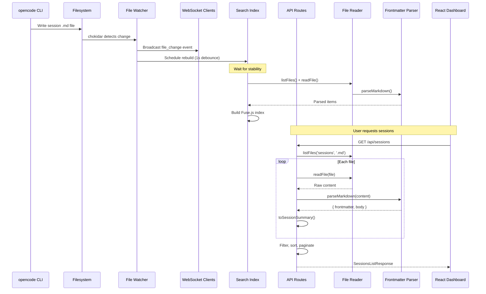
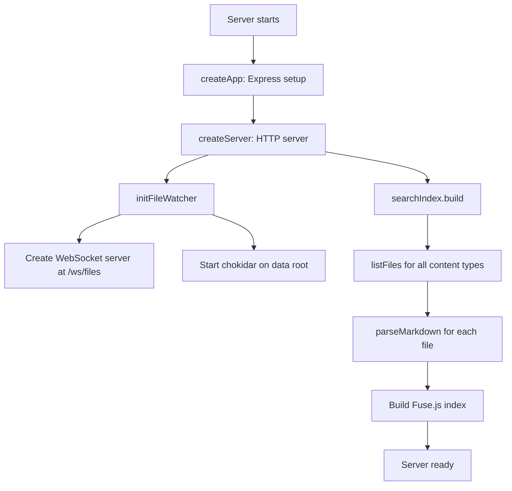
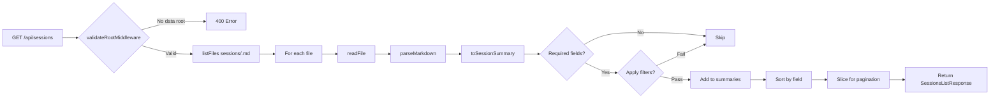

# Session Data Pipeline

> **Created:** 2026-04-14
> **Author:** Chronicler
> **Scope:** `server/services/` (file-watcher, file-reader, frontmatter-parser, search-index), `server/routes/sessions.ts`

---

## Overview

The session data pipeline is the backbone of AKL's Knowledge — it transforms raw markdown files written by the opencode CLI into a queryable, filterable, searchable API consumed by the React dashboard. The pipeline is entirely **read-only**: files are created externally, and the server watches, parses, caches, and serves them.

There is no database. The filesystem IS the database.

---

## Architecture

```
┌─────────────────────────────────────────────────────────────────────┐
│                        AKL Server (port 3001)                       │
│                                                                     │
│  ┌──────────────┐    ┌──────────────┐    ┌───────────────────────┐  │
│  │  HTTP Server │    │  WebSocket   │    │   Search Index        │  │
│  │  (Express)   │    │  /ws/files   │    │   (Fuse.js, in-memory)│  │
│  └──────┬───────┘    └──────┬───────┘    └───────────┬───────────┘  │
│         │                   │                        │              │
│  ┌──────┴───────────────────┴────────────────────────┴───────────┐  │
│  │                    API Routes Layer                            │  │
│  │  GET /api/sessions        → List (paginated, filtered, sorted)│  │
│  │  GET /api/sessions/meta   → Filter options (agents, tags...)  │  │
│  │  GET /api/sessions/:id    → Single session detail             │  │
│  │  GET /api/search          → Full-text search                  │  │
│  └──────────────────────────┬────────────────────────────────────┘  │
│                             │                                       │
│  ┌──────────────────────────┴────────────────────────────────────┐  │
│  │                    Service Layer                               │  │
│  │  ┌─────────────┐  ┌──────────────────┐  ┌──────────────────┐  │  │
│  │  │ file-reader │  │ frontmatter-     │  │   search-index   │  │  │
│  │  │ .ts         │  │ parser.ts        │  │   .ts            │  │  │
│  │  │             │  │                  │  │                  │  │  │
│  │  │ readFile()  │  │ parseMarkdown()  │  │ build()          │  │  │
│  │  │ listFiles() │  │ parseFrontmatter()│ │ search()         │  │  │
│  │  │ fileExists()│  └──────────────────┘  └──────────────────┘  │  │
│  │  └─────────────┘                                              │  │
│  └──────────────────────────┬────────────────────────────────────┘  │
│                             │                                       │
│  ┌──────────────────────────┴────────────────────────────────────┐  │
│  │              File Watcher (chokidar + WebSocket)               │  │
│  │  • Watches data root for .md changes                          │  │
│  │  • Broadcasts events to WebSocket clients                     │  │
│  │  • Debounces search index rebuild (1s)                        │  │
│  └──────────────────────────┬────────────────────────────────────┘  │
│                             │                                       │
└─────────────────────────────┼───────────────────────────────────────┘
                              │
                    ┌─────────┴─────────┐
                    │   Data Root       │
                    │   (filesystem)    │
                    │                   │
                    │  sessions/        │
                    │    YYYY-MM/       │
                    │      *.md         │
                    └───────────────────┘
```

---

## Component Map

### 1. File Watcher (`server/services/file-watcher.ts`)

**Purpose:** Detect filesystem changes and notify clients in real-time.

| Aspect | Detail |
|--------|--------|
| **Library** | `chokidar` for file watching, `ws` for WebSocket |
| **WebSocket path** | `/ws/files` |
| **Watched root** | `getDataRoot()` (configured via `server/.data-root.json`) |
| **Ignored** | Dotfiles (`/(^|[\/\\])\../`) |
| **Write stability** | 500ms threshold, 100ms poll interval |
| **Events** | `add`, `change`, `unlink` |

**How it works:**

1. On server startup, `initFileWatcher(httpServer)` creates a WebSocket server attached to the HTTP server.
2. Chokidar watches the data root directory (ignoring dotfiles).
3. On any file change, the watcher:
   - Computes the relative path from data root.
   - Derives the content type from the first path segment (e.g., `sessions`, `agents`).
   - Broadcasts a JSON message to all connected WebSocket clients.
   - Schedules a debounced search index rebuild (1 second delay).

**WebSocket message format:**

```json
{
  "type": "file_change",
  "event": "add|change|unlink",
  "path": "sessions/2025-04/2025-04-12-eager-moon.md",
  "contentType": "sessions",
  "timestamp": "2025-04-12T10:30:00.000Z"
}
```

**Key design decisions:**

- **Debounced rebuild:** Multiple rapid file changes (e.g., a bulk migration) trigger only one index rebuild, 1 second after the last change.
- **No in-memory cache:** The watcher does NOT maintain a cache of file contents. Every API request reads files fresh from disk. The only cached structure is the search index (Fuse.js).
- **Client management:** WebSocket clients are tracked in a `Set<WebSocket>`. Clients are removed on `close` or `error` events.

---

### 2. File Reader (`server/services/file-reader.ts`)

**Purpose:** Safe filesystem access with path traversal protection.

| Function | Description |
|----------|-------------|
| `readFile(filePath)` | Read a file's content as UTF-8 string |
| `listFiles(directory, extension?)` | Recursively list files, optionally filtered by extension |
| `fileExists(filePath)` | Check if a file exists within data root |
| `validateDirectory(dirPath)` | Check if a path is a valid directory |

**Security: Path traversal protection**

Every file operation passes through `validatePathWithinRoot()`:

```
dataRoot = "/Users/khoi/akl-knowledge"
requested = "../../etc/passwd"
resolved  = "/etc/passwd"
→ throws PATH_TRAVERSAL
```

The validation ensures the resolved absolute path starts with the data root (with trailing separator to prevent prefix matching like `/data` vs `/data-other`).

**Error types (`FileError`):**

| Code | HTTP Mapping | Trigger |
|------|-------------|---------|
| `DATA_ROOT_NOT_SET` | 500 | No data root configured |
| `PATH_TRAVERSAL` | 403 | Path escapes data root |
| `FILE_NOT_FOUND` | 404 | File does not exist |
| `INTERNAL_ERROR` | 500 | Unexpected filesystem error |

**Recursive listing:**

`listFiles()` uses a recursive `walk()` function that:
- Reads directory entries with `fs.readdir({ withFileTypes: true })`.
- Recurses into subdirectories.
- Collects files matching the optional extension filter.
- Returns paths **relative to the data root**, sorted alphabetically.
- Silently skips unreadable directories (catch-and-return).

---

### 3. Frontmatter Parser (`server/services/frontmatter-parser.ts`)

**Purpose:** Extract YAML frontmatter and markdown body from session files.

| Function | Description |
|----------|-------------|
| `parseMarkdown(content)` | Split markdown into `{ frontmatter, body }` |
| `parseFrontmatter(yamlContent)` | Parse a raw YAML string into an object |

**Parsing logic:**

1. Check if content starts with `---`.
2. Find the closing `---` delimiter (second line that is exactly `---` after trimming).
3. Extract the YAML block between delimiters.
4. Parse YAML with `js-yaml`.
5. Return `{ frontmatter: Record<string, unknown>, body: string }`.

**Edge cases handled:**

| Scenario | Behavior |
|----------|----------|
| No frontmatter | Returns `{ frontmatter: {}, body: content }` |
| No closing `---` | Returns `{ frontmatter: {}, body: content }` |
| Invalid YAML | Returns `{ frontmatter: {}, body: content }` (graceful degradation) |
| YAML parses to non-object | Returns `{ frontmatter: {}, body: content }` |

**Note:** `parseFrontmatter()` (the standalone YAML parser) **throws** on invalid YAML, while `parseMarkdown()` is forgiving.

---

### 4. Search Index (`server/services/search-index.ts`)

**Purpose:** Full-text search across all content types using Fuse.js.

| Aspect | Detail |
|--------|--------|
| **Library** | Fuse.js (fuzzy search) |
| **Storage** | In-memory (`SearchItem[]`) |
| **Build trigger** | Server startup + debounced on file changes |
| **File limit** | Sessions capped at 500 files per build |

**Indexed content types:** `session`, `agent`, `skill`, `topic`, `config`

**Search field weights:**

| Field | Weight |
|-------|--------|
| `title` | 0.5 |
| `content` | 0.3 |
| `tags` | 0.1 |
| `agent` | 0.05 |
| `category` | 0.05 |

**Build process:**

```
1. Set building = true (prevent concurrent builds)
2. Clear existing items
3. For each content type:
   a. listFiles(type, '.md')
   b. For each file:
      i.   readFile()
      ii.  parseMarkdown()
      iii. Create SearchItem
4. Build Fuse.js index with weighted keys
5. Set lastBuilt timestamp
6. Set building = false
```

**Concurrency guard:** The `building` flag prevents overlapping rebuilds. If `build()` is called while already building, it returns immediately.

---

### 5. Sessions API (`server/routes/sessions.ts`)

**Purpose:** Serve session data via REST endpoints.

| Endpoint | Method | Description |
|----------|--------|-------------|
| `GET /api/sessions` | GET | Paginated, filtered, sorted session list |
| `GET /api/sessions/meta` | GET | Filter options (agents, statuses, tags, date range) |
| `GET /api/sessions/:id` | GET | Single session detail (frontmatter + body + raw) |

**All routes require valid data root** (enforced by `validateRootMiddleware` registered in `server/index.ts`).

#### GET /api/sessions

**Query parameters:**

| Param | Type | Default | Description |
|-------|------|---------|-------------|
| `page` | number | 1 | Page number (min: 1) |
| `limit` | number | 50 | Items per page (min: 1, max: 100) |
| `agent` | string | — | Filter by agent name |
| `status` | string | — | Filter by status |
| `tags` | string | — | Comma-separated tags (ALL must match) |
| `dateFrom` | string | — | Filter sessions from this date (string comparison) |
| `dateTo` | string | — | Filter sessions to this date (string comparison) |
| `sort` | string | `date` | Sort field: `date`, `title`, `agent`, `tokens`, `cost`, `duration` |
| `order` | string | `desc` | Sort order: `asc` or `desc` |

**Response format:**

```json
{
  "success": true,
  "data": {
    "sessions": [...],
    "total": 145,
    "page": 1,
    "limit": 50
  },
  "meta": {
    "timestamp": "2025-04-12T10:30:00.000Z",
    "totalPages": 3
  }
}
```

#### GET /api/sessions/meta

Returns aggregated filter options computed by scanning all session files:

```json
{
  "success": true,
  "data": {
    "agents": ["explorer", "fixer", "researcher"],
    "statuses": ["completed", "failed"],
    "tags": ["debugging", "flutter", "research"],
    "dateRange": {
      "min": "2025-01-15T08:00:00Z",
      "max": "2025-04-12T10:30:00Z"
    }
  },
  "meta": { "timestamp": "..." }
}
```

#### GET /api/sessions/:id

The `:id` parameter matches the session's `id` frontmatter field (not the filename). The route scans all session files, parses each, and returns the first match.

**Response format:**

```json
{
  "success": true,
  "data": {
    "frontmatter": { "id": "...", "slug": "...", ... },
    "body": "## Summary\n\n...",
    "raw": "---\nid: ...\n---\n\n## Summary..."
  },
  "meta": { "timestamp": "..." }
}
```

**Not found:** Returns 404 with `{ success: false, error: { code: "FILE_NOT_FOUND", ... } }`.

---

## Data Flow

### Complete Pipeline: File Change → Parse → Cache → Serve



### Startup Flow



### Request Flow (List Sessions)



---

## Session Schema Reference

### Frontmatter Fields (from `server/types/index.ts`)

| Field | Type | Required | Description |
|-------|------|----------|-------------|
| `id` | `string` | Yes | Unique session ID (e.g., `ses_abc123`) |
| `slug` | `string` | Yes | URL-friendly identifier (e.g., `eager-moon`) |
| `title` | `string` | Yes | Human-readable title |
| `agent` | `string` | Yes | Primary agent used |
| `model` | `string` | Yes | LLM model used |
| `createdAt` | `string` | Yes | ISO 8601 UTC timestamp |
| `updatedAt` | `string` | Yes | ISO 8601 UTC timestamp |
| `tokens` | `SessionTokens` | Yes | `{ input, output, reasoning, total }` |
| `cost` | `number` | Yes | Total cost in USD |
| `status` | `SessionStatus` | Yes | `active` \| `completed` \| `failed` \| `abandoned` |
| `tags` | `string[]` | No | Array of lowercase tags |
| `duration` | `number` | No | Session duration in seconds |
| `version` | `number` | Yes | Schema version |
| `relatedSessions` | `string[]` | No | Related session IDs |
| `parentSession` | `string` | No | Parent session ID |

### API Response Types

**SessionSummary** (list items):

```typescript
interface SessionSummary {
  id: string;
  slug: string;
  title: string;
  agent: string;
  model: string;
  createdAt: string;
  tokens: SessionTokens;
  cost: number;
  status: SessionStatus;
  tags?: string[];
  duration?: number;
}
```

**SessionDetail** (single session):

```typescript
interface SessionDetail {
  frontmatter: SessionFrontmatter;
  body: string;
  raw: string;
}
```

### Required Fields for List Inclusion

A session file is **excluded** from the list API if any of these frontmatter fields are missing: `id`, `slug`, `title`, `agent`, `createdAt`. (Checked in `toSessionSummary()`.)

---

## Key Decisions and Patterns

### 1. No In-Memory Session Cache

**Decision:** Every API request reads files from disk and parses them fresh.

**Rationale:**
- Simplicity — no cache invalidation logic needed.
- File watcher handles real-time updates via WebSocket.
- Search index is the only cached structure (rebuilt on changes).

**Trade-off:** List endpoints are O(n) file reads per request. For large session counts, this could be slow. The 500-file cap on search index builds hints at awareness of this.

### 2. Debounced Index Rebuild

**Decision:** Search index rebuilds are debounced at 1 second after the last file change.

**Rationale:** Prevents thrashing during bulk operations (migrations, syncs). The `awaitWriteFinish` config (500ms stability) on chokidar provides additional protection against partial writes.

### 3. Graceful Error Handling

**Decision:** File read/parse errors are silently skipped in list operations.

**Pattern:** Every file operation in the routes is wrapped in try/catch with empty catch blocks. Invalid files are excluded from results rather than causing errors.

### 4. Path Traversal Protection

**Decision:** All file operations validate that the resolved path stays within the data root.

**Implementation:** `validatePathWithinRoot()` in `file-reader.ts` checks the resolved absolute path starts with the normalized data root (with trailing separator).

### 5. Atomic File Writes (Sync Engine)

**Decision:** The sync engine writes to `.tmp` files first, then renames for atomicity.

**Note:** The sync engine (`sync-engine.ts`) is for vault synchronization (copying config files to vault directories), not for the session read pipeline. It uses `.bak` backups and `.tmp` atomic writes.

### 6. String-Based Date Filtering

**Decision:** Date filtering uses string comparison on ISO 8601 timestamps.

**Rationale:** ISO 8601 strings sort lexicographically in chronological order, so `<` and `>` comparisons work correctly without parsing.

---

## Gotchas

### 1. Sessions Are Read on Every Request

There is **no session cache**. `GET /api/sessions` reads and parses every `.md` file in `sessions/` on each request. For 300+ sessions, this means 300+ file reads per request. The search index is the only pre-built structure.

### 2. Search Index Caps at 500 Session Files

`search-index.ts` limits session indexing to `slice(0, 500)`. If the data root has more than 500 session files, older ones (alphabetically) won't appear in search results.

### 3. Session ID ≠ Filename

`GET /api/sessions/:id` matches against the `id` frontmatter field, not the filename. Two files could theoretically have the same `id` — only the first match is returned.

### 4. Invalid Frontmatter Silently Excludes Sessions

If a session file has invalid YAML frontmatter, `parseMarkdown()` returns `{ frontmatter: {}, body: content }`. The `toSessionSummary()` function then returns `null` (missing required fields), and the session is silently excluded from list results.

### 5. WebSocket Clients Are Not Notified of Index State

The WebSocket broadcasts file change events, but clients must independently decide when to refetch data. There is no "index ready" event after a rebuild completes.

### 6. Date Filtering Is String Comparison

`dateFrom` and `dateTo` use string comparison (`summary.createdAt < dateFrom`). This works for ISO 8601 but may produce unexpected results if timestamps are not consistently formatted.

### 7. Tags Filter Requires ALL Tags

The `tags` query parameter uses `every()` — all specified tags must be present on the session. This is an AND filter, not OR.

### 8. Sort Field `date` Is Default, Not `createdAt`

The sort field `date` maps to `createdAt` comparison. The API accepts `date` as the sort field name, not `createdAt`.

---

## Related Documentation

| Document | Path |
|----------|------|
| OMC Knowledge Architecture (schema spec) | `docs/specs/2025-04-12-omc-knowledge-architecture.md` |
| Server entry point | `server/index.ts` |
| Server configuration | `server/config.ts` |
| Shared types | `server/types/index.ts` |
| Search routes | `server/routes/search.ts` |
| Sync engine | `server/services/sync-engine.ts` |
| File hasher | `server/services/file-hasher.ts` |
| AGENTS.md (project conventions) | `AGENTS.md` |
