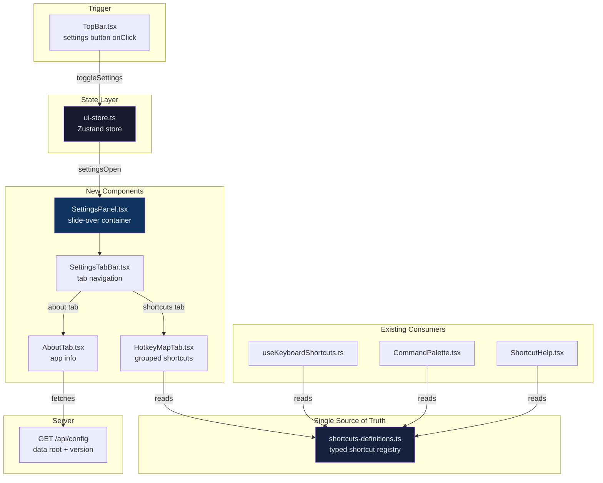

# Design: Settings Panel with Hotkey Map Tab

**Date:** 2026-04-14
**Status:** Approved
**Author:** Orchestrator
**Related Requirement:** `docs/ai/requirements/settings-panel-hotkey-map.md`

## 1. Architecture Overview



## 2. Component Design

### 2.1 `SettingsPanel.tsx` — Slide-over Container

**Purpose:** Root container that renders when `settingsOpen` is true. Handles backdrop, positioning, focus management, and tab content switching.

**Location:** `src/components/settings/SettingsPanel.tsx`

**Structure:**
```
SettingsPanel
├── Backdrop (click to close)
└── Panel (fixed right, w-96, top-12 to bottom)
    ├── Header ("Settings" title + close button)
    ├── SettingsTabBar (shortcuts | about)
    └── Tab Content
        ├── HotkeyMapTab (default)
        └── AboutTab
```

**Key behaviors:**
- Conditional rendering: `{settingsOpen && <SettingsPanel />}` in `App.tsx` — unmounts when closed
- Backdrop: semi-transparent overlay (`bg-black/40 backdrop-blur-sm`), click closes panel
- Escape key: closes panel (handled via existing `useKeyboardShortcuts` hook extension)
- **Focus trap (custom, no new dependencies):** On mount, a `useEffect` attaches a `keydown` listener to the panel element. When `Tab` is pressed:
  - Query all focusable elements inside the panel (`button, [href], input, select, textarea, [tabindex]:not([tabindex="-1"])`)
  - If `Shift+Tab` on the first focusable element → prevent default, focus the last focusable element
  - If `Tab` on the last focusable element → prevent default, focus the first focusable element
  - This cycles focus within the panel without escaping to the background content
- **Focus restoration:** `App.tsx` maintains a `useRef<HTMLElement | null>(null)` that stores `document.activeElement` at the moment `toggleSettings()` is called (captured via a `beforeToggleSettings` callback in the store). On `SettingsPanel` unmount, `triggerRef.current?.focus()` restores focus to the settings button.
- ARIA: `role="dialog"`, `aria-labelledby="settings-title"`, `aria-label="Settings"`, `aria-modal="true"`
- **Auto-close ShortcutHelp:** When Settings Panel opens, if `shortcutHelpOpen` is true, auto-close it to prevent overlap

**Styling:**
- Panel: `fixed right-0 top-12 bottom-0 w-96 bg-surface-container-highest border-l border-outline-variant/15 shadow-sb-xl z-50`
- Backdrop: `fixed inset-0 bg-black/40 backdrop-blur-sm z-40`
- Header: `flex items-center justify-between px-4 py-3 border-b border-outline-variant/15`
- Title element: `<h2 id="settings-title">` — referenced by `aria-labelledby` on the dialog

### 2.2 `SettingsTabBar.tsx` — Tab Navigation

**Purpose:** Renders tab buttons and manages tab selection state.

**Location:** `src/components/settings/SettingsTabBar.tsx`

**Props:**
```ts
interface SettingsTabBarProps {
  activeTab: 'shortcuts' | 'about';
  onTabChange: (tab: 'shortcuts' | 'about') => void;
}
```

**Keyboard navigation (WAI-ARIA Tabs, manual activation):**
- `Arrow Left` / `Arrow Right`: move focus between tabs
- `Space` / `Enter`: activate the focused tab
- `Tab`: move focus out of tab bar into the tabpanel

**Styling:**
- Tab bar container: `flex border-b border-outline-variant/15`
- Active tab: `text-primary border-b-2 border-primary px-4 py-2 text-sm font-medium`
- Inactive tab: `text-on-surface-variant px-4 py-2 text-sm hover:text-on-surface`

### 2.3 `HotkeyMapTab.tsx` — Grouped Shortcuts Display

**Purpose:** Renders all shortcuts grouped by category from the single source of truth.

**Location:** `src/components/settings/HotkeyMapTab.tsx`

**Data source:** `shortcuts-definitions.ts` (see Section 3)

**Rendering:**
```
HotkeyMapTab
├── Category: "Global"
│   ├── ShortcutRow: Command Palette → ⌘ K
│   ├── ShortcutRow: New Note → ⌘ N
│   └── ...
├── Category: "Navigation"
│   ├── ShortcutRow: Graph View → G
│   └── ...
└── Category: "Editor"
    ├── ShortcutRow: Bold → ⌘ B
    └── ...
```

**Platform-aware modifier rendering:**
- Detect once at component mount: `const isMac = navigator.platform.toUpperCase().includes('MAC')`
- Replace `Ctrl` with `⌘`, `Ctrl+Shift` with `⌘⇧` in display
- Each key segment in its own `<kbd>` element with `+` text separator

**Empty state:** If no shortcuts defined, render: "No keyboard shortcuts defined" in muted text.

### 2.4 `AboutTab.tsx` — Application Information

**Purpose:** Displays app metadata and configuration info.

**Location:** `src/components/settings/AboutTab.tsx`

**Data sources:**
- App name: hardcoded string `"Monolithic Lexicon"`
- Version: `import.meta.env.PACKAGE_VERSION` (Vite define at build time) or fallback `"unknown"`
- Description: hardcoded string
- Repository link: conditional — only renders if `import.meta.env.REPOSITORY_URL` is set
- Data root path: fetched from `GET /api/config` on mount

**Error handling:**
- If `GET /api/config` fails: display "Unable to load" for data root path, rest of tab renders normally
- Loading state: show skeleton or "Loading..." while fetching config

**Layout:**
```
AboutTab
├── App Name (large, bold)
├── Version (muted, monospace)
├── Description (body text)
├── Repository Link (conditional, clickable)
└── Data Root Path (label + value from API)
```

## 3. Single Source of Truth: `shortcuts-definitions.ts`

**Location:** `src/config/shortcuts-definitions.ts`

**Type definitions:**
```ts
export type ShortcutCategory = 'global' | 'navigation' | 'editor';

export interface ShortcutDefinition {
  id: string;           // unique identifier, e.g. 'command-palette'
  action: string;       // display name, e.g. 'Command Palette'
  category: ShortcutCategory;
  keys: string[];       // individual keys, e.g. ['Ctrl', 'K']
}
```

**Note:** The `handler`, `macKeys`, and `matchesShortcut` fields are intentionally omitted. The `shortcuts-definitions.ts` module is the **display-only** source of truth in this iteration. The `useKeyboardShortcuts.ts` hook retains its existing handler logic (which has complex context like "only when not typing"). The `CommandPalette.tsx` retains its own `commands` array with action functions — it only imports shortcut display labels from this module. These can be unified in a future iteration when hook migration is scoped.

**Exported data:**
```ts
export const SHORTCUT_DEFINITIONS: ShortcutDefinition[] = [
  // Global
  { id: 'command-palette', action: 'Command Palette', category: 'global', keys: ['Ctrl', 'K'] },
  { id: 'new-note', action: 'New Note', category: 'global', keys: ['Ctrl', 'N'] },
  { id: 'toggle-sidebar', action: 'Toggle Sidebar', category: 'global', keys: ['Ctrl', '\\'] },
  { id: 'toggle-right-panel', action: 'Toggle Right Panel', category: 'global', keys: ['Ctrl', '/'] },
  { id: 'focus-mode', action: 'Focus Mode', category: 'global', keys: ['Ctrl', '.'] },
  { id: 'show-shortcuts', action: 'Show Shortcuts', category: 'global', keys: ['Ctrl', 'Shift', '?'] },
  // Navigation
  { id: 'graph-view', action: 'Graph View', category: 'navigation', keys: ['G'] },
  { id: 'close-overlay', action: 'Close Overlay', category: 'navigation', keys: ['Esc'] },
  // Editor
  { id: 'bold', action: 'Bold', category: 'editor', keys: ['Ctrl', 'B'] },
  { id: 'italic', action: 'Italic', category: 'editor', keys: ['Ctrl', 'I'] },
  { id: 'heading', action: 'Heading', category: 'editor', keys: ['Ctrl', 'Shift', 'H'] },
  { id: 'wikilink', action: 'Wikilink', category: 'editor', keys: ['[', '['] },
];
```

**Helper exports:**
```ts
// Get display keys for current platform
// Replaces 'Ctrl' → '⌘' and 'Shift' → '⇧' on macOS
export function getDisplayKeys(shortcut: ShortcutDefinition): string[];

// Group shortcuts by category
export function getShortcutsByCategory(): Record<ShortcutCategory, ShortcutDefinition[]>;
```

## 4. State Changes

### 4.1 `ui-store.ts` — New Fields

```ts
interface UIState {
  // ... existing fields ...
  settingsOpen: boolean;
  settingsTab: 'shortcuts' | 'about';

  toggleSettings: () => void;
  setSettingsTab: (tab: 'shortcuts' | 'about') => void;
}
```

**Implementation:**
```ts
settingsOpen: false,
settingsTab: 'shortcuts',
_settingsTriggerElement: null as HTMLElement | null,  // internal: stores element to restore focus to

toggleSettings: () => set((state) => {
  if (!state.settingsOpen) {
    // Capturing the triggering element before opening
    return {
      settingsOpen: true,
      settingsTab: 'shortcuts',
      _settingsTriggerElement: document.activeElement as HTMLElement,
      shortcutHelpOpen: false, // auto-close ShortcutHelp if open
    };
  }
  return { settingsOpen: false };
}),
setSettingsTab: (tab) => set({ settingsTab: tab }),
```

**Focus restoration:** `SettingsPanel` reads `useUIStore.getState()._settingsTriggerElement` on unmount and calls `.focus()` on it.

### 4.2 `useKeyboardShortcuts.ts` — Extended

Add handler for Escape to close settings panel:
```ts
if (e.key === 'Escape') {
  // ... existing handlers ...
  if (useUIStore.getState().settingsOpen) toggleSettings();
}
```

**Important:** `toggleSettings` must be added to the `useEffect` dependency array (currently missing from the existing hook).

## 5. Integration Points

### 5.1 `TopBar.tsx` — Wire Settings Button

Add `onClick` to the existing settings button:
```tsx
import { useUIStore } from '../../state/ui-store';

// Inside TopBar component:
const { toggleSettings } = useUIStore();

<button onClick={toggleSettings} title="Settings">
  <MaterialIcon name="settings" size={20} />
</button>
```

### 5.2 `App.tsx` — Mount SettingsPanel

Add conditional render after existing overlays:
```tsx
import SettingsPanel from './components/settings/SettingsPanel';

// In the App component render, alongside CommandPalette and ShortcutHelp:
{settingsOpen && <SettingsPanel />}
```

### 5.3 `vite.config.ts` — Inject Build-Time Variables

```ts
define: {
  'import.meta.env.PACKAGE_VERSION': JSON.stringify(packageJson.version),
  'import.meta.env.REPOSITORY_URL': JSON.stringify(process.env.REPOSITORY_URL || ''),
}
```

### 5.4 Consumer Migration (Existing Components)

**`CommandPalette.tsx`:** The `commands` array in CommandPalette wires action functions (`createNote`, `toggleSidebar`, etc.) — these are **not** sourced from `shortcuts-definitions.ts`. Only the shortcut display labels (e.g., `'Ctrl+K'`) are imported via `getDisplayKeys()` to replace the hardcoded `shortcut` strings. The action wiring remains local to CommandPalette.

**`ShortcutHelp.tsx`:** Replace local `SHORTCUTS` constant with import from `shortcuts-definitions.ts`. Use `getDisplayKeys()` for platform-aware rendering. The modal structure and behavior remain unchanged.

**`useKeyboardShortcuts.ts`:** Keep existing handlers for now (they have complex logic like "only when not typing"). The `shortcuts-definitions.ts` module serves as the display-only source. Hook migration is deferred to a future iteration.

## 6. File Change Summary

| File | Action | Description |
|------|--------|-------------|
| `src/config/shortcuts-definitions.ts` | **Create** | Single source of truth for shortcut definitions |
| `src/components/settings/SettingsPanel.tsx` | **Create** | Slide-over panel container |
| `src/components/settings/SettingsTabBar.tsx` | **Create** | Tab navigation component |
| `src/components/settings/HotkeyMapTab.tsx` | **Create** | Grouped shortcuts display |
| `src/components/settings/AboutTab.tsx` | **Create** | App info display |
| `src/state/ui-store.ts` | **Modify** | Add `settingsOpen`, `settingsTab`, `toggleSettings`, `setSettingsTab` |
| `src/components/layout/TopBar.tsx` | **Modify** | Wire `onClick` to `toggleSettings()` |
| `src/routes/App.tsx` | **Modify** | Conditionally render `<SettingsPanel />` |
| `src/hooks/useKeyboardShortcuts.ts` | **Modify** | Add Escape handler for settings panel |
| `vite.config.ts` | **Modify** | Inject `PACKAGE_VERSION` and `REPOSITORY_URL` |
| `src/components/shared/ShortcutHelp.tsx` | **Modify** | Import from `shortcuts-definitions.ts` |
| `src/components/search/CommandPalette.tsx` | **Modify** | Import display labels from `shortcuts-definitions.ts` (action wiring remains local) |

## 7. Error Handling Strategy

| Scenario | Handling |
|----------|----------|
| `GET /api/config` fails | About tab shows "Unable to load" for data root, rest renders |
| Empty shortcut definitions | HotkeyMapTab shows "No keyboard shortcuts defined" |
| Rapid open/close clicks | Zustand toggle is atomic — no duplicate instances possible |
| Narrow viewport (< 384px) | Panel uses `max-w-full` to prevent overflow |
| Unknown shortcut category | TypeScript union type prevents this at compile time |
| Settings Panel + ShortcutHelp overlap | Opening Settings Panel auto-closes ShortcutHelp (via `toggleSettings` calling `set({ shortcutHelpOpen: false })` if it's true) |

## 8. Security Considerations

- **No user input rendered:** All content is static or from trusted API (`/api/config`)
- **No XSS risk:** Data root path displayed as text, not innerHTML
- **Repository URL:** Injected at build time from env var — no runtime URL parsing
- **API is local-only:** Server binds to `127.0.0.1`, no external network calls

## 9. Performance Considerations

- **Conditional rendering:** Panel unmounts when closed — zero render cost
- **No lazy loading needed:** Total new code estimated < 3KB gzipped (well under 5KB threshold)
- **Single API call:** `GET /api/config` fetched once on About tab mount, not on every open
- **No re-renders:** Shortcut definitions are static constants — no state-driven re-renders

## 10. Acceptance Criteria Traceability

| AC # | Requirement | Design Coverage |
|------|-------------|-----------------|
| 1-5 | Settings Panel Infrastructure | Section 2.1, 2.2, 4.1, 5.1, 5.2 |
| 6-10 | Hotkey Map Tab | Section 2.3, 3 |
| 11-12 | Single Source of Truth | Section 3, 5.4 |
| 13-16 | Visual Design | Section 2.1, 2.2 |
| 17-18 | About Tab | Section 2.4, 5.3 |
| 19-22 | Accessibility | Section 2.1 (focus trap, ARIA), 2.2 (keyboard nav) |
| 23-24 | Performance | Section 9 |
| Edge cases | Edge Cases | Section 7 |

## 11. Out of Scope (Confirmed)

- Settings persistence / localStorage
- Customizable key remapping
- Additional tabs beyond "Keyboard Shortcuts" and "About"
- Mobile gesture shortcuts
- Search/filter within hotkey map
- Changes to ShortcutHelp modal behavior
- Changes to Command Palette behavior (beyond data source migration)
