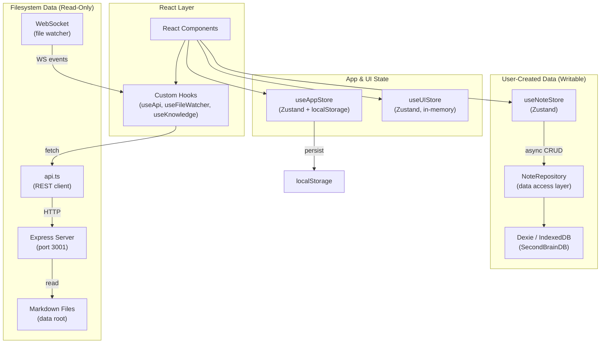
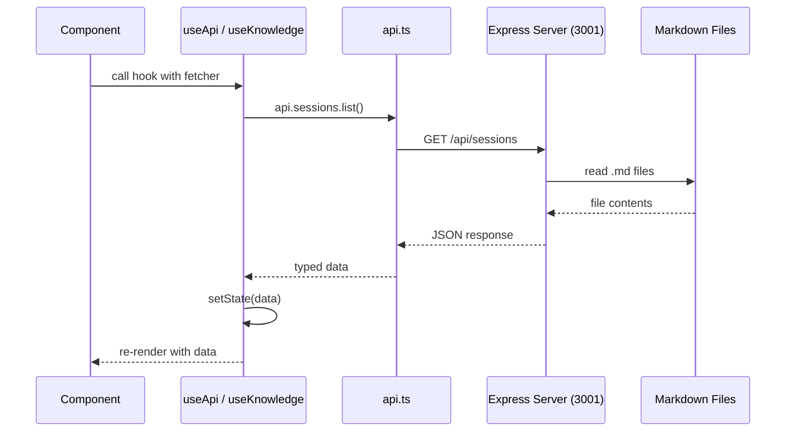
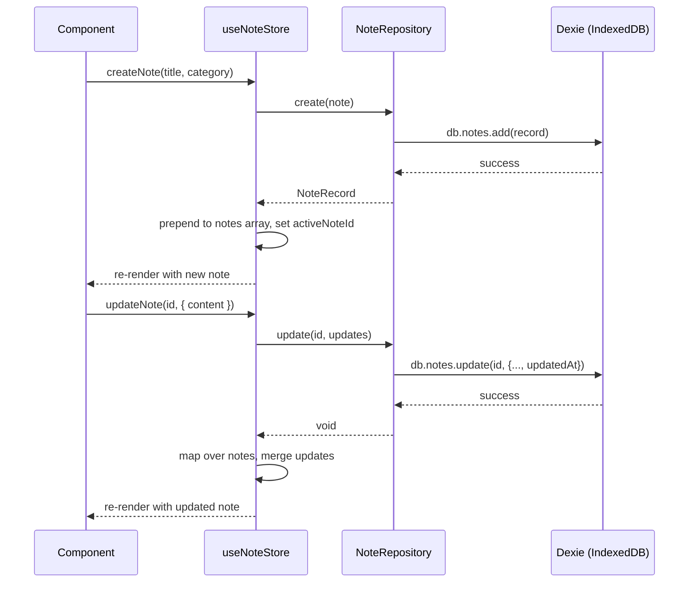
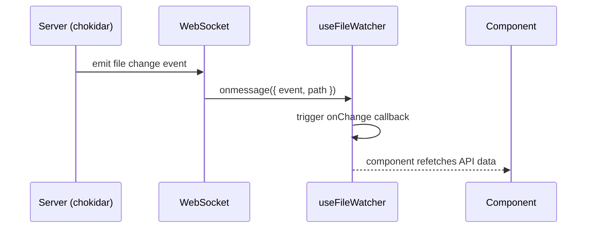

# State Management — Zustand + Dexie + REST API

> **Status:** Active  
> **Created:** 2026-04-14  
> **Last Updated:** 2026-04-14  
> **Author:** Chronicler  

---

## Table of Contents

1. [Overview](#1-overview)
2. [Architecture Diagram](#2-architecture-diagram)
3. [Store Map](#3-store-map)
4. [Data Flow](#4-data-flow)
5. [State Synchronization Patterns](#5-state-synchronization-patterns)
6. [Key Decisions and Patterns](#6-key-decisions-and-patterns)
7. [Gotchas](#7-gotchas)
8. [Related Documentation](#8-related-documentation)

---

## 1. Overview

AKL's Knowledge uses **three separate Zustand stores** to manage distinct domains of application state, backed by **Dexie (IndexedDB)** for user-created notes and a **REST API** for read-only session/agent/skill/topic data from the filesystem.

| Store | Purpose | Persistence |
|-------|---------|-------------|
| `useAppStore` | Global app config (data root, loading, errors, watcher status) | `localStorage` |
| `useNoteStore` | User-created notes (CRUD, PARA categorization, tags, search) | IndexedDB via Dexie |
| `useUIStore` | UI chrome state (sidebar, panels, modals, focus mode) | In-memory only |

**Why three stores?** Each store owns a disjoint slice of state with different persistence strategies and update patterns. Splitting them avoids unnecessary re-renders — a UI toggle change doesn't trigger note-related subscribers, and vice versa.

---

## 2. Architecture Diagram



---

## 3. Store Map

### 3.1 `useAppStore` — Application State

**File:** `src/state/app-store.ts`

| State | Type | Default | Source |
|-------|------|---------|--------|
| `dataRoot` | `string \| null` | `localStorage.getItem('akl-data-root')` | localStorage |
| `isConfigured` | `boolean` | derived from `dataRoot` presence | computed |
| `isLoading` | `boolean` | `false` | in-memory |
| `error` | `string \| null` | `null` | in-memory |
| `sessionCount` | `number` | `0` | in-memory |
| `watcherStatus` | `'watching' \| 'error' \| 'idle'` | `'idle'` | in-memory |

| Action | Signature | Side Effects |
|--------|-----------|--------------|
| `setDataRoot` | `(path: string) => void` | Writes to `localStorage`, clears error |
| `clearDataRoot` | `() => void` | Removes from `localStorage` |
| `setLoading` | `(loading: boolean) => void` | — |
| `setError` | `(error: string \| null) => void` | — |
| `setSessionCount` | `(count: number) => void` | — |
| `setWatcherStatus` | `(status) => void` | — |

**Key pattern:** `dataRoot` is the single source of truth for where the server reads markdown files. It is persisted to `localStorage` so the configuration survives page reloads. The `isConfigured` flag is derived at store creation time — **it is not reactive** to `dataRoot` changes (it's computed once from the initial localStorage value).

---

### 3.2 `useNoteStore` — Note State Management

**File:** `src/state/note-store.ts`

| State | Type | Default |
|-------|------|---------|
| `notes` | `NoteRecord[]` | `[]` |
| `activeNoteId` | `string \| null` | `null` |
| `isLoading` | `boolean` | `false` |
| `selectedParaCategory` | `ParaCategory \| 'all' \| null` | `'all'` |
| `searchQuery` | `string` | `''` |
| `lastDeletedNote` | `NoteRecord \| null` | `null` |

**PARA categories:** `'projects'` | `'areas'` | `'resources'` | `'archives'`

| Action | Signature | Persistence | Behavior |
|--------|-----------|-------------|----------|
| `loadNotes` | `() => Promise<void>` | Reads from IndexedDB | Fetches all non-deleted notes, reverses order (newest first) |
| `selectNote` | `(id: string \| null) => void` | None | Sets active note for editor view |
| `createNote` | `(title, paraCategory) => Promise<NoteRecord>` | Writes to IndexedDB | Generates UUID, prepends to list, auto-selects |
| `updateNote` | `(id, updates) => Promise<void>` | Writes to IndexedDB | Merges updates, sets `updatedAt` timestamp |
| `deleteNote` | `(id: string) => Promise<void>` | Soft-delete in IndexedDB | Sets `isDeleted: true`, stores in `lastDeletedNote` for undo |
| `undoDelete` | `() => Promise<void>` | Writes to IndexedDB | Restores `isDeleted: false`, prepends to list |
| `addTag` | `(id, tag) => Promise<void>` | Writes to IndexedDB | Deduplicates, no-op if tag exists |
| `removeTag` | `(id, tag) => Promise<void>` | Writes to IndexedDB | Filters tag from array |
| `setParaCategory` | `(category) => void` | None | Filter state for note list |
| `setSearchQuery` | `(query: string) => void` | None | Search filter state |

**NoteRecord shape:**

```typescript
interface NoteRecord {
  id: string;           // UUID
  title: string;
  content: string;      // TipTap JSON or HTML
  paraCategory: ParaCategory;
  tags: string[];
  createdAt: number;    // epoch ms
  updatedAt: number;    // epoch ms
  isDeleted: boolean;   // soft delete flag
}
```

---

### 3.3 `useUIStore` — UI State

**File:** `src/state/ui-store.ts`

| State | Type | Default |
|-------|------|---------|
| `sidebarOpen` | `boolean` | `true` |
| `rightPanelOpen` | `boolean` | `true` |
| `rightPanelTab` | `'info' \| 'backlinks' \| 'graph' \| 'outline'` | `'info'` |
| `focusMode` | `boolean` | `false` |
| `commandPaletteOpen` | `boolean` | `false` |
| `shortcutHelpOpen` | `boolean` | `false` |
| `graphOverlayOpen` | `boolean` | `false` |

| Action | Signature |
|--------|-----------|
| `toggleSidebar` | `() => void` |
| `toggleRightPanel` | `() => void` |
| `setRightPanelTab` | `(tab: RightPanelTab) => void` |
| `toggleFocusMode` | `() => void` |
| `toggleCommandPalette` | `() => void` |
| `setCommandPaletteOpen` | `(open: boolean) => void` |
| `toggleShortcutHelp` | `() => void` |
| `toggleGraphOverlay` | `() => void` |
| `setGraphOverlayOpen` | `(open: boolean) => void` |

**Key pattern:** All UI state is **in-memory only** — no persistence. UI resets to defaults on page reload. This is intentional: UI preferences are ephemeral and should not survive across sessions.

---

## 4. Data Flow

### 4.1 API Data Flow (Read-Only Session/Agent/Skill/Topic Data)



**Pattern:** API data is **not stored in Zustand**. Each component that needs server data uses the `useApi<T>` hook or a domain-specific hook (`useKnowledge`, `useGraphData`). The hook manages its own `data`, `loading`, `error`, and `refetch` state via `useState`. This keeps API data scoped to the components that need it.

### 4.2 Note Data Flow (Writable User Data)



### 4.3 File Watcher → UI Refresh Flow



The `useFileWatcher` hook maintains a WebSocket connection to the server. When markdown files change, the server pushes events through the WebSocket. Components register an `onChange` callback that triggers API refetches, keeping the UI in sync with the filesystem.

---

## 5. State Synchronization Patterns

### 5.1 Zustand ↔ IndexedDB (Notes)

The note store follows a **write-through cache** pattern:

1. **Write path:** Every mutation (`createNote`, `updateNote`, `deleteNote`, `addTag`, `removeTag`) writes to IndexedDB **first**, then updates the Zustand store optimistically.
2. **Read path:** `loadNotes()` reads from IndexedDB and populates the store. There is no separate cache — the store **is** the cache.
3. **Soft deletes:** `deleteNote` sets `isDeleted: true` in IndexedDB rather than removing the record. `loadNotes` filters out deleted notes. This enables the `undoDelete` feature.

```
Component Action → Zustand Store → NoteRepository → IndexedDB
                      ↑                                    |
                      └──────── optimistic update ─────────┘
```

### 5.2 Zustand ↔ localStorage (App Config)

The app store uses **synchronous localStorage** for the `dataRoot`:

- **Initialization:** Store reads `localStorage` synchronously at creation time.
- **Writes:** `setDataRoot` writes to `localStorage` **before** calling `set()`, ensuring persistence happens immediately.
- **No reactivity:** `isConfigured` is computed once at store creation. If `dataRoot` is changed via `setDataRoot`, `isConfigured` is explicitly set to `true` in the same `set()` call.

### 5.3 API Data — No Zustand Caching

API data (sessions, agents, skills, topics, stats, search, graph, backlinks) is **not cached in Zustand**. Each hook (`useApi`, `useKnowledge`, `useGraphData`) manages its own local state. This means:

- **No cross-component sharing** of API data via stores — each component fetches independently.
- **No stale data problem** — data is always fresh on mount.
- **Potential for redundant fetches** — if two components on the same route both call `api.sessions.list()`, two HTTP requests are made.

---

## 6. Key Decisions and Patterns

### 6.1 Separate Stores by Domain

Three stores instead of one monolithic store. This follows Zustand's recommendation to split stores by concern:

- **App store** — global configuration, rarely changes
- **Note store** — user data, frequent CRUD operations
- **UI store** — ephemeral UI state, very frequent toggles

### 6.2 Repository Pattern for IndexedDB

`NoteRepository` abstracts Dexie operations behind a clean interface. The store calls repository methods, not Dexie directly. This enables:

- Easy testing (mock the repository)
- Future migration to a different storage backend
- Centralized query logic (e.g., `getAll` always filters `isDeleted`)

### 6.3 Optimistic Updates for Notes

All note mutations update the Zustand store immediately after the IndexedDB write completes (not before). This is **pessimistic optimistic** — the DB write is awaited, but the UI doesn't show a loading spinner for individual operations. If the DB write fails, the error propagates but the store is not rolled back (a potential improvement area).

### 6.4 `useApi` Hook Pattern

The generic `useApi<T>` hook provides a consistent interface for all API calls:

```typescript
const { data, loading, error, refetch } = useApi(
  () => api.sessions.list({ limit: 20 }),
  [limit], // dependency array triggers refetch
);
```

### 6.5 Soft Delete with Undo

Notes use soft deletes (`isDeleted: true`) rather than hard deletes. The `lastDeletedNote` field in the store enables a single-level undo. This is a deliberate UX choice — accidental deletions are common in note-taking apps.

---

## 7. Gotchas

### 7.1 `isConfigured` Is Not Reactive

`isConfigured` is computed once at store creation from `localStorage`. If you call `clearDataRoot()`, `isConfigured` is set to `false` in the same `set()` call. But if you manually manipulate `localStorage` outside the store, `isConfigured` will not update. **Always use the store actions.**

### 7.2 Notes Are Reversed on Load

`loadNotes()` calls `.reverse()` on the array returned from IndexedDB (which is sorted by `updatedAt` ascending). This means notes are displayed newest-first. The reverse happens **in the store**, not in the repository — `noteRepository.getAll()` returns ascending order.

### 7.3 `getState()` in Async Actions

Several note store actions (`deleteNote`, `undoDelete`, `addTag`, `removeTag`) call `useNoteStore.getState()` to read the current state inside async functions. This is necessary because the `state` parameter in `set((state) => ...)` captures the state at the time `set` is called, not at the time the async operation completes. However, this pattern is vulnerable to race conditions if two async actions run concurrently.

### 7.4 No API Data in Zustand

If you need to share API data between components that aren't in a parent-child relationship, you'll need to either:
- Lift the `useApi` call to a common ancestor and pass data down as props
- Add a Zustand store for that specific API domain
- Use React Context

Currently, there is no shared cache for API data.

### 7.5 `updatedAt` Is Set Twice

In `updateNote`, the store merges `updatedAt: Date.now()` into the note object, and `noteRepository.update` also sets `updatedAt: Date.now()`. These happen within milliseconds of each other, so the values will differ slightly. The IndexedDB value is the authoritative one (used for sorting).

### 7.6 UI State Is Not Persisted

All UI state (sidebar open/closed, active tab, focus mode) resets on page reload. If persistence is desired in the future, the UI store would need localStorage integration similar to the app store.

---

## 8. Related Documentation

| Document | Description |
|----------|-------------|
| [OMC Knowledge Architecture](../specs/2025-04-12-omc-knowledge-architecture.md) | Overall data architecture, filesystem-as-database design |
| [AGENTS.md](../../../AGENTS.md) | Project overview, architecture summary, developer commands |
| [API Routes](../../../server/) | Express server routes that serve the REST API |
| [Dexie Schema](../../src/storage/db.ts) | IndexedDB table definitions and indexes |
| [Note Types](../../src/core/note/note.ts) | `NoteRecord`, `LinkRecord`, `ParaCategory` type definitions |
