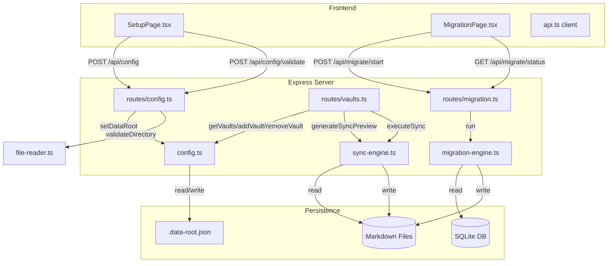
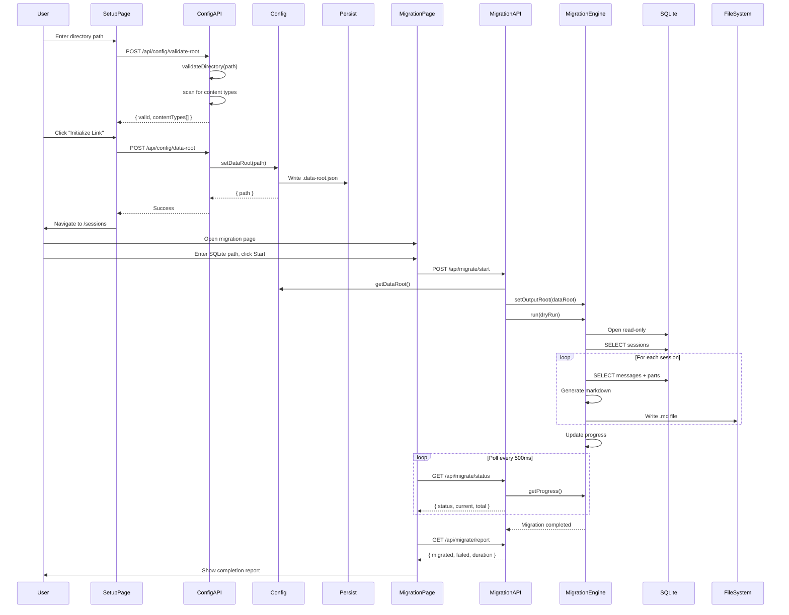

# Vault & Data Root Management

## Overview

The vault and data root configuration system manages where AKL's Knowledge reads session data from (data root) and where it replicates data to (vaults). It provides a persistence layer via `server/.data-root.json`, REST API endpoints for configuration, and a migration engine to import data from opencode's SQLite database into the markdown-based format.

**Key responsibilities:**
- Configure and persist the primary data root directory
- Register and manage output vaults for data replication
- Migrate existing opencode SQLite sessions to markdown files
- Validate paths and detect content types before configuration

---

## Architecture



---

## Component Map

### 1. Configuration Core (`server/config.ts`)

The central module for data root and vault management. Maintains both in-memory state and file-based persistence.

**In-memory state:**
```typescript
const config: ServerConfig = {
  port: 3001,
  host: '127.0.0.1',
  dataRoot: string | null,  // loaded from persistence on startup
};
```

**Persistence file:** `server/.data-root.json`

**Exported functions:**

| Function | Purpose |
|----------|---------|
| `getConfig()` | Returns a copy of the full server config |
| `getDataRoot()` | Returns the current data root path or `null` |
| `setDataRoot(rootPath)` | Sets and persists the data root (resolves to absolute path) |
| `clearDataRoot()` | Clears data root and deletes persistence file |
| `getVaults()` | Returns array of registered vaults |
| `addVault(vault)` | Adds a vault and persists |
| `removeVault(vaultId)` | Removes a vault by ID, returns boolean |

### 2. Config API (`server/routes/config.ts`)

Three endpoints for data root configuration:

| Method | Path | Purpose |
|--------|------|---------|
| `GET` | `/api/config/data-root` | Get current data root |
| `POST` | `/api/config/data-root` | Set data root (validates directory exists) |
| `POST` | `/api/config/validate-root` | Validate a path without setting it |

### 3. Vault API (`server/routes/vaults.ts`)

Five endpoints for vault management and sync:

| Method | Path | Purpose |
|--------|------|---------|
| `GET` | `/api/vaults` | List all registered vaults |
| `POST` | `/api/vaults` | Add a new vault (validates path, creates if needed) |
| `DELETE` | `/api/vaults/:id` | Remove a vault by ID |
| `POST` | `/api/vaults/preview` | Preview sync diff (requires data root) |
| `POST` | `/api/vaults/sync` | Execute sync to all vaults (requires data root) |

### 4. Migration API (`server/routes/migration.ts`)

Three endpoints for SQLite-to-markdown migration:

| Method | Path | Purpose |
|--------|------|---------|
| `POST` | `/api/migrate/start` | Start async migration (body: `{ sqlitePath?, dryRun? }`) |
| `GET` | `/api/migrate/status` | Get current migration progress |
| `GET` | `/api/migrate/report` | Get summary of last completed migration |

### 5. Migration Engine (`server/services/migration-engine.ts`)

The `MigrationEngine` class handles the full SQLite-to-markdown conversion pipeline.

**Default SQLite path:** `~/.local/share/opencode/opencode.db`

**Migration flow:**
1. Open SQLite database in read-only mode
2. Query all sessions (joined with project info)
3. For each session:
   - Fetch messages ordered by creation time
   - Fetch parts for each message
   - Parse JSON data from messages and parts
   - Generate markdown with YAML frontmatter + conversation body
   - Write to `{dataRoot}/sessions/YYYY-MM/YYYY-MM-DD-slug.md`
4. Track progress and errors per-session (one failure doesn't stop others)

**Output file format:**
```
{dataRoot}/
  sessions/
    2025-03/
      2025-03-14-my-session-slug.md
    2025-04/
      2025-04-01-another-session.md
```

**Markdown structure:**
```markdown
---
id: "session-uuid"
slug: "my-session-slug"
title: "Session Title"
directory: "/path/to/project"
agent: "orchestrator"
model: "claude-sonnet-4-20250514"
createdAt: "2025-03-14T10:00:00.000Z"
updatedAt: "2025-03-14T10:30:00.000Z"
tokens:
  input: 15000
  output: 8000
  reasoning: 2000
  total: 25000
cost: 0.123456
status: "completed"
tags: []
version: 1
---

# Session Title

## Session Info

- **Directory:** `/path/to/project`
- **Project:** my-project
- **Created:** 2025-03-14T10:00:00.000Z
- **Updated:** 2025-03-14T10:30:00.000Z
- **Agent:** orchestrator
- **Tokens:** 25,000 (input: 15,000, output: 8,000, reasoning: 2,000)
- **Cost:** $0.123456
- **Git Changes:** +120 -45 (8 files)

---

## Conversation

### User — 10:00:00 AM

User message text...

---

### Assistant (orchestrator) — 10:00:05 AM

Assistant response...

**Tool:** `read` — Reading file.ts

```json
{ "path": "file.ts" }
```

**Output:**
```
file contents...
```

---
```

**Part types rendered:**
| Part Type | Rendering |
|-----------|-----------|
| `text` | Plain markdown text |
| `reasoning` | Italicized "Reasoning:" label + text |
| `tool` | Tool name, title, JSON input, and output blocks |
| `file` | Filename and MIME type |
| `patch` | Hash and affected files list |
| `agent` | Sub-agent name and source |
| `subtask` | Subtask description |
| `step-start` / `step-finish` | Skipped (structural markers) |
| Unknown | Raw JSON dump for debugging |

### 6. Frontend Pages

**SetupPage.tsx** — Initial data root configuration wizard:
1. User enters a directory path
2. Clicks validate button → `POST /api/config/validate-root`
3. Shows content types found (sessions, agents, skills, topics, configs)
4. On submit → `POST /api/config/data-root` → navigates to `/sessions`

**MigrationPage.tsx** — SQLite migration wizard with 4 steps:
1. **Configure** — Enter SQLite path, toggle dry run mode
2. **Preview** — (UI step, actual preview via vaults API)
3. **Migrate** — `POST /api/migrate/start`, polls `/api/migrate/status` every 500ms
4. **Complete** — Shows report with migrated/failed counts and duration

---

## Data Flow



---

## API Reference

### Config Endpoints

#### `GET /api/config/data-root`

Returns the currently configured data root.

**Response:**
```json
{
  "success": true,
  "data": { "path": "/Users/khoi/akl-knowledge" },
  "meta": { "timestamp": "2025-04-14T10:00:00.000Z" }
}
```

#### `POST /api/config/data-root`

Sets the data root path. Validates the path is an existing directory.

**Request body:**
```json
{ "path": "/Users/khoi/akl-knowledge" }
```

**Success response (200):**
```json
{
  "success": true,
  "data": { "path": "/Users/khoi/akl-knowledge" },
  "meta": { "timestamp": "2025-04-14T10:00:00.000Z" }
}
```

**Error response (400):**
```json
{
  "success": false,
  "error": {
    "code": "DATA_ROOT_INVALID",
    "message": "The specified path is not a valid directory: /bad/path",
    "details": { "path": "/bad/path" }
  }
}
```

#### `POST /api/config/validate-root`

Validates a path without persisting it. Returns detected content types.

**Request body:**
```json
{ "path": "/Users/khoi/akl-knowledge" }
```

**Response:**
```json
{
  "success": true,
  "data": {
    "valid": true,
    "contentTypes": ["sessions", "agents", "skills"]
  },
  "meta": { "timestamp": "2025-04-14T10:00:00.000Z" }
}
```

Content types checked: `sessions`, `agents`, `skills`, `topics`, `configs`. A type is included only if the subdirectory exists AND contains at least one `.md` file.

---

### Vault Endpoints

#### `GET /api/vaults`

Lists all registered vaults.

**Response:**
```json
{
  "success": true,
  "data": {
    "vaults": [
      {
        "id": "vault-1713096000000",
        "path": "/Users/khoi/backup-vault",
        "name": "backup-vault",
        "addedAt": "2025-04-14T10:00:00.000Z"
      }
    ]
  },
  "meta": { "timestamp": "2025-04-14T10:00:00.000Z" }
}
```

#### `POST /api/vaults`

Adds a new vault. Validates path exists or parent exists (creates directory if needed). Tests writability.

**Request body:**
```json
{ "path": "/Users/khoi/backup-vault" }
```

**Error codes:**
| Code | Status | Meaning |
|------|--------|---------|
| `VAULT_PATH_INVALID` | 400 | Path is invalid or parent directory doesn't exist |
| `VAULT_NOT_WRITABLE` | 403 | Path exists but is not writable |

#### `DELETE /api/vaults/:id`

Removes a vault by ID. Returns 404 if not found.

#### `POST /api/vaults/preview`

Generates a sync preview showing what would change across all vaults. Requires data root to be set.

**Error:** `DATA_ROOT_NOT_SET` (400) if no data root configured.

#### `POST /api/vaults/sync`

Executes the actual sync to all registered vaults. Requires data root to be set.

**Error:** `DATA_ROOT_NOT_SET` (400) if no data root configured.

---

### Migration Endpoints

#### `POST /api/migrate/start`

Starts an asynchronous migration from SQLite to markdown.

**Request body:**
```json
{
  "sqlitePath": "~/.local/share/opencode/opencode.db",
  "dryRun": false
}
```

Both fields are optional. `sqlitePath` defaults to `~/.local/share/opencode/opencode.db`. `dryRun` defaults to `false`.

**Security:** Paths containing `..` are rejected with `PATH_TRAVERSAL` (403).

**Error codes:**
| Code | Status | Meaning |
|------|--------|---------|
| `MIGRATION_IN_PROGRESS` | 409 | A migration is already running |
| `DATA_ROOT_NOT_SET` | 400 | No data root configured |
| `PATH_TRAVERSAL` | 403 | SQLite path contains `..` sequences |

**Success response:**
```json
{
  "success": true,
  "data": {
    "migrationId": "mig_1713096000000",
    "status": "running"
  },
  "meta": { "timestamp": "2025-04-14T10:00:00.000Z" }
}
```

#### `GET /api/migrate/status`

Returns current migration progress.

**Response:**
```json
{
  "success": true,
  "data": {
    "status": "running",
    "current": 42,
    "total": 100,
    "errors": [],
    "startedAt": 1713096000000,
    "completedAt": null
  },
  "meta": { "timestamp": "2025-04-14T10:00:00.000Z" }
}
```

Status values: `idle`, `running`, `completed`, `failed`.

#### `GET /api/migrate/report`

Returns a summary of the last completed migration.

**Response:**
```json
{
  "success": true,
  "data": {
    "status": "completed",
    "migrated": 98,
    "failed": 2,
    "total": 100,
    "errors": [
      "Session abc123def456... (broken-session): JSON parse error"
    ],
    "duration": "12.3s"
  },
  "meta": { "timestamp": "2025-04-14T10:00:00.000Z" }
}
```

---

## Persistence Format

### `server/.data-root.json`

This file stores the data root path and registered vaults. It is read on server startup and written on every configuration change.

**Schema:**
```json
{
  "dataRoot": "/absolute/path/to/data/root",
  "vaults": [
    {
      "id": "vault-1713096000000",
      "path": "/absolute/path/to/vault",
      "name": "vault-name",
      "addedAt": "2025-04-14T10:00:00.000Z"
    }
  ]
}
```

**Field descriptions:**

| Field | Type | Description |
|-------|------|-------------|
| `dataRoot` | `string \| null` | Absolute path to the primary data directory. `null` if not configured. |
| `vaults` | `Vault[]` | Array of registered output vaults. |
| `vaults[].id` | `string` | Unique ID, format: `vault-{timestamp}` |
| `vaults[].path` | `string` | Absolute path to the vault directory |
| `vaults[].name` | `string` | Directory basename of the vault path |
| `vaults[].addedAt` | `string` | ISO 8601 timestamp when vault was added |

**Behavior:**
- File is created on first `setDataRoot()` or `addVault()` call
- File is deleted on `clearDataRoot()`
- If file is missing or invalid JSON, defaults to `{ dataRoot: null, vaults: [] }`
- All errors during read/write are silently ignored (fail-safe)

---

## Key Decisions and Patterns

### 1. Read-then-write persistence model
Every write operation (`setDataRoot`, `addVault`, `removeVault`) reads the current state from disk, modifies it, and writes back. This ensures concurrent operations don't lose data, though it's not atomic.

### 2. In-memory config + file persistence
The server config is loaded once at startup into memory. Changes update both the in-memory object and the persistence file. This means:
- Restarting the server reloads from `.data-root.json`
- In-memory state is the source of truth during runtime
- File is the source of truth across restarts

### 3. Path resolution
All paths are resolved to absolute paths via `path.resolve()` before storage. This ensures consistency regardless of how paths are provided (relative, with `~`, etc.).

### 4. Migration is per-session fault-tolerant
Each session is processed independently. If one session fails to migrate, the error is recorded and processing continues with the next session. The migration only fully fails if the database can't be opened or the output path is invalid.

### 5. SQLite opened read-only
The migration engine opens the SQLite database with `{ readonly: true }` to prevent any accidental writes to the source database.

### 6. Async migration with polling
Migration runs asynchronously (doesn't block the HTTP response). The frontend polls `/api/migrate/status` every 500ms for progress updates. A concurrent migration guard prevents starting a second migration while one is in progress.

### 7. Vault ID generation
Vault IDs are generated as `vault-${Date.now()}`. This is simple but means rapid sequential additions could theoretically collide (unlikely in practice).

### 8. Content type detection
The validate-root endpoint checks for 5 known content types: `sessions`, `agents`, `skills`, `topics`, `configs`. A type is only reported if the subdirectory exists AND contains at least one `.md` file.

---

## Gotchas

1. **`server/.data-root.json` is NOT the data directory** — It's a configuration file stored in the `server/` directory. The actual data lives in the path specified by `dataRoot` (default: `~/akl-knowledge`).

2. **Silent failure on persistence errors** — Both `loadVaultConfig()` and `saveVaultConfig()` catch and ignore all errors. If the file becomes corrupted or permissions change, the server will silently fall back to defaults without warning.

3. **Migration doesn't validate SQLite schema** — The migration engine assumes the opencode SQLite schema (`session`, `message`, `part`, `project` tables) exists. If the database is from a different version or corrupted, errors will be caught per-session but the root cause may not be obvious.

4. **No migration reset mechanism** — Once a migration completes, there's no API endpoint to reset the progress. To re-run migration, the server must be restarted (which resets the in-memory `MigrationEngine` progress to `idle`).

5. **Path traversal check is string-based** — The migration route checks for `..` in the SQLite path string. This is a basic check; the `validateOutputPath()` function in the migration engine does the same. Neither performs full path normalization before the check.

6. **Vault sync requires data root** — Both `/api/vaults/preview` and `/api/vaults/sync` return 400 if no data root is configured, even though vaults themselves are independent of the data root in the persistence model.

7. **Dry run still reads the database** — In dry run mode, the migration engine still opens and reads the SQLite database and processes all sessions — it just doesn't write any files. This means a dry run on a large database will still take time and memory.

8. **Frontend sends `outputRoot` but backend ignores it** — The `MigrationPage.tsx` sends `outputRoot` in the migration start request body, but the backend route only reads `sqlitePath` and `dryRun`. The output root is always taken from `getDataRoot()`.

---

## Related Documentation

- [CLI Packaging](./cli-packaging.md) — How the `bin/akl.js` CLI starts the server and manages ports
- [New Design System](./new-design-system.md) — The UI design system used by SetupPage and MigrationPage
- [AGENTS.md](../../AGENTS.md) — Project overview and architecture summary
- [Server Types](../../server/types/index.ts) — Full TypeScript type definitions for all API contracts
