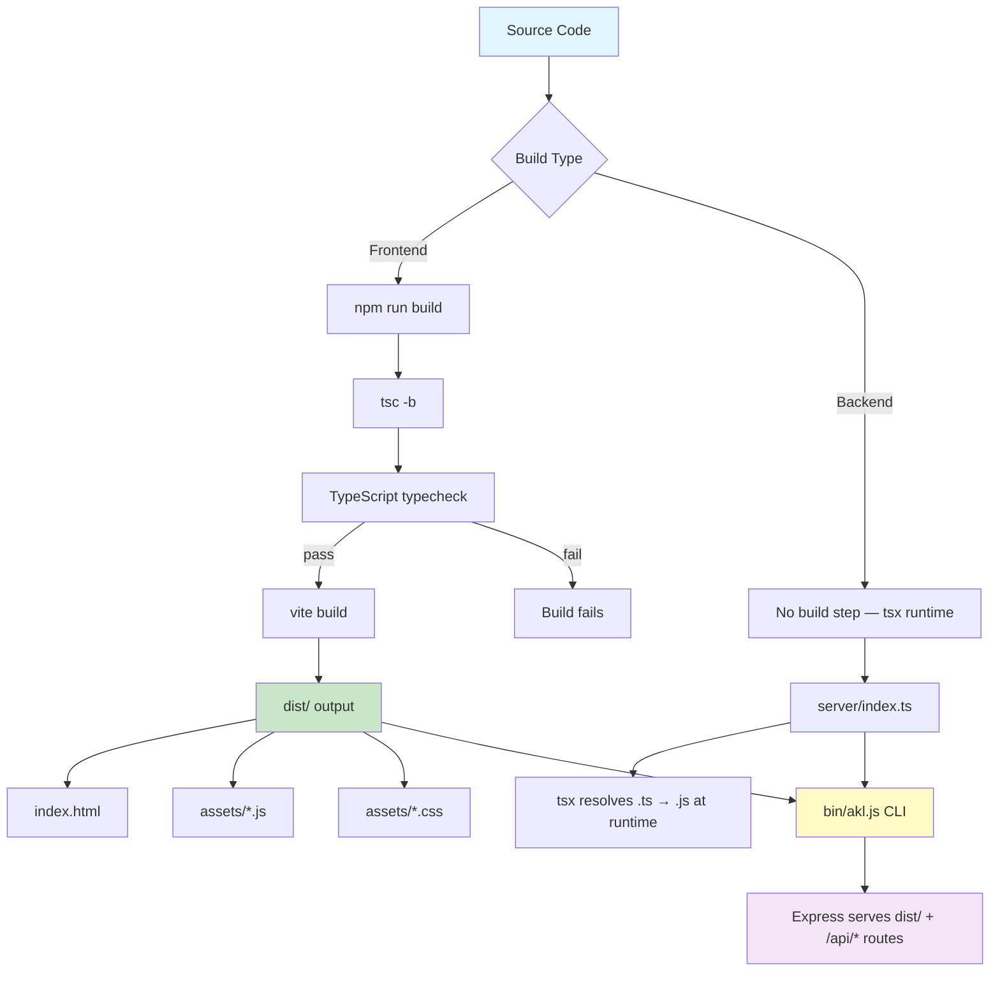
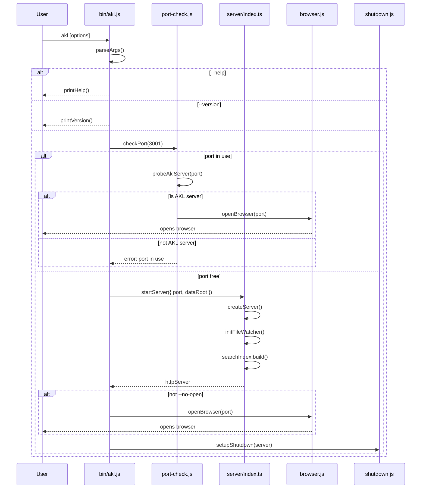

# Build & Deployment

## Overview

AKL's Knowledge is a React SPA + Express API server packaged as a distributable CLI tool. The build pipeline produces a static frontend bundle (`dist/`) that the Express server serves alongside its REST API. The CLI entry point (`bin/akl.js`) orchestrates startup: port checking, server initialization, browser opening, and graceful shutdown.

**Key characteristics:**
- **Frontend**: Vite + React 19 + Tailwind CSS 4 → static bundle
- **Backend**: Express + TypeScript (tsx runtime) → served from `server/`
- **Distribution**: npm package with `bin` entry, runs via `tsx` (no pre-compilation of CLI)
- **Network**: Binds to `127.0.0.1` only (local-first)

---

## Build Pipeline



---

## Configuration Reference

### Vite Configuration (`vite.config.ts`)

| Plugin | Purpose |
|--------|---------|
| `@vitejs/plugin-react` | React 19 support, Fast Refresh, JSX transform |
| `@tailwindcss/vite` | Tailwind CSS v4 integration (replaces PostCSS) |

```ts
import { defineConfig } from 'vite'
import react from '@vitejs/plugin-react'
import tailwindcss from '@tailwindcss/vite'

export default defineConfig({
  plugins: [react(), tailwindcss()],
})
```

**Notable defaults** (Vite defaults, not overridden):
- Build output directory: `dist/`
- Base path: `/`
- Target: ES modules (modern browsers)
- No custom alias or proxy configuration

### Frontend TypeScript (`tsconfig.json`)

| Setting | Value | Rationale |
|---------|-------|-----------|
| `target` | `ES2020` | Modern browser support |
| `module` | `ESNext` | Vite handles bundling |
| `moduleResolution` | `bundler` | Vite-style resolution (no `.js` extensions needed in imports) |
| `jsx` | `react-jsx` | React 17+ automatic JSX transform |
| `noEmit` | `true` | Vite handles compilation; tsc is typecheck-only |
| `strict` | `true` | Full type safety |
| `noUnusedLocals` | `true` | Dead code prevention |
| `noUnusedParameters` | `true` | Dead code prevention |
| `include` | `["src"]` | Frontend source only |

### Backend TypeScript (`server/tsconfig.json`)

| Setting | Value | Rationale |
|---------|-------|-----------|
| `target` | `ES2022` | Node.js 18+ support |
| `module` | `NodeNext` | Native ESM for Node.js |
| `moduleResolution` | `NodeNext` | Node.js-style resolution (requires `.js` extensions) |
| `outDir` | `./dist` | Compiled output (not used in dev — tsx handles runtime) |
| `declaration` | `true` | Type declarations for imports |
| `declarationMap` | `true` | Source map for declarations |
| `sourceMap` | `true` | Debugging support |
| `noUncheckedIndexedAccess` | `true` | Stricter index access safety |
| `include` | `["**/*.ts"]` | All server TypeScript files |
| `exclude` | `["node_modules", "dist"]` | Standard exclusions |

### Package.json (`package.json`)

**Package metadata:**
- **Name**: `akl-knowledge`
- **Version**: `0.1.0`
- **Type**: `module` (ESM)
- **Private**: `true` (not published to npm)

**Bin configuration:**
```json
{
  "bin": {
    "akl": "./bin/akl.js"
  }
}
```

**Scripts:**

| Script | Command | Purpose |
|--------|---------|---------|
| `dev` | `vite` | Frontend dev server with HMR |
| `build` | `tsc -b && vite build` | Typecheck + production build |
| `preview` | `vite preview` | Serve built SPA locally |
| `akl` | `tsx bin/akl.js` | Start full app (builds + serves on port 3001) |
| `seed` | `tsx scripts/seed-notes.ts` | Seed demo notes into IndexedDB |
| `test` | `vitest` | Run tests (watch mode) |
| `test:ui` | `vitest --ui` | Run tests with Vitest UI |
| `test:coverage` | `vitest --coverage` | Run tests with v8 coverage |

---

## Build Commands and Outputs

### `npm run build`

Two-step process:

1. **`tsc -b`** — TypeScript typecheck (no emit, `noEmit: true`)
   - Validates all `src/` files against `tsconfig.json`
   - Fails fast on type errors before Vite build
   - Uses project references if configured ( `-b` flag)

2. **`vite build`** — Production bundle
   - Outputs to `dist/` directory
   - Minifies JS/CSS
   - Generates content-hashed filenames for cache busting
   - Produces `dist/index.html` as entry point

### Build Output Structure (`dist/`)

```
dist/
├── index.html          # SPA entry point (HTML shell)
└── assets/
    ├── index-<hash>.js     # Bundled React application
    ├── index-<hash>.css    # Bundled Tailwind styles
    └── *.js, *.css         # Code-split chunks (if any)
```

### `npm run preview`

- Serves `dist/` via Vite's built-in preview server
- Default port: `4173`
- Useful for testing production build before deployment
- Does **not** include the Express API server

---

## CLI Packaging and Distribution

### Entry Point: `bin/akl.js`

The CLI is a JavaScript file (not TypeScript) that runs via `tsx` at development time and would run directly when installed globally via npm.

**Shebang**: `#!/usr/bin/env node`

**Startup flow:**



### CLI Modules

| Module | File | Responsibility |
|--------|------|----------------|
| **Args parser** | `cli/lib/args.js` | Parse `--port`, `--no-open`, `--data-root`, `--help`, `--version` |
| **Port checker** | `cli/lib/port-check.js` | Check port availability + probe for existing AKL server |
| **Server starter** | `cli/lib/server.js` | Validate data root, create Express server, start listening |
| **Browser opener** | `cli/lib/browser.js` | Cross-platform browser launch (`open`/`start`/`xdg-open`) |
| **Shutdown handler** | `cli/lib/shutdown.js` | Graceful shutdown on SIGINT/SIGTERM with 5s timeout |

### Server Integration

The CLI imports from `server/index.js` (the `.ts` file resolved by `tsx`):

```js
import { createServer } from '../../server/index.js';
import { setDataRoot } from '../../server/config.js';
```

**How this works:**
- `tsx` is a TypeScript runtime that transpiles `.ts` files on-the-fly
- The `.js` extension in the import is how ESM resolution works with `tsx`
- At runtime, `tsx` resolves `server/index.js` → `server/index.ts`
- This is why `npm run akl` uses `tsx bin/akl.js` — it enables `.ts` imports

### Server Factory (`server/index.ts`)

The server exports two functions:

| Export | Purpose |
|--------|---------|
| `createApp()` | Returns Express app with routes, middleware, SPA fallback. Does **not** start listening. |
| `createServer()` | Returns `{ app, httpServer }` with file watcher and search index initialized. Does **not** start listening. |

**Server startup sequence:**
1. `createApp()` — builds Express app with:
   - CORS middleware (localhost/127.0.0.1 only)
   - JSON body parser (10mb limit)
   - API routes (`/api/*`)
   - Error handler
   - Static file serving (`dist/`)
   - SPA fallback (`*` → `index.html`)
2. `createServer()` — wraps app in HTTP server, initializes:
   - File watcher with WebSocket (`ws://127.0.0.1:{port}/ws/files`)
   - Search index (async, non-blocking)
3. `httpServer.listen(port, '127.0.0.1')` — starts listening

**Legacy entry point:** When `server/index.ts` is run directly via `npx tsx index.ts`, it auto-starts using `config.port` and `config.host`.

---

## Key Decisions and Patterns

### Dual TypeScript Configurations

The project maintains **two separate `tsconfig.json` files**:

| Config | Location | Module Resolution | Purpose |
|--------|----------|-------------------|---------|
| Frontend | `/tsconfig.json` | `bundler` | Vite handles imports; no `.js` extensions needed |
| Backend | `/server/tsconfig.json` | `NodeNext` | Node.js ESM; requires `.js` extensions in imports |

**Why not merge?** The `moduleResolution` values are incompatible. `bundler` resolution works for Vite's bundler but breaks Node.js ESM. `NodeNext` works for Node.js but breaks Vite's import resolution.

### No Backend Build Step

The server TypeScript files are **never compiled** in the build pipeline. They run via `tsx` at runtime:
- Development: `cd server && npm run dev` → `tsx watch`
- Production CLI: `tsx bin/akl.js` → `tsx` resolves `.ts` imports

This means distribution requires `tsx` as a dependency (currently in `devDependencies` — would need to move to `dependencies` for npm distribution).

### SPA Fallback Pattern

The Express server serves `dist/index.html` for all non-API routes:

```ts
app.use(express.static(clientDist));
app.get('*', (_req, res) => {
  res.sendFile(path.join(clientDist, 'index.html'));
});
```

This enables client-side routing (React Router) while keeping API routes separate.

### Port Conflict Resolution

The CLI distinguishes between:
1. **AKL server already running** → opens browser to existing instance
2. **Other process using port** → exits with error code 2

Detection works via HTTP probe to `/api/config/data-root` — a unique AKL endpoint.

### Local-First Security

- Server binds to `127.0.0.1` only (not `0.0.0.0`)
- CORS allows only `localhost` and `127.0.0.1` origins
- No external network calls
- Data root validated for existence and write permissions

---

## Gotchas

### 1. CLI imports `.js` but source is `.ts`

```js
import { createServer } from '../../server/index.js';
```

This works because `tsx` handles `.ts` → `.js` resolution at runtime. Do **not** rename the import to `.ts` — it will break ESM resolution.

### 2. `server/.data-root.json` is not the data directory

This file stores the **configuration** for the data root path and vault settings. The actual knowledge data lives in the directory specified by this config (default: `~/akl-knowledge`).

### 3. `tsx` is in `devDependencies`

For the CLI to work when installed globally via npm, `tsx` must be moved to `dependencies`. Currently it only works via `npm run akl` (which uses the local `tsx`).

### 4. Frontend typecheck is separate from build

`npm run build` runs `tsc -b` first. If typecheck fails, Vite build never runs. However, `npm run dev` does **not** typecheck — Vite compiles regardless of type errors.

### 5. Tailwind CSS v4 uses Vite plugin, not PostCSS

Tailwind v4 integration uses `@tailwindcss/vite` plugin instead of the traditional PostCSS setup. No `postcss.config.js` is needed.

### 6. `clientDist` path resolution

In `server/index.ts`:
```ts
const clientDist = path.resolve(__dirname, '../dist');
```

This resolves relative to the **server** directory, not the project root. When the server runs from `server/`, it correctly points to `dist/` at the project root.

### 7. Build does not include server code

`npm run build` only produces the frontend `dist/`. The server TypeScript files remain uncompiled. For a fully self-contained distribution, a separate server build step would be needed (e.g., `tsc -p server/tsconfig.json`).

---

## Related Documentation

- [API Routes](./api-routes.md) — Server endpoint documentation
- [Data Flow](./data-flow.md) — How session data flows from markdown to dashboard
- [Server Architecture](./server-architecture.md) — Express server structure and services
- [Frontend Architecture](./frontend-architecture.md) — React SPA structure and state management
