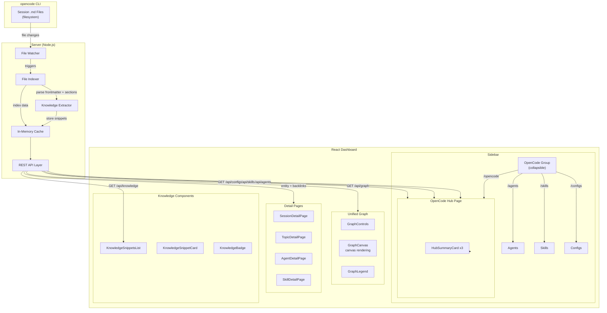

# Design Spec: OpenCode Hub & Obsidian-Like Knowledge Flow

**Date:** 2026-04-13
**Status:** Reviewed
**Author:** Orchestrator
**Requirement:** `docs/ai/requirements/opencode-hub-and-obsidian-flow.md`

---

## 1. Architecture Overview

This design adds two major capabilities to the AKL Knowledge dashboard:

1. **OpenCode Hub** — Consolidates Agents, Skills, and Configs under a single sidebar navigation item with a summary dashboard page
2. **Knowledge Flow Pipeline** — Extracts structured knowledge from session markdown files and displays it in a unified graph view with backlink navigation

The app remains **read-only** — all content creation happens via opencode CLI. The dashboard is a visualization and discovery layer.

### Architecture Diagram



### Data Flow Architecture

```
opencode CLI → Session .md files → File Watcher
                                      ↓
                    ┌─────────────────┴─────────────────┐
                    ↓                                   ↓
          Server (Node.js)                    Client (React)
          - Parse markdown                    - Display knowledge
          - Extract sections                  - Unified graph view
          - Index to API                      - Backlink navigation
          - Expose /api/knowledge             - Hub dashboard
```

---

## 2. Sidebar Changes

### Current Structure
```
├── Sessions        (/sessions)
├── Agents          (/agents)
├── Skills          (/skills)
├── Topics          (/topics)
├── Configs         (/configs)
├── Stats           (/stats)
└── Migration       (/migration)
```

### New Structure
```
├── Sessions        (/sessions)
├── OpenCode        (/opencode)          ← New collapsible group
│   ├── Overview    (/opencode)          ← Hub dashboard
│   ├── Agents      (/agents)            ← Existing route
│   ├── Skills      (/skills)            ← Existing route
│   └── Configs     (/configs)           ← Existing route
├── Topics          (/topics)
├── Stats           (/stats)
└── Migration       (/migration)
```

### Implementation Details

**File:** `src/components/layout/Sidebar.tsx`

- Replace the three separate nav items (Agents, Skills, Configs) with a single collapsible group
- Use a chevron icon to indicate expandable group
- When "OpenCode" label is clicked → navigate to `/opencode`
- When chevron is clicked → expand/collapse sub-items (no navigation)
- Sub-items (Agents, Skills, Configs) navigate to their existing routes
- Active state: highlight "OpenCode" group when any sub-route is active
- Keyboard shortcut `g+o` → navigate to `/opencode`
- Existing shortcuts `g+a`, `g+k`, `g+c` continue to work (backward compatible)

---

## 3. OpenCode Hub Page

### Route: `/opencode`

**File:** `src/routes/OpenCodePage.tsx` (new)

### Layout

```
┌─────────────────────────────────────────────┐
│  OpenCode Hub                               │
│  Your AI team configuration & knowledge     │
├─────────────────────────────────────────────┤
│                                             │
│  ┌──────────┐  ┌──────────┐  ┌──────────┐  │
│  │ Agents   │  │ Skills   │  │ Configs  │  │
│  │   13     │  │   24     │  │    5     │  │
│  │          │  │          │  │          │  │
│  │ • coord  │  │ • dev    │  │ • openc  │  │
│  │ • spec   │  │ • arch   │  │ • skill  │  │
│  │ • exec   │  │ • ui     │  │ • agent  │  │
│  │          │  │          │  │          │  │
│  │ View All →│ │ View All →│ │ View All →│  │
│  └──────────┘  └──────────┘  └──────────┘  │
│                                             │
│  ┌───────────────────────────────────────┐  │
│  │ Recent Activity                        │  │
│  │ • Session "X" used Agent Y + Skill Z  │  │
│  │ • Config "W" updated 2 days ago       │  │
│  └───────────────────────────────────────┘  │
└─────────────────────────────────────────────┘
```

### Component Breakdown

| Component | File | Purpose |
|-----------|------|---------|
| `OpenCodePage` | `src/routes/OpenCodePage.tsx` | Page wrapper, fetches all 3 data types |
| `HubSummaryCard` | `src/components/opencode/HubSummaryCard.tsx` | Reusable card showing count + icon + top items + "View All" link. Shows "No agents/skills/configs found" with count 0 when empty. |
| `RecentActivityFeed` | `src/components/opencode/RecentActivityFeed.tsx` | Timeline of recent sessions only (scope limited to sessions to match acceptance criteria; config change tracking deferred) |

### Data Fetching

- Fetch agents, skills, configs in parallel using `Promise.all`
- Show loading skeleton for each card independently
- Cache results — data changes infrequently

---

## 4. Unified Knowledge Graph

### Current State
- `MiniGraph` — 30 nodes, circular layout, IndexedDB Notes only
- `GraphOverlay` — Full-screen, force-directed, PARA category filters
- Data source: `useNoteStore` + `linkRepository` (IndexedDB)

### New State: Unified Graph

**File:** `src/components/graph/UnifiedGraph.tsx` (new)

### Data Sources Merged

| Entity Type | Source | ID Field | Display Name |
|-------------|--------|----------|--------------|
| Note | IndexedDB | `id` | `title` |
| Session | REST API | `frontmatter.id` | `frontmatter.title` |
| Topic | REST API | `frontmatter.id` | `frontmatter.title` |
| Agent | REST API | `id` | `name` |
| Skill | REST API | `id` | `name` |

### Node Schema

```typescript
type GraphNodeType = 'note' | 'session' | 'topic' | 'agent' | 'skill';

interface GraphNode {
  id: string;
  label: string;
  type: GraphNodeType;
  color: string;  // note: blue, session: blue, topic: green, agent: purple, skill: orange
  metadata: NoteMetadata | SessionMetadata | TopicMetadata | AgentMetadata | SkillMetadata;
}

interface NoteMetadata { entityType: 'note'; paraCategory: string; }
interface SessionMetadata { entityType: 'session'; status: string; agent: string; createdAt: number; }
interface TopicMetadata { entityType: 'topic'; category: string; type: string; }
interface AgentMetadata { entityType: 'agent'; tier: string; status: string; }
interface SkillMetadata { entityType: 'skill'; category: string; status: string; }

interface GraphEdge {
  source: string;  // node ID
  target: string;  // node ID
  type: 'wikilink' | 'relatedSessions' | 'relatedTopics' | 'sourceSession' | 'agentsUsed' | 'skillsUsed';
}
```

### Edge Mapping

| Edge Type | Source | Target | Derived From |
|-----------|--------|--------|--------------|
| `wikilink` | Note | Note | `[[wikilink]]` in content |
| `relatedSessions` | Session | Session | `relatedSessions` frontmatter |
| `relatedTopics` | Topic | Topic | `relatedTopics` frontmatter |
| `sourceSession` | Topic | Session | `sourceSession` frontmatter |
| `agentsUsed` | Session | Agent | `agentsUsed` frontmatter |
| `skillsUsed` | Session | Skill | `skillsUsed` frontmatter |

### Component Architecture

```
UnifiedGraph (wrapper)
├── GraphControls (filters, zoom, reset)
├── GraphCanvas (SVG/Canvas rendering)
│   ├── NodeRenderer (colored circles with labels)
│   ├── EdgeRenderer (lines with optional arrows)
│   └── Tooltip (hover info)
└── GraphLegend (entity type colors)
```

### Integration Points

- Replace `MiniGraph` in RightPanel with `UnifiedGraph` (mini mode)
- Replace `GraphOverlay` with `UnifiedGraph` (full mode)
- Add entity type filter toggles (checkboxes for Note, Session, Topic, Agent, Skill)
- Clicking a node navigates to the appropriate detail page:
  - Note → existing note selection
  - Session → `/sessions/:id`
  - Topic → `/topics/:slug`
  - Agent → `/agents/:slug`
  - Skill → `/skills/:slug`

### Performance

- Use canvas rendering (not SVG) for 100+ nodes to maintain ≥30fps during interaction
- Force-directed simulation uses d3-force on main thread initially; profile at 500 nodes and move to Web Worker only if FPS drops below 30
- Debounce layout recalculations (100ms)
- Lazy-load entity data on demand (don't fetch all sessions at once)
- For >500 nodes: auto-filter to recent 30 days, show warning banner with "Show all" override
- Empty state (0 nodes): display centered message "No knowledge graph yet. Knowledge will appear after you create sessions with opencode"
- Single-node state (1 node): display node centered with no edges
- Tooltip on hover: display entity name and type (e.g., "Session: Fix auth bug")

---

## 5. Knowledge Extraction Pipeline

### Server-Side (Node.js Bridge)

**New endpoint:** `GET /api/knowledge`

**File:** `server/routes/knowledge.ts` (new)

#### Extraction Process

1. During file indexing, parse each session markdown file
2. Extract sections using markdown heading regex:
   - `## Key Findings` → array of knowledge snippets
   - `## Files Modified` → array of file references
   - `## Next Steps` → array of action items
3. Store extracted data in memory cache (refreshed on file change)
4. Expose via REST API

#### API Response Schema

```typescript
interface KnowledgeSnippet {
  id: string;           // "${sessionId}-finding-${index}"
  sessionId: string;
  type: 'finding' | 'file' | 'action';
  content: string;      // The extracted text
  sourceSection: string; // "Key Findings", "Files Modified", "Next Steps"
  createdAt: number;
}

interface KnowledgeResponse {
  snippets: KnowledgeSnippet[];
  total: number;
  byType: { findings: number; files: number; actions: number };
}
```

#### Server File Changes

| File | Change |
|------|--------|
| `server/routes/knowledge.ts` | New route handler + extraction logic |
| `server/routes/sessions.ts` | Add `knowledgeSnippets` field to session response (optional, for detail pages) |
| `server/services/file-watcher.ts` | Trigger knowledge re-extraction on session file change |

### Client-Side (React App)

**New hook:** `useKnowledge()` → `src/hooks/useKnowledge.ts`

### API Contracts

#### `GET /api/knowledge`

Returns all extracted knowledge snippets.

**Response:** `KnowledgeResponse` (schema defined above)

**Query Parameters:**
- `type` (optional): Filter by snippet type — `finding`, `file`, `action`
- `sessionId` (optional): Filter by parent session ID

#### `GET /api/graph`

Returns unified graph data (nodes + edges).

**Response:**
```typescript
interface GraphResponse {
  nodes: GraphNode[];
  edges: GraphEdge[];
  counts: { notes: number; sessions: number; topics: number; agents: number; skills: number };
}
```

**Query Parameters:**
- `types` (optional): Comma-separated entity types to include (e.g., `session,topic,agent`)
- `days` (optional): Limit to entities created in the last N days (for large graph optimization)

#### `GET /api/sessions/:id/backlinks`

Returns backlinks for a specific session.

**Response:**
```typescript
interface BacklinkResponse {
  sessions: Array<{ id: string; slug: string; title: string; relationship: 'relatedSessions' | 'parentSession' }>;
  topics: Array<{ id: string; slug: string; title: string; relationship: 'sourceSession' }>;
}
```

#### `GET /api/topics/:slug/backlinks`

Returns backlinks for a specific topic.

**Response:**
```typescript
interface TopicBacklinkResponse {
  sessions: Array<{ id: string; slug: string; title: string }>;
  topics: Array<{ id: string; slug: string; title: string }>;
}
```

#### `GET /api/agents/:slug/used-in`

Returns sessions that used a specific agent.

**Response:**
```typescript
interface UsedInResponse {
  sessions: Array<{ id: string; slug: string; title: string; createdAt: number }>;
  totalCount: number;
}
```

**Query Parameters:**
- `limit` (optional, default 10): Number of recent sessions to return

#### `GET /api/skills/:slug/used-in`

Returns sessions that used a specific skill. Same response schema as agents.

#### Display Locations

| Location | What's Shown |
|----------|-------------|
| Session detail page | "Key Findings" section with extracted snippets |
| Session list page | Outcome preview + finding count badge |
| Topic detail page | "Source Session" link + related findings |

#### Component Breakdown

| Component | File | Purpose |
|-----------|------|---------|
| `KnowledgeSnippetsList` | `src/components/knowledge/KnowledgeSnippetsList.tsx` | Displays extracted snippets grouped by type |
| `KnowledgeSnippetCard` | `src/components/knowledge/KnowledgeSnippetCard.tsx` | Individual snippet with type badge + content |
| `KnowledgeBadge` | `src/components/knowledge/KnowledgeBadge.tsx` | Small badge showing finding count (for list views) |

---

## 6. Backlink & Relationship Display

### Session Detail Page Enhancement

**File:** `src/routes/SessionDetailPage.tsx` (modify)

Add sections below the markdown body:

```
## Related Knowledge
- Links to topics from `relatedTopics` frontmatter
- Links to parent session from `parentSession` frontmatter

## Backlinks
- Sessions that reference this session via `relatedSessions`
- Topics that cite this session via `sourceSession`

## Knowledge Extracted
- Key Findings from this session
- Files Modified in this session
- Next Steps from this session
```

### Session List Page Enhancement

**File:** `src/routes/SessionsPage.tsx` (modify)

- Display `outcome` frontmatter field as preview text alongside session title
- Display `KnowledgeBadge` showing count of extracted findings per session

### Topic Detail Page Enhancement

**File:** `src/routes/TopicDetailPage.tsx` (modify)

Add sections:

```
## Source
- Link to source session (from `sourceSession` frontmatter)

## Related Topics
- Links from `relatedTopics` frontmatter

## Referenced By
- Sessions that have this topic in `relatedTopics`
- Other topics that reference this topic
```

### Agent & Skill Detail Page Enhancement

**Files:** `src/routes/AgentDetailPage.tsx`, `src/routes/SkillDetailPage.tsx` (modify)

Add sections:

```
## Used In
- Top 10 most recent sessions that used this agent/skill (from `agentsUsed`/`skillsUsed` frontmatter)
```

### Data Flow for Backlinks

```
Client requests entity detail page
    ↓
Server returns entity + computed backlinks
    ↓
Client renders backlinks section using existing BacklinksPanel pattern
    ↓
Clicking a backlink navigates to that entity's detail page
```

**Note:** Backlink computation happens server-side (more efficient for cross-entity queries). The client receives pre-computed backlink arrays.

---

## 7. Routes Summary

| Route | Component | Status |
|-------|-----------|--------|
| `/` | Redirect → `/sessions` | Unchanged |
| `/sessions` | `SessionsPage` | Unchanged |
| `/sessions/:id` | `SessionDetailPage` | **Enhanced** (add knowledge + backlinks) |
| `/opencode` | `OpenCodePage` | **New** |
| `/agents` | `AgentsPage` | Unchanged |
| `/agents/:slug` | `AgentDetailPage` | **Enhanced** (add "Used In") |
| `/skills` | `SkillsPage` | Unchanged |
| `/skills/:slug` | `SkillDetailPage` | **Enhanced** (add "Used In") |
| `/configs` | `ConfigsPage` | Unchanged |
| `/topics` | `TopicsPage` | Unchanged |
| `/topics/:slug` | `TopicDetailPage` | **Enhanced** (add backlinks) |
| `/stats` | `StatsPage` | Unchanged |
| `/migration` | `MigrationPage` | Unchanged |

---

## 8. Implementation Phases

### Phase 1: OpenCode Hub
- Sidebar collapsible group
- `/opencode` route + hub page
- `HubSummaryCard` components
- Keyboard shortcut `g+o`

### Phase 2: Knowledge Extraction
- Server-side markdown section extraction
- `GET /api/knowledge` endpoint
- Client hook + display components
- Session detail page enhancements

### Phase 3: Unified Graph
- Unified data model (nodes + edges)
- `UnifiedGraph` component (canvas-based)
- Entity type filters
- Click-to-navigate

### Phase 4: Backlinks & Relationships
- Server-side backlink computation
- Detail page enhancements (Session, Topic, Agent, Skill)
- Cross-entity navigation

---

## 9. Error Handling

| Scenario | Handling |
|----------|----------|
| Knowledge API fails | Show "Knowledge extraction unavailable" placeholder |
| Graph API fails | Show error state with retry button |
| Graph data too large (>500 nodes) | Show warning, auto-filter to recent 30 days |
| Session file missing sections | Gracefully skip — no false positives |
| Backlink query timeout | Show "Loading backlinks..." skeleton, retry once |
| Any API call fails | Retry once with 1s delay, then show error placeholder |

## 10. Security Considerations

| Risk | Mitigation |
|------|-----------|
| Path traversal via file watcher | Validate all file paths are within configured data root directory |
| Markdown injection in extracted snippets | Sanitize extracted text before rendering (strip HTML tags, escape special characters) |
| Large file parsing DoS | Set maximum file size limit (10MB) for session parsing |
| API response data exposure | All data is local-first, no external network calls; API only binds to 127.0.0.1 |
| XSS via frontmatter fields | Escape all frontmatter values in HTML output; use React's automatic escaping |

---

## 11. Testing Strategy

| Area | Test Type | What to Verify |
|------|-----------|----------------|
| Sidebar | Unit | Collapsible group expands/collapses, navigation works |
| Hub Page | Unit | Cards render with correct counts, "View All" links work, empty states display |
| Knowledge Extraction | Unit | Markdown parsing extracts correct sections, handles missing sections |
| Knowledge API | Integration | Returns correct schema, handles file changes |
| Unified Graph | Unit | Node/edge generation from mixed data sources, empty state, single-node state |
| Graph Performance | Benchmark | ≥30fps at 500 nodes, <2s initial render |
| Backlinks | Integration | Cross-entity backlinks computed correctly |
| Keyboard Shortcuts | E2E | `g+o` navigates to hub, existing shortcuts still work |
| Security | Unit | Path traversal prevention, input sanitization |
